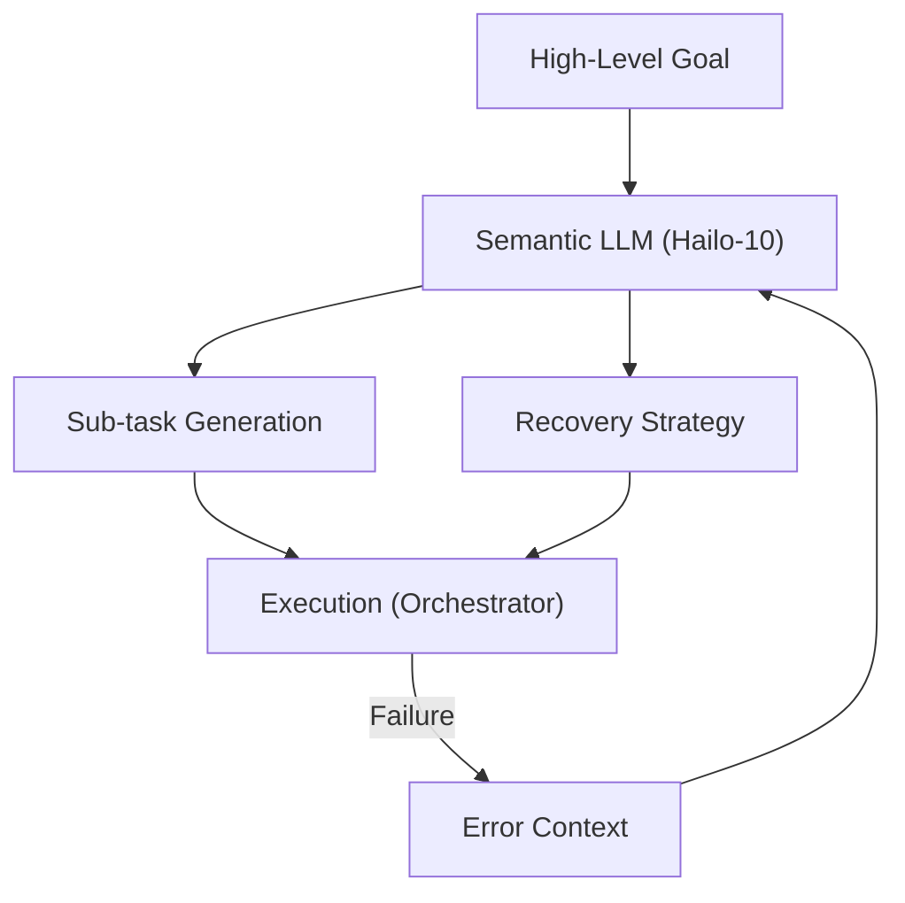

<p align="center">
  
</p>

# 🧩 HYDRA-UMC-SEMANTIC-PLANNER

<p align="center">🇺🇸 <b>English</b> | <a href="README_spa.md">🇪🇸 Español</a> | <a href="README_fra.md">🇫🇷 Français</a> | <a href="README_ita.md">🇮🇹 Italiano</a> | <a href="README_deu.md">🇩🇪 Deutsch</a> | <a href="README_zho.md">🇨🇳 简体中文</a> | <a href="README_jpn.md">🇯🇵 日本語</a></p>

### 🧠 LLM-Based Mission Planner & Logic Recovery System

<p align="left">
  
  
  
</p>

---

## 1. 🛠️ TECHNICAL OVERVIEW

**HYDRA-UMC-SEMANTIC-PLANNER** is the "Logic Orchestrator" of the Cognitive AI Node. It uses local LLMs (Large Language Models) to decompose complex goals into actionable robotic primitives.

It handles high-level ambiguity and provides semantic error recovery: if a task fails (e.g., "vacuum gripper lost seal"), the planner reasons about the cause and decides whether to increase pressure, try again, or swap for a mechanical tool.

### Key Features:
* 🧩 **Task Decomposition (v0):** Real rule-based breakdown of a small known goal vocabulary (e.g., "assemble PCB") into sequential robot commands. *(implemented as real template rules, not yet an LLM - see BUILD & RUN below)*
* 🛡️ **Semantic Recovery (v0):** Real rule-based lookup from structured MCU error codes to a recovery action. *(implemented as a real, explicit table over a known code vocabulary; unknown codes always escalate to a human)*
* ✅ **Precondition Validation:** Every decomposed plan is checked against what each real primitive genuinely needs before being handed off - a plan that fails is refused, never silently passed on as execution-ready. *(implemented)*
* 🌐 **JSON/HTTP API (v0.0.7):** the `serve` subcommand exposes `decompose`/`recover`'s exact same logic over a plain stdlib `http.server` (`POST /decompose`, `POST /recover`, `GET /stats`) for callers that aren't the CLI itself - loopback-only by default, matching the `systemd/hydra-umc-semantic-planner.service` unit. See [`docs/CLI_REFERENCE.md`](docs/CLI_REFERENCE.md) for every real command, flag and exit code, and [`docs/RECOVERY_CONTRACT.md`](docs/RECOVERY_CONTRACT.md) for the full public error-code vocabulary.
* 🎲 **Deterministic + Property-Tested:** `decompose_goal()` is proven deterministic (same goal, same plan, always) and fuzz-tested against hundreds of random/invalid goals - never crashes, never returns a malformed plan. *(implemented)*
* 🤖 **Agentic Workflow:** Operates as a local agent capable of querying system state and tools. *(planned)*
* ⚡ **Hailo-10 Optimized:** Leverages 40 TOPS for fast multi-step reasoning. *(planned - needs the real local LLM)*
* 👨‍👩‍👧 **Cognitive AI Node Child:** Runs as one of four sibling services
  under [HYDRA-UMC-COGNITIVE-NODE](https://github.com/JuanenRac/HYDRA-UMC-COGNITIVE-NODE)
  (alongside VLA-Engine, Voice-UI and Docs-QA), sharing its parent's
  HydraOS image and model weights instead of keeping its own copies.
* 📦 **Odometer Versioning:** Every real build bumps `pyproject.toml`'s
  own version automatically (`bump_version.py`) - no manual version edits.

---

## 2. 🔄 PLANNING CYCLE



---

## 3. 🧱 ARCHITECTURE & DESIGN DECISIONS

This repository is a **child** of the Cognitive AI Node family - its
parent, [HYDRA-UMC-COGNITIVE-NODE](https://github.com/JuanenRac/HYDRA-UMC-COGNITIVE-NODE),
owns the shared HydraOS image and quantized model weights, and wires this
service into `docker-compose.yml` alongside its three siblings
(VLA-Engine, Voice-UI, Docs-QA):

* **Why this child has no hardware/firmware/`os/`/`models/` of its
  own.** It runs entirely on the CM5 + Hailo-10 M.2 module already owned
  by the parent - keeping model weights and the HydraOS image
  centralized in one place avoids four divergent multi-gigabyte copies
  across the family.
* **Why a `src/` layout.** Keeps the installable package
  (`hydra_umc_semantic_planner`) separate from repo-root tooling
  (`bump_version.py`), matching the layout used by every other Python
  project across the ecosystem.
* **Why the entry point only prints identity/version/role today.** This
  is the andamiaje (scaffolding) stage: proving the package installs,
  compiles and imports cleanly - on the actual target Python version - is
  a prerequisite for adding real LLM-based planning/recovery logic later,
  and keeps that later work isolated from packaging concerns.
* **How this fits the rest of the ecosystem.** This planner is the
  decision-making core of the Cognitive AI Node: it consumes intent from
  its sibling HYDRA-UMC-VOICE-UI and action tokens from its sibling
  HYDRA-UMC-VLA-ENGINE, and sends the resulting mission decisions
  downstream to HYDRA-UMC-ORCHESTRATOR for physical execution.
* **Why `decompose.py` is real regex templates, not a local LLM.** A
  small, real goal vocabulary (assemble/pick-and-place/inspect) is fully
  and honestly covered by rules today - the same reasoning as the
  sibling HYDRA-UMC-DOCS-QA's real TF-IDF index instead of an embedding
  model: a real, testable kernel now that a future LLM-based planner can
  replace behind the same `decompose_goal()` contract.
* **Why `recovery.py`'s error codes match the public recovery contract.**
  `INVALID_STATE`/
  `OUT_OF_RANGE`/`ESTOP_ACTIVE`/`TOOL_INCOMPATIBLE`/`TIMEOUT`/
  `UNSUPPORTED` are the real structured errors that adapter is designed
  to return - recovery logic built against that real vocabulary today
  stays valid once the adapter itself exists, instead of inventing a
  parallel error taxonomy that would need reconciling later.
* **Why `ESTOP_ACTIVE`/`UNSUPPORTED`/unknown codes always escalate to a
  human.** Matches the ecosystem-wide safety rule that IA, UI and cloud
  layers never override a physical safety condition - this planner
  proposes a recovery action, it never clears an E-STOP or guesses at an
  error it doesn't recognize.
* **Why `validation.py` exists even though `decompose.py`'s real
  templates never actually produce an invalid plan.** A fixed template
  can guarantee well-formed params by construction - a future LLM-based
  planner cannot. `validate_plan()` is the real, explicit contract that
  planner would have to satisfy, checked here and now against the only
  planner that exists today so the contract itself is proven correct
  before anything harder ever has to meet it.
* **Why `decompose_goal()` is fuzz-tested with a fixed random seed
  instead of `hypothesis`.** This project (like the rest of the
  ecosystem) stays stdlib-only - a reproducible, seeded `random.Random`
  loop over hundreds of synthetic goals gets the same real property
  (never crashes, never returns a malformed plan) without a new
  dependency.

---

## 📂 DIRECTORY STRUCTURE

```text
HYDRA-UMC-SEMANTIC-PLANNER/
├── src/hydra_umc_semantic_planner/
│   ├── primitives.py                  # Real closed vocabulary of robot command primitives
│   ├── decompose.py                    # Real rule-based task decomposition
│   ├── recovery.py                      # Real rule-based semantic error recovery
│   ├── validation.py                    # Real precondition validation over a decomposed Plan
│   ├── api.py                             # Plain JSON/HTTP surface (stdlib http.server) over decompose/recover
│   └── main.py                            # Entry point + real `decompose`/`recover` subcommands
├── tests/                            # Real tests: decomposition, recovery, validation, api, property tests, end-to-end CLI
├── docs/                             # Documentation and knowledge base
│   ├── CLI_REFERENCE.md               # Public command-line contract
│   └── RECOVERY_CONTRACT.md           # Public error/recovery vocabulary
├── images/                           # Media and diagrams
├── systemd/
│   └── hydra-umc-semantic-planner.service # Local CM5 decompose/recover API systemd unit
├── tools/
│   ├── build_test.py                 # Non-versioning build/compile check
│   └── ci_validate.py                # Manifest/CHANGELOG/docs validation used by CI
├── build/                            # Local build output (git-ignored)
├── pyproject.toml                    # Package metadata (version odometer-bumped on every real build)
├── bump_version.py                   # Odometer-style native version bump (used by build.sh/.bat)
├── bump_manifest_version.py          # Syncs hydra-umc.project.json's version to the native one (--sync)
├── build.sh / build.bat              # Create venv, install (with dev extras), run tests, verify import
└── run.sh / run.bat                  # Run the entry point (forwards args, e.g. `decompose`)
```

> **Note:** `hardware/` and `firmware/` were pruned - this node runs on an
> existing CM5 + Hailo-10 M.2 module with no hardware/firmware design of
> its own. `os/` and `models/` were also pruned - the HydraOS image and
> the shared Hailo-10 model weights live in the parent
> `HYDRA-UMC-COGNITIVE-NODE`, which this project attaches to as a
> service (see its `docker-compose.yml`).

---

## ⚙️ BUILD & RUN GUIDE

Requires Python >= 3.10.

```bash
# Linux / macOS / Git Bash
./build.sh   # creates .venv, installs the package (editable), verifies import
./run.sh     # runs the entry point

# Windows (cmd)
build.bat
run.bat
```

`build.sh`/`build.bat` bump the version (odometer-style, see
`bump_version.py`) before every real build, and run the real test suite
(`pytest tests/`). Expected output of a bare `run.sh`:

```text
HYDRA-UMC-SEMANTIC-PLANNER v0.0.7
Semantic Planner (Hailo-10) - decomposes high-level goals into robotic primitives and recovers from execution failures.
```

The real subcommands decompose a goal or propose a recovery:

```bash
./run.sh decompose "assemble the pcb"
./run.sh recover --component gripper --error-code GRIP_LOST_SEAL --detail "vacuum gripper lost seal"

# Windows
run.bat decompose "assemble the pcb"
run.bat recover --component gripper --error-code GRIP_LOST_SEAL --detail "vacuum gripper lost seal"
```

Every real decomposed plan is checked against `validation.py`'s real
preconditions before being printed. `decompose.py`'s own templates
always pass; a plan that failed would be refused instead:

```text
Plan for: "broken" FAILED precondition validation:
  step 1 (GRIP): missing required param 'target'
```

The same `decompose`/`recover` logic is also reachable over HTTP, for
callers that aren't the CLI itself:

```bash
./run.sh serve --addr 127.0.0.1 --port 8109
# in another terminal:
curl -s -X POST http://127.0.0.1:8109/decompose -d '{"goal": "assemble the pcb"}'
```

See [`docs/CLI_REFERENCE.md`](docs/CLI_REFERENCE.md) for the full command/flag/exit-code reference, and [`docs/RECOVERY_CONTRACT.md`](docs/RECOVERY_CONTRACT.md) for the public recovery error-code vocabulary.

### 🩺 Troubleshooting

* **`python: command not found` / build fails at step 1.** Requires
  Python >= 3.10 on `PATH`. On Windows, install from
  [python.org](https://python.org) and make sure "Add to PATH" was
  checked during setup; `python3` is the usual name on Linux/macOS.
* **`build.sh` fails to activate the venv.** `python3 -m venv .venv`
  lays out the activate script differently per platform:
  `.venv/bin/activate` on Linux/macOS, `.venv/Scripts/activate` on
  Windows (also true for a Windows Python venv used from Git Bash).
  `build.sh` already checks both paths - if it still fails, delete
  `.venv/` and re-run `./build.sh` to rebuild it from scratch.
* **`pip install -e .` fails.** Usually a stale `.venv/`. Delete the
  `.venv/` folder and re-run `./build.sh`/`build.bat` to recreate it.
* **`import OK` never prints.** Means `python -c "import
  hydra_umc_semantic_planner"` itself failed - re-run with the venv
  active to see the real traceback.

---

## 🚀 ROADMAP
* **Phase 1:** VLA engine deployment and multi-modal input processing on Hailo-10.
* **Phase 2:** Semantic planner integration with swarm behavioral models and long-term memory.
* **Phase 3:** Voice UI low-latency local execution and industrial noise cancellation.
* **Phase 4:** Multi-agent coordination for shared goal decomposition and semantic recovery optimization.

---

## 🔗 Related Projects

This project is part of the HYDRA-UMC robotics ecosystem by the same author (JuanenRac / Electro Hobby 3D). Worth knowing about, since a request might actually be about one of these rather than this repository.

**Parent Project**
- **[HYDRA-UMC-COGNITIVE-NODE](https://github.com/JuanenRac/HYDRA-UMC-COGNITIVE-NODE)** — integration hub for the Hailo-10 cognitive pipeline (LLM/VLA/voice orchestration); the parent this repo is one specific stage or consumer of, within its own cognitive pipeline.

**Sibling Projects** — the other stages/consumers of HYDRA-UMC-COGNITIVE-NODE's own Hailo-10 cognitive pipeline
- **[HYDRA-UMC-VOICE-UI](https://github.com/JuanenRac/HYDRA-UMC-VOICE-UI)** — real voice front-end (VAD + intent parser) with a bounded, confirmation-gated Watch relay.
- **[HYDRA-UMC-VLA-ENGINE](https://github.com/JuanenRac/HYDRA-UMC-VLA-ENGINE)** — real action-token encoding/decoding and trajectory generation for a Vision-Language-Action model.
- **[HYDRA-UMC-DOCS-QA](https://github.com/JuanenRac/HYDRA-UMC-DOCS-QA)** — real stdlib-only TF-IDF document search over this ecosystem's own Markdown docs.

**Directly Related**
- **[HYDRA-UMC-ORCHESTRATOR](https://github.com/JuanenRac/HYDRA-UMC-ORCHESTRATOR)** — integration hub with a real gRPC/Protobuf health-report contract and mission state machine; receives this planner's own mission decisions.

**Also Part of the Ecosystem**

*Core Hardware & Platform*
- **[HYDRA-UMC](https://github.com/JuanenRac/HYDRA-UMC)** — the physical robot-arm motherboard: CM5 host + dual-core STM32H745, orchestrating up to 8 tool arms over CAN-OTA/SPI-OTA.
- **[HYDRA-UMC-OS](https://github.com/JuanenRac/HYDRA-UMC-OS)** — reproducible Raspberry Pi OS product layer for the CM5: read-only agent, validated config/profiles, WiFi first-contact provisioning.
- **[HYDRA-UMC-SDK](https://github.com/JuanenRac/HYDRA-UMC-SDK)** — the shared JSON-Schema contract and safety-gate boundary every bridge validates its commands against.

*Core Backend & Clients*
- **[HYDRA-UMC-SERVER](https://github.com/JuanenRac/HYDRA-UMC-SERVER)** — the real headless backend (REST/WebSocket) every control client actually talks to.
- **[HYDRA-UMC-STUDIO](https://github.com/JuanenRac/HYDRA-UMC-STUDIO)** — web control dashboard with real-time multi-robot 3D visualization.
- **[HYDRA-UMC-SUITE](https://github.com/JuanenRac/HYDRA-UMC-SUITE)** — desktop (PySide6) swarm command center for multiple servers at once, packaged as a standalone executable.
- **[HYDRA-UMC-ANDROID-CONTROL](https://github.com/JuanenRac/HYDRA-UMC-ANDROID-CONTROL)** — native Android control app with biometric login and a paired Wear OS companion.
- **[HYDRA-UMC-IOS-CONTROL](https://github.com/JuanenRac/HYDRA-UMC-IOS-CONTROL)** — iOS/iPadOS control app (Flutter) with real-time WebSocket sync.
- **[HYDRA-UMC-DSI](https://github.com/JuanenRac/HYDRA-UMC-DSI)** — native touch UI for the onboard 7" DSI touchscreen, embedded on the CM5 itself.
- **[HYDRA-UMC-EDITOR-URDF](https://github.com/JuanenRac/HYDRA-UMC-EDITOR-URDF)** — desktop graphical URDF creator/editor that pushes finished models into STUDIO's own catalog.
- **[HYDRA-UMC-BRIDGE-AMR](https://github.com/JuanenRac/HYDRA-UMC-BRIDGE-AMR)** — coordination boundary for AGV/AMR fleets via a real VDA 5050 MQTT publisher.
- **[HYDRA-UMC-BRIDGE-CNC](https://github.com/JuanenRac/HYDRA-UMC-BRIDGE-CNC)** — high-level CNC-cell coordinator with real GRBL status/control-byte access.
- **[HYDRA-UMC-BRIDGE-DROIDS](https://github.com/JuanenRac/HYDRA-UMC-BRIDGE-DROIDS)** — coordination boundary for legged/humanoid droids, with a real Boston Dynamics Spot command sender.
- **[HYDRA-UMC-BRIDGE-LASER](https://github.com/JuanenRac/HYDRA-UMC-BRIDGE-LASER)** — laser-cell safety coordinator reading 3 real key/enclosure/interlock GPIO safeguards.
- **[HYDRA-UMC-BRIDGE-OPENPNP](https://github.com/JuanenRac/HYDRA-UMC-BRIDGE-OPENPNP)** — safe high-level board-flow coordinator for OpenPnP pick-and-place.
- **[HYDRA-UMC-BRIDGE-PRINTER3D](https://github.com/JuanenRac/HYDRA-UMC-BRIDGE-PRINTER3D)** — safe coordination boundary for Moonraker/Klipper 3D printers, with real gated job commands.
- **[HYDRA-UMC-BRIDGE-ROS2](https://github.com/JuanenRac/HYDRA-UMC-BRIDGE-ROS2)** — safety coordinator with a real, lazily-imported rclpy ROS 2 transport.
- **[HYDRA-UMC-BRIDGE-UAV](https://github.com/JuanenRac/HYDRA-UMC-BRIDGE-UAV)** — coordination boundary for camera-equipped UAVs, with a real MAVLink command sender.

*URTC Tool Platform*
- **[URTC](https://github.com/JuanenRac/URTC)** — firmware for the physical Universal Robot Tool Controller PCB, 25+ tool profiles over CAN bus.
- **[URTC-FLASHER](https://github.com/JuanenRac/URTC-FLASHER)** — desktop GUI flashing tool for URTC boards, CAN-OTA plus full-chip SWD/JTAG.
- **[URTC-TESTER](https://github.com/JuanenRac/URTC-TESTER)** — desktop live CAN-bus diagnostic tool for URTC boards, one panel per tool profile.
- **[URTC-WEB-STUDIO](https://github.com/JuanenRac/URTC-WEB-STUDIO)** — browser-based alternative to URTC-TESTER via the Web Serial API, no local install needed.

*Vision AI Node (Hailo-8)*
- **[HYDRA-UMC-VISION-NODE](https://github.com/JuanenRac/HYDRA-UMC-VISION-NODE)** — integration hub for the Hailo-8 vision pipeline, with a real per-stage hardware-readiness check.
- **[HYDRA-UMC-DETECTION-HEF](https://github.com/JuanenRac/HYDRA-UMC-DETECTION-HEF)** — real compiled-model registry with Hailo-architecture/checksum safe-load verification.
- **[HYDRA-UMC-VISION-STREAMER](https://github.com/JuanenRac/HYDRA-UMC-VISION-STREAMER)** — real GStreamer pipeline + MediaMTX config generator with a real HailoRT integration boundary.
- **[HYDRA-UMC-VISUAL-SERVOING-API](https://github.com/JuanenRac/HYDRA-UMC-VISUAL-SERVOING-API)** — real Position-Based Visual Servoing correction law, safety-gated on upstream zone state.
- **[HYDRA-UMC-SAFETY-ZONES](https://github.com/JuanenRac/HYDRA-UMC-SAFETY-ZONES)** — real zone-breach checking and E-STOP requesting, with calibration-freshness enforcement.

*Orchestration & Swarm*
- **[HYDRA-UMC-JOB-DISPATCHER](https://github.com/JuanenRac/HYDRA-UMC-JOB-DISPATCHER)** — real priority-based job queue with deduplication, over a real HTTP API.
- **[HYDRA-UMC-NODE-HEALING](https://github.com/JuanenRac/HYDRA-UMC-NODE-HEALING)** — real gRPC-based fleet health watchdog with retry/backoff and identity-mismatch detection.
- **[HYDRA-UMC-PATH-PLANNER-3D](https://github.com/JuanenRac/HYDRA-UMC-PATH-PLANNER-3D)** — real RRT-based 3D path planner with real obstacle/workspace collision validation.
- **[HYDRA-UMC-SWARM-SYNC](https://github.com/JuanenRac/HYDRA-UMC-SWARM-SYNC)** — real CRDT LWW-Element-Map state sync, property-tested for multi-cell convergence.

*Digital Twin & Simulation*
- **[HYDRA-UMC-TWIN](https://github.com/JuanenRac/HYDRA-UMC-TWIN)** — integration hub for the digital-twin engine, with a real version-compatibility sync contract.
- **[HYDRA-UMC-HIL-BRIDGE](https://github.com/JuanenRac/HYDRA-UMC-HIL-BRIDGE)** — real hardware-in-the-loop safety interlock routing commands between simulation and real hardware.
- **[HYDRA-UMC-PHYSICS-REPLICA](https://github.com/JuanenRac/HYDRA-UMC-PHYSICS-REPLICA)** — real forward kinematics and joint-limit validation over a real URDF subset.
- **[HYDRA-UMC-SYNTHETIC-DATA-GEN](https://github.com/JuanenRac/HYDRA-UMC-SYNTHETIC-DATA-GEN)** — real procedural 2D scene generator with YOLO/COCO annotation export.

*Data & Analytics*
- **[HYDRA-UMC-DATALAKE](https://github.com/JuanenRac/HYDRA-UMC-DATALAKE)** — real sqlite3-backed time-series store with a real ingest/query HTTP API.
- **[HYDRA-UMC-ANOMALY-DETECTOR](https://github.com/JuanenRac/HYDRA-UMC-ANOMALY-DETECTOR)** — real FFT + statistical baseline anomaly detector with drift monitoring.
- **[HYDRA-UMC-PRODUCTION-REPORTS](https://github.com/JuanenRac/HYDRA-UMC-PRODUCTION-REPORTS)** — real OEE/availability calculation over DATALAKE history, with reproducible CSV export.
- **[HYDRA-UMC-TELEMETRY-COLLECTOR](https://github.com/JuanenRac/HYDRA-UMC-TELEMETRY-COLLECTOR)** — real CAN/WebSocket ingestion pipeline into DATALAKE, with sequence deduplication.

*Industrial Gateway*
- **[HYDRA-UMC-GATEWAY-INDUSTRIAL](https://github.com/JuanenRac/HYDRA-UMC-GATEWAY-INDUSTRIAL)** — integration hub relaying to industrial protocols, with a real command allowlist/backpressure layer.
- **[HYDRA-UMC-OPCUA-SERVER](https://github.com/JuanenRac/HYDRA-UMC-OPCUA-SERVER)** — real OPC-UA address space, verified with a real binary-protocol client session.
- **[HYDRA-UMC-MQTT-BROKER](https://github.com/JuanenRac/HYDRA-UMC-MQTT-BROKER)** — real MQTT broker with optional per-client authentication and topic ACLs.
- **[HYDRA-UMC-MTCONNECT-ADAPTER](https://github.com/JuanenRac/HYDRA-UMC-MTCONNECT-ADAPTER)** — real MTConnect `/probe` and `/current` XML endpoints with degraded-mode output.

*Complementary Tools & Ecosystem Operations*
- **[HYDRA-UMC-DASHBOARD-AI](https://github.com/JuanenRac/HYDRA-UMC-DASHBOARD-AI)** — Smart Summaries and Anomaly Highlighting panels over DATALAKE/ANOMALY-DETECTOR, with an honest statistical fallback.
- **[HYDRA-UMC-TOOL-CLI](https://github.com/JuanenRac/HYDRA-UMC-TOOL-CLI)** — fleet CLI with a real, stable exit-code contract, a genuine live client of HYDRA-UMC-SERVER's own API.
- **[HYDRA-UMC-WATCH](https://github.com/JuanenRac/HYDRA-UMC-WATCH)** — WearOS companion app with real haptic alerts and a paired-phone voice relay.
- **[URTC-SMART-RACK](https://github.com/JuanenRac/URTC-SMART-RACK)** — firmware for a board-mounting rack with real tool-ID decoding and Smart Idle pre-heating logic.
- **[URTC-VISION-TOOL](https://github.com/JuanenRac/URTC-VISION-TOOL)** — firmware plus a real Python vision companion for a thermal/RGB inspection tool head.
- **[HYDRA-UMC-UPDATER](https://github.com/JuanenRac/HYDRA-UMC-UPDATER)** — administrative desktop tool that discovers, clones and updates every repo in this ecosystem.
- **[HYDRA-UMC-OS-REBUILDER](https://github.com/JuanenRac/HYDRA-UMC-OS-REBUILDER)** — Windows/Linux desktop tool that builds a ready-to-flash CM5 image pre-loaded with the ecosystem's most current versions, with Raspberry-Pi-Imager-style first-boot Wi-Fi/user/SSH configuration.

---

## 📚 Documentation & Community

- **[CONTRIBUTING.md](CONTRIBUTING.md)** — tech stack and coding guidelines for a pull request.
- **[CODE_OF_CONDUCT.md](CODE_OF_CONDUCT.md)** — the standards of behavior expected in this community.
- **[SECURITY.md](SECURITY.md)** — how to report a vulnerability, and this project's own real security focus areas.
- **[SUPPORT.md](SUPPORT.md)** — where to ask questions and report bugs.
- **[LICENSE.md](LICENSE.md)** — this project's own license.

## 👤 AUTHOR
**JuanenRac** (Electro Hobby 3D)
📧 electrohobby3d@gmail.com
📺 [youtube.com/@electrohobby3d](https://youtube.com/@electrohobby3d)

## 📜 LICENSE
GPL-3.0 - See LICENSE for details.
