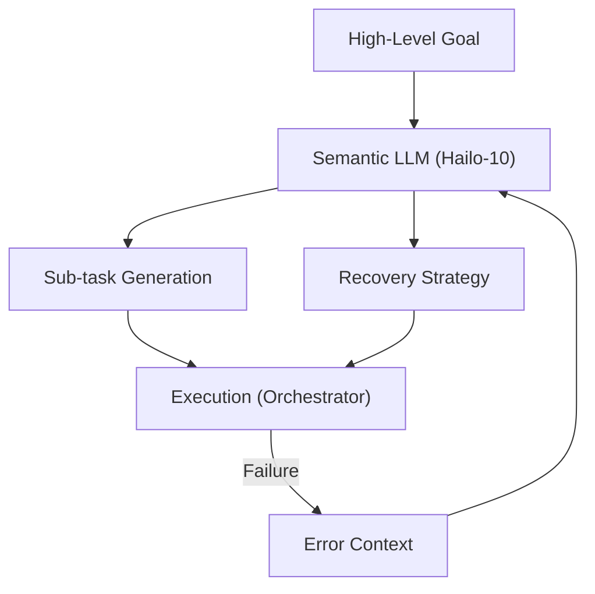

<p align="center">
  
</p>

# 🧩 HYDRA-UMC-SEMANTIC-PLANNER

<p align="center">🇺🇸 <b>English</b> | <a href="README_spa.md">🇪🇸 Español</a> | <a href="README_fra.md">🇫🇷 Français</a> | <a href="README_ita.md">🇮🇹 Italiano</a> | <a href="README_deu.md">🇩🇪 Deutsch</a> | <a href="README_zho.md">🇨🇳 简体中文</a> | <a href="README_jpn.md">🇯🇵 日本語</a></p>

### 🧠 LLM-Based Mission Planner & Logic Recovery System

<p align="left">
  
  
  
</p>

---

## 1. 🛠️ TECHNICAL OVERVIEW

**HYDRA-UMC-SEMANTIC-PLANNER** is the "Logic Orchestrator" of the Cognitive AI Node. It uses local LLMs (Large Language Models) to decompose complex goals into actionable robotic primitives.

It handles high-level ambiguity and provides semantic error recovery: if a task fails (e.g., "vacuum gripper lost seal"), the planner reasons about the cause and decides whether to increase pressure, try again, or swap for a mechanical tool.

### Key Features:
* 🧩 **Task Decomposition (v0):** Real rule-based breakdown of a small known goal vocabulary (e.g., "assemble PCB") into sequential robot commands. *(implemented as real template rules, not yet an LLM - see BUILD & RUN below)*
* 🛡️ **Semantic Recovery (v0):** Real rule-based lookup from structured MCU error codes to a recovery action. *(implemented as a real, explicit table over a known code vocabulary; unknown codes always escalate to a human)*
* ✅ **Precondition Validation:** Every decomposed plan is checked against what each real primitive genuinely needs before being handed off - a plan that fails is refused, never silently passed on as execution-ready. *(implemented)*
* 🎲 **Deterministic + Property-Tested:** `decompose_goal()` is proven deterministic (same goal, same plan, always) and fuzz-tested against hundreds of random/invalid goals - never crashes, never returns a malformed plan. *(implemented)*
* 🤖 **Agentic Workflow:** Operates as a local agent capable of querying system state and tools. *(planned)*
* ⚡ **Hailo-10 Optimized:** Leverages 40 TOPS for fast multi-step reasoning. *(planned - needs the real local LLM)*
* 👨‍👩‍👧 **Cognitive AI Node Child:** Runs as one of four sibling services
  under [HYDRA-UMC-COGNITIVE-NODE](https://github.com/JuanenRac/HYDRA-UMC-COGNITIVE-NODE)
  (alongside VLA-Engine, Voice-UI and Docs-QA), sharing its parent's
  HydraOS image and model weights instead of keeping its own copies.
* 📦 **Odometer Versioning:** Every real build bumps `pyproject.toml`'s
  own version automatically (`bump_version.py`) - no manual version edits.

---

## 2. 🔄 PLANNING CYCLE



---

## 3. 🧱 ARCHITECTURE & DESIGN DECISIONS

This repository is a **child** of the Cognitive AI Node family - its
parent, [HYDRA-UMC-COGNITIVE-NODE](https://github.com/JuanenRac/HYDRA-UMC-COGNITIVE-NODE),
owns the shared HydraOS image and quantized model weights, and wires this
service into `docker-compose.yml` alongside its three siblings
(VLA-Engine, Voice-UI, Docs-QA):

* **Why this child has no hardware/firmware/`os/`/`models/` of its
  own.** It runs entirely on the CM5 + Hailo-10 M.2 module already owned
  by the parent - keeping model weights and the HydraOS image
  centralized in one place avoids four divergent multi-gigabyte copies
  across the family.
* **Why a `src/` layout.** Keeps the installable package
  (`hydra_umc_semantic_planner`) separate from repo-root tooling
  (`bump_version.py`), matching the layout used by every other Python
  project across the ecosystem.
* **Why the entry point only prints identity/version/role today.** This
  is the andamiaje (scaffolding) stage: proving the package installs,
  compiles and imports cleanly - on the actual target Python version - is
  a prerequisite for adding real LLM-based planning/recovery logic later,
  and keeps that later work isolated from packaging concerns.
* **How this fits the rest of the ecosystem.** This planner is the
  decision-making core of the Cognitive AI Node: it consumes intent from
  its sibling HYDRA-UMC-VOICE-UI and action tokens from its sibling
  HYDRA-UMC-VLA-ENGINE, and sends the resulting mission decisions
  downstream to HYDRA-UMC-ORCHESTRATOR for physical execution.
* **Why `decompose.py` is real regex templates, not a local LLM.** A
  small, real goal vocabulary (assemble/pick-and-place/inspect) is fully
  and honestly covered by rules today - the same reasoning as the
  sibling HYDRA-UMC-DOCS-QA's real TF-IDF index instead of an embedding
  model: a real, testable kernel now that a future LLM-based planner can
  replace behind the same `decompose_goal()` contract.
* **Why `recovery.py`'s error codes match the public recovery contract.**
  `INVALID_STATE`/
  `OUT_OF_RANGE`/`ESTOP_ACTIVE`/`TOOL_INCOMPATIBLE`/`TIMEOUT`/
  `UNSUPPORTED` are the real structured errors that adapter is designed
  to return - recovery logic built against that real vocabulary today
  stays valid once the adapter itself exists, instead of inventing a
  parallel error taxonomy that would need reconciling later.
* **Why `ESTOP_ACTIVE`/`UNSUPPORTED`/unknown codes always escalate to a
  human.** Matches the ecosystem-wide safety rule that IA, UI and cloud
  layers never override a physical safety condition - this planner
  proposes a recovery action, it never clears an E-STOP or guesses at an
  error it doesn't recognize.
* **Why `validation.py` exists even though `decompose.py`'s real
  templates never actually produce an invalid plan.** A fixed template
  can guarantee well-formed params by construction - a future LLM-based
  planner cannot. `validate_plan()` is the real, explicit contract that
  planner would have to satisfy, checked here and now against the only
  planner that exists today so the contract itself is proven correct
  before anything harder ever has to meet it.
* **Why `decompose_goal()` is fuzz-tested with a fixed random seed
  instead of `hypothesis`.** This project (like the rest of the
  ecosystem) stays stdlib-only - a reproducible, seeded `random.Random`
  loop over hundreds of synthetic goals gets the same real property
  (never crashes, never returns a malformed plan) without a new
  dependency.

---

## 📂 DIRECTORY STRUCTURE

```text
HYDRA-UMC-SEMANTIC-PLANNER/
├── src/hydra_umc_semantic_planner/
│   ├── primitives.py                  # Real closed vocabulary of robot command primitives
│   ├── decompose.py                    # Real rule-based task decomposition
│   ├── recovery.py                      # Real rule-based semantic error recovery
│   ├── validation.py                    # Real precondition validation over a decomposed Plan
│   └── main.py                            # Entry point + real `decompose`/`recover` subcommands
├── tests/                            # Real tests: decomposition, recovery, validation, property tests, end-to-end CLI
├── docs/                             # Documentation and knowledge base
│   ├── CLI_REFERENCE.md               # Public command-line contract
│   └── RECOVERY_CONTRACT.md           # Public error/recovery vocabulary
├── images/                           # Media and diagrams
├── scripts/                          # Utility scripts
├── build/                            # Local build output (git-ignored)
├── pyproject.toml                    # Package metadata (version odometer-bumped on every real build)
├── bump_version.py                   # Odometer-style version bump (used by build.sh/.bat)
├── build.sh / build.bat              # Create venv, install (with dev extras), run tests, verify import
└── run.sh / run.bat                  # Run the entry point (forwards args, e.g. `decompose`)
```

> **Note:** `hardware/` and `firmware/` were pruned - this node runs on an
> existing CM5 + Hailo-10 M.2 module with no hardware/firmware design of
> its own. `os/` and `models/` were also pruned - the HydraOS image and
> the shared Hailo-10 model weights live in the parent
> `HYDRA-UMC-COGNITIVE-NODE`, which this project attaches to as a
> service (see its `docker-compose.yml`).

---

## ⚙️ BUILD & RUN

Requires Python >= 3.10.

```bash
# Linux / macOS / Git Bash
./build.sh   # creates .venv, installs the package (editable), verifies import
./run.sh     # runs the entry point

# Windows (cmd)
build.bat
run.bat
```

`build.sh`/`build.bat` bump the version (odometer-style, see
`bump_version.py`) before every real build, and run the real test suite
(`pytest tests/`). Expected output of a bare `run.sh`:

```text
HYDRA-UMC-SEMANTIC-PLANNER v0.0.4
Semantic Planner (Hailo-10) - decomposes high-level goals into robotic primitives and recovers from execution failures.
```

The real subcommands decompose a goal or propose a recovery:

```bash
./run.sh decompose "assemble the pcb"
./run.sh recover --component gripper --error-code GRIP_LOST_SEAL --detail "vacuum gripper lost seal"

# Windows
run.bat decompose "assemble the pcb"
run.bat recover --component gripper --error-code GRIP_LOST_SEAL --detail "vacuum gripper lost seal"
```

Every real decomposed plan is checked against `validation.py`'s real
preconditions before being printed. `decompose.py`'s own templates
always pass; a plan that failed would be refused instead:

```text
Plan for: "broken" FAILED precondition validation:
  step 1 (GRIP): missing required param 'target'
```

### 🩺 Troubleshooting

* **`python: command not found` / build fails at step 1.** Requires
  Python >= 3.10 on `PATH`. On Windows, install from
  [python.org](https://python.org) and make sure "Add to PATH" was
  checked during setup; `python3` is the usual name on Linux/macOS.
* **`build.sh` fails to activate the venv.** `python3 -m venv .venv`
  lays out the activate script differently per platform:
  `.venv/bin/activate` on Linux/macOS, `.venv/Scripts/activate` on
  Windows (also true for a Windows Python venv used from Git Bash).
  `build.sh` already checks both paths - if it still fails, delete
  `.venv/` and re-run `./build.sh` to rebuild it from scratch.
* **`pip install -e .` fails.** Usually a stale `.venv/`. Delete the
  `.venv/` folder and re-run `./build.sh`/`build.bat` to recreate it.
* **`import OK` never prints.** Means `python -c "import
  hydra_umc_semantic_planner"` itself failed - re-run with the venv
  active to see the real traceback.

---

## 🚀 ROADMAP
* **Phase 1:** VLA engine deployment and multi-modal input processing on Hailo-10.
* **Phase 2:** Semantic planner integration with swarm behavioral models and long-term memory.
* **Phase 3:** Voice UI low-latency local execution and industrial noise cancellation.
* **Phase 4:** Multi-agent coordination for shared goal decomposition and semantic recovery optimization.

---

## 🔗 RELATED PROJECTS

This project is part of a larger robotics ecosystem by the same author (JuanenRac / Electro Hobby 3D), spanning firmware, control software, AI nodes, and fleet tooling.

### Directly Related to This Planner

- **[HYDRA-UMC-ORCHESTRATOR](https://github.com/JuanenRac/HYDRA-UMC-ORCHESTRATOR)** — receives this planner's mission decisions.

### Rest of the Ecosystem

**HYDRA-UMC platform** — the multi-robot micro-factory cell
- **[HYDRA-UMC](https://github.com/JuanenRac/HYDRA-UMC)** — the motherboard itself: Raspberry Pi CM5 host + dual-core STM32H745 real-time co-processor, orchestrating up to 8 distributed robot arms over CAN-OTA/SPI-OTA.
- **[HYDRA-UMC SERVER](https://github.com/JuanenRac/HYDRA-UMC-SERVER)** — headless Express/WebSocket backend that owns robot state.
- **[HYDRA-UMC STUDIO](https://github.com/JuanenRac/HYDRA-UMC-STUDIO)** — web-based control dashboard.
- **[HYDRA-UMC-ANDROID-CONTROL](https://github.com/JuanenRac/HYDRA-UMC-ANDROID-CONTROL)** — Android control app for HYDRA-UMC.
- **[HYDRA-UMC-IOS-CONTROL](https://github.com/JuanenRac/HYDRA-UMC-IOS-CONTROL)** — iOS/iPadOS control app for HYDRA-UMC.
- **[HYDRA-UMC-SUITE](https://github.com/JuanenRac/HYDRA-UMC-SUITE)** — desktop swarm command center.
- **[HYDRA-UMC-EDITOR-URDF](https://github.com/JuanenRac/HYDRA-UMC-EDITOR-URDF)** — desktop graphical URDF creator/editor.
- **[HYDRA-UMC-DSI](https://github.com/JuanenRac/HYDRA-UMC-DSI)** — native touchscreen UI for HYDRA-UMC.

**URTC platform** — the tool head controller every HYDRA-UMC robot arm carries
- **[URTC](https://github.com/JuanenRac/URTC)** — Universal Robot Tool Controller, firmware.
- **[URTC Flasher](https://github.com/JuanenRac/URTC-FLASHER)** — desktop CAN-OTA + SWD/JTAG flashing tool.
- **[URTC Tester](https://github.com/JuanenRac/URTC-TESTER)** — desktop live CAN-bus diagnostic tool.
- **[URTC Web Studio](https://github.com/JuanenRac/URTC-WEB-STUDIO)** — browser-based alternative to the 2 desktop tools above.

**👁️ Vision AI Node (Hailo-8)**
- [HYDRA-UMC-VISION-NODE](https://github.com/JuanenRac/HYDRA-UMC-VISION-NODE)
- [HYDRA-UMC-VISION-STREAMER](https://github.com/JuanenRac/HYDRA-UMC-VISION-STREAMER)
- [HYDRA-UMC-DETECTION-HEF](https://github.com/JuanenRac/HYDRA-UMC-DETECTION-HEF)
- [HYDRA-UMC-SAFETY-ZONES](https://github.com/JuanenRac/HYDRA-UMC-SAFETY-ZONES)
- [HYDRA-UMC-VISUAL-SERVOING-API](https://github.com/JuanenRac/HYDRA-UMC-VISUAL-SERVOING-API)

**🐝 Orchestration & Swarm**
- [HYDRA-UMC-SWARM-SYNC](https://github.com/JuanenRac/HYDRA-UMC-SWARM-SYNC)
- [HYDRA-UMC-PATH-PLANNER-3D](https://github.com/JuanenRac/HYDRA-UMC-PATH-PLANNER-3D)
- [HYDRA-UMC-JOB-DISPATCHER](https://github.com/JuanenRac/HYDRA-UMC-JOB-DISPATCHER)
- [HYDRA-UMC-NODE-HEALING](https://github.com/JuanenRac/HYDRA-UMC-NODE-HEALING)

**🎮 Digital Twin & Simulation**
- [HYDRA-UMC-TWIN](https://github.com/JuanenRac/HYDRA-UMC-TWIN)
- [HYDRA-UMC-PHYSICS-REPLICA](https://github.com/JuanenRac/HYDRA-UMC-PHYSICS-REPLICA)
- [HYDRA-UMC-HIL-BRIDGE](https://github.com/JuanenRac/HYDRA-UMC-HIL-BRIDGE)
- [HYDRA-UMC-SYNTHETIC-DATA-GEN](https://github.com/JuanenRac/HYDRA-UMC-SYNTHETIC-DATA-GEN)

**📊 Data & Analytics**
- [HYDRA-UMC-DATALAKE](https://github.com/JuanenRac/HYDRA-UMC-DATALAKE)
- [HYDRA-UMC-TELEMETRY-COLLECTOR](https://github.com/JuanenRac/HYDRA-UMC-TELEMETRY-COLLECTOR)
- [HYDRA-UMC-ANOMALY-DETECTOR](https://github.com/JuanenRac/HYDRA-UMC-ANOMALY-DETECTOR)
- [HYDRA-UMC-PRODUCTION-REPORTS](https://github.com/JuanenRac/HYDRA-UMC-PRODUCTION-REPORTS)

**🏭 Industrial Gateway**
- [HYDRA-UMC-GATEWAY-INDUSTRIAL](https://github.com/JuanenRac/HYDRA-UMC-GATEWAY-INDUSTRIAL)
- [HYDRA-UMC-OPCUA-SERVER](https://github.com/JuanenRac/HYDRA-UMC-OPCUA-SERVER)
- [HYDRA-UMC-MQTT-BROKER](https://github.com/JuanenRac/HYDRA-UMC-MQTT-BROKER)
- [HYDRA-UMC-MTCONNECT-ADAPTER](https://github.com/JuanenRac/HYDRA-UMC-MTCONNECT-ADAPTER)

**🛠️ Complementary Tools**
- [URTC-SMART-RACK](https://github.com/JuanenRac/URTC-SMART-RACK)
- [URTC-VISION-TOOL](https://github.com/JuanenRac/URTC-VISION-TOOL)
- [HYDRA-UMC-WATCH](https://github.com/JuanenRac/HYDRA-UMC-WATCH)
- [HYDRA-UMC-TOOL-CLI](https://github.com/JuanenRac/HYDRA-UMC-TOOL-CLI)
- [HYDRA-UMC-DASHBOARD-AI](https://github.com/JuanenRac/HYDRA-UMC-DASHBOARD-AI)

---

## 👤 AUTHOR
**JuanenRac** (Electro Hobby 3D)
📧 electrohobby3d@gmail.com

## 📜 LICENSE
GPL-3.0 - See LICENSE for details.

## 🛠️ BUILD & RUN

Use the non-versioning build check before a release build:

| Action | Windows | Linux / macOS |
|---|---|---|
| Build check (no version or CHANGELOG change) | `build-test.bat` | `./build-test.sh` |
| Run / development (when provided) | `run*.bat` or `dev*.bat` | `./run*.sh` or `./dev*.sh` |

`build-test.bat` and `build-test.sh` compile or validate the project stack without incrementing `hydra-umc.project.json` or modifying `CHANGELOG.md`. They may create normal compiler output only. Existing `build*.bat`, `build*.sh`, `run*` and `dev*` scripts retain their project-specific, versioned or runtime behavior; use them when that behavior is required.
