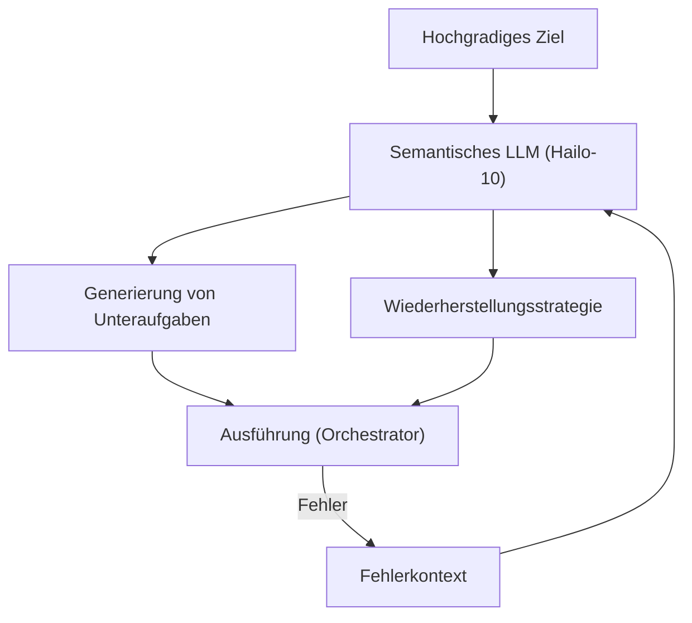

<p align="center">
  
</p>

# 🧩 HYDRA-UMC-SEMANTIC-PLANNER

<p align="center"><a href="README.md">🇺🇸 English</a> | <a href="README_spa.md">🇪🇸 Español</a> | <a href="README_fra.md">🇫🇷 Français</a> | <a href="README_ita.md">🇮🇹 Italiano</a> | 🇩🇪 <b>Deutsch</b> | <a href="README_zho.md">🇨🇳 简体中文</a> | <a href="README_jpn.md">🇯🇵 日本語</a></p>

### 🧠 LLM-basierter Missionsplaner & Logik-Wiederherstellungssystem

<p align="left">
  
  
  
</p>

---

## 1. 🛠️ TECHNISCHER ÜBERBLICK

**HYDRA-UMC-SEMANTIC-PLANNER** ist der "Logik-Orchestrator" des Cognitive AI Node. Er nutzt lokale LLMs (Large Language Models), um komplexe Ziele in ausführbare Roboter-Primitive zu zerlegen.

Er handhabt hochgradige Ambiguität und bietet eine semantische Fehlerbehebung: Wenn eine Aufgabe fehlschlägt (z. B. "Vakuumgreifer hat die Abdichtung verloren"), analysiert der Planer die Ursache und entscheidet, ob er den Druck erhöhen, es erneut versuchen oder gegen ein mechanisches Werkzeug austauschen soll.

### Hauptmerkmale:
* 🧩 **Aufgabenzerlegung (v0):** Echte, regelbasierte Zerlegung eines kleinen bekannten Zielvokabulars (z. B. "Leiterplatte montieren") in sequentielle Roboterbefehle. *(implementiert als echte Vorlagenregeln, noch kein LLM - siehe BUILD UND AUSFÜHRUNG unten)*
* 🛡️ **Semantische Wiederherstellung (v0):** Echtes, regelbasiertes Nachschlagen von strukturierten MCU-Fehlercodes zu einer Wiederherstellungsaktion. *(implementiert als echte, explizite Tabelle über ein bekanntes Codevokabular; unbekannte Codes eskalieren immer an einen Menschen)*
* ✅ **Präconditions-Validierung:** Jeder zerlegte Plan wird gegen das geprüft, was jede echte Primitive tatsächlich benötigt, bevor er weitergegeben wird - ein fehlgeschlagener Plan wird abgelehnt und niemals stillschweigend als ausführungsbereit durchgereicht. *(implementiert)*
* 🎲 **Deterministisch und Property-getestet:** `decompose_goal()` ist nachweislich deterministisch (gleiches Ziel, gleicher Plan, immer) und wird per Fuzzing gegen Hunderte zufälliger/ungültiger Ziele getestet - stürzt nie ab, liefert nie einen fehlerhaft geformten Plan. *(implementiert)*
* 🤖 **Agentischer Workflow:** Agiert als lokaler Agent, der den Systemstatus und die Werkzeuge abfragen kann. *(geplant)*
* ⚡ **Hailo-10 optimiert:** Nutzt 40 TOPS für schnelles mehrstufiges Denken. *(geplant - benötigt das echte lokale LLM)*
* 👨‍👩‍👧 **Kind des Cognitive AI Node:** Läuft als einer von vier
  Schwesterdiensten unter [HYDRA-UMC-COGNITIVE-NODE](https://github.com/JuanenRac/HYDRA-UMC-COGNITIVE-NODE)
  (neben VLA-Engine, Voice-UI und Docs-QA) und teilt sich das
  HydraOS-Image und die Modellgewichte des Elternteils, statt eigene
  Kopien vorzuhalten.
* 📦 **Kilometerzähler-Versionierung:** Jeder echte Build erhöht
  automatisch die Version in `pyproject.toml` (`bump_version.py`) - keine
  manuellen Versionsänderungen.

---

## 2. 🔄 PLANUNGSZYKLUS



---

## 3. 🧱 ARCHITEKTUR & DESIGNENTSCHEIDUNGEN

Dieses Repository ist ein **Kind** der Cognitive AI Node-Familie - sein
Elternteil, [HYDRA-UMC-COGNITIVE-NODE](https://github.com/JuanenRac/HYDRA-UMC-COGNITIVE-NODE),
besitzt das gemeinsam genutzte HydraOS-Image und die quantisierten
Modellgewichte und bindet diesen Dienst in seiner `docker-compose.yml`
neben seinen drei Geschwistern (VLA-Engine, Voice-UI, Docs-QA) ein:

* **Warum dieses Kind keine eigene Hardware/Firmware/`os/`/`models/`
  hat.** Es läuft vollständig auf dem CM5 + Hailo-10 M.2-Modul, das
  bereits dem Elternteil gehört - Modellgewichte und HydraOS-Image an
  einer zentralen Stelle zu halten vermeidet vier abweichende, mehrere
  Gigabyte große Kopien innerhalb der Familie.
* **Warum ein `src/`-Layout.** Trennt das installierbare Paket
  (`hydra_umc_semantic_planner`) vom Tooling im Repo-Root
  (`bump_version.py`) und entspricht dem Layout aller anderen
  Python-Projekte im Ökosystem.
* **Warum der Einstiegspunkt heute nur Identität/Version/Rolle
  ausgibt.** Dies ist die Andamiaje- (Gerüst-) Phase: zu beweisen, dass
  sich das Paket auf der tatsächlichen Ziel-Python-Version sauber
  installieren, kompilieren und importieren lässt, ist Voraussetzung,
  bevor echte LLM-basierte Planungs-/Wiederherstellungslogik hinzugefügt
  wird, und hält diese spätere Arbeit von Packaging-Fragen getrennt.
* **Wie sich das in den Rest des Ökosystems einfügt.** Dieser Planer ist
  der Entscheidungskern des Cognitive AI Node: Er verarbeitet die
  Absicht seines Geschwisters HYDRA-UMC-VOICE-UI und die Aktions-Token
  seines Geschwisters HYDRA-UMC-VLA-ENGINE und sendet die daraus
  resultierenden Missionsentscheidungen nachgelagert an
  HYDRA-UMC-ORCHESTRATOR zur physischen Ausführung.
* **Warum `decompose.py` echte Regex-Regeln sind, kein lokales LLM.**
  Ein kleines, echtes Zielvokabular (montieren/pick-and-place/
  inspizieren) wird heute vollständig und ehrlich durch Regeln abgedeckt
  - dieselbe Überlegung wie der echte TF-IDF-Index des Geschwisterprojekts
  HYDRA-UMC-DOCS-QA anstelle eines Embedding-Modells: ein echter,
  testbarer Kern jetzt, den ein künftiger LLM-basierter Planer hinter
  demselben `decompose_goal()`-Vertrag ersetzen kann.
* **Warum die Fehlercodes von `recovery.py` dem öffentlichen
  Wiederherstellungsvertrag entsprechen.**
  `INVALID_STATE`/`OUT_OF_RANGE`/`ESTOP_ACTIVE`/`TOOL_INCOMPATIBLE`/
  `TIMEOUT`/`UNSUPPORTED` sind die echten strukturierten Fehler, die
  dieser Adapter zurückgeben soll - eine schon heute gegen dieses echte
  Vokabular gebaute Wiederherstellungslogik bleibt gültig, sobald der
  Adapter selbst existiert, statt eine parallele Fehlertaxonomie zu
  erfinden, die später abgeglichen werden müsste.
* **Warum `ESTOP_ACTIVE`/`UNSUPPORTED`/unbekannte Codes immer an einen
  Menschen eskalieren.** Entspricht der ökosystemweiten Sicherheitsregel,
  dass KI-, UI- und Cloud-Schichten niemals eine physische
  Sicherheitsbedingung außer Kraft setzen - dieser Planer schlägt eine
  Wiederherstellungsaktion vor, er hebt niemals einen E-STOP auf und rät
  nicht bei einem Fehler, den er nicht erkennt.
* **Warum `validation.py` existiert, obwohl die echten Vorlagen von
  `decompose.py` nie tatsächlich einen ungültigen Plan erzeugen.**
  Eine feste Vorlage kann wohlgeformte Parameter allein durch ihre
  Konstruktion garantieren - ein künftiger LLM-basierter Planer kann
  das nicht. `validate_plan()` ist der echte, explizite Vertrag, den
  dieser Planer erfüllen müsste, hier und heute gegen den einzigen
  existierenden Planer geprüft, damit der Vertrag selbst als korrekt
  erwiesen ist, bevor etwas Schwierigeres ihn je erfüllen muss.
* **Warum `decompose_goal()` mit einem festen Zufalls-Seed statt mit
  `hypothesis` gefuzzt wird.** Dieses Projekt bleibt (wie der Rest des
  Ökosystems) ausschließlich bei der Standardbibliothek - eine
  reproduzierbare, mit Seed versehene `random.Random`-Schleife über
  Hunderte synthetischer Ziele liefert dieselbe echte Eigenschaft
  (stürzt nie ab, liefert nie einen fehlerhaft geformten Plan), ohne
  eine neue Abhängigkeit hinzuzufügen.

---

## 📂 VERZEICHNISSTRUKTUR

```text
HYDRA-UMC-SEMANTIC-PLANNER/
├── src/hydra_umc_semantic_planner/
│   ├── primitives.py                  # Echtes geschlossenes Vokabular von Roboter-Befehlsprimitiven
│   ├── decompose.py                    # Echte regelbasierte Aufgabenzerlegung
│   ├── recovery.py                      # Echte regelbasierte semantische Fehlerwiederherstellung
│   ├── validation.py                    # Echte Präconditions-Validierung über einen zerlegten Plan
│   └── main.py                            # Einstiegspunkt + echte Subcommands `decompose`/`recover`
├── tests/                            # Echte Tests: Zerlegung, Wiederherstellung, Validierung, Property-Tests, End-to-End-CLI
├── docs/                             # Dokumentation und Wissensdatenbank
│   ├── CLI_REFERENCE.md               # Öffentlicher Befehlszeilenvertrag
│   └── RECOVERY_CONTRACT.md           # Öffentliches Wiederherstellungsvokabular
├── images/                           # Medien und Diagramme
├── scripts/                          # Utility-Skripte
├── build/                            # Lokale Build-Ausgabe (von git ignoriert)
├── pyproject.toml                    # Paket-Metadaten (Version 0.0.4, Kilometerzähler-Inkrement)
├── bump_version.py                   # Versionserhöhung im Kilometerzähler-Stil (von build.sh/.bat verwendet)
├── build.sh / build.bat              # Erstellt das venv, installiert (mit Dev-Extras), führt Tests aus, prüft den Import
└── run.sh / run.bat                  # Führt den Einstiegspunkt aus (leitet Argumente weiter, z. B. `decompose`)
```

> **Hinweis:** `hardware/` und `firmware/` wurden entfernt - dieser Knoten
> läuft auf einem bereits vorhandenen CM5 + Hailo-10 M.2 Modul ohne
> eigenes Hardware-/Firmware-Design. Auch `os/` und `models/` wurden
> entfernt - das HydraOS-Image und die gemeinsam genutzten
> Hailo-10-Modellgewichte befinden sich im übergeordneten Projekt
> `HYDRA-UMC-COGNITIVE-NODE`, an das dieses Projekt als Dienst angebunden
> wird (siehe dessen `docker-compose.yml`).

---

## ⚙️ BUILD UND AUSFÜHRUNG

Erfordert Python >= 3.10.

```bash
# Linux / macOS / Git Bash
./build.sh   # erstellt .venv, installiert das Paket (editable), prüft den Import
./run.sh     # führt den Einstiegspunkt aus

# Windows (cmd)
build.bat
run.bat
```

`build.sh`/`build.bat` erhöhen die Version (Kilometerzähler-Stil, siehe
`bump_version.py`) vor jedem echten Build und führen die echte Testsuite
aus (`pytest tests/`). Erwartete Ausgabe eines `run.sh` ohne Argumente:

```text
HYDRA-UMC-SEMANTIC-PLANNER v0.0.4
Semantic Planner (Hailo-10) - decomposes high-level goals into robotic primitives and recovers from execution failures.
```

Die echten Subcommands zerlegen ein Ziel oder schlagen eine
Wiederherstellung vor:

```bash
./run.sh decompose "die pcb montieren"
./run.sh recover --component gripper --error-code GRIP_LOST_SEAL --detail "vacuum gripper lost seal"

# Windows
run.bat decompose "die pcb montieren"
run.bat recover --component gripper --error-code GRIP_LOST_SEAL --detail "vacuum gripper lost seal"
```

Jeder echte zerlegte Plan wird vor der Ausgabe gegen die echten
Präconditions von `validation.py` geprüft. Die eigenen Vorlagen von
`decompose.py` bestehen immer; ein fehlgeschlagener Plan würde
stattdessen abgelehnt:

```text
Plan for: "broken" FAILED precondition validation:
  step 1 (GRIP): missing required param 'target'
```

### 🩺 Fehlerbehebung

* **`python: Befehl nicht gefunden` / der Build schlägt bei Schritt 1
  fehl.** Erfordert Python >= 3.10 im `PATH`. Unter Windows von
  [python.org](https://python.org) installieren und bei der Installation
  "Add to PATH" ankreuzen; unter Linux/macOS heißt es meist `python3`.
* **`build.sh` kann das venv nicht aktivieren.** `python3 -m venv .venv`
  legt das Aktivierungsskript je nach Plattform an anderer Stelle ab:
  `.venv/bin/activate` unter Linux/macOS, `.venv/Scripts/activate` unter
  Windows (auch bei einem Windows-Python-venv, das aus Git Bash heraus
  verwendet wird). `build.sh` prüft bereits beide Pfade - schlägt es
  weiterhin fehl, `.venv/` löschen und `./build.sh` erneut ausführen, um
  es von Grund auf neu zu erstellen.
* **`pip install -e .` schlägt fehl.** Meist wegen eines veralteten
  `.venv/`. Den Ordner `.venv/` löschen und `./build.sh`/`build.bat`
  erneut ausführen, um ihn neu zu erstellen.
* **`import OK` erscheint nie.** Bedeutet, dass `python -c "import
  hydra_umc_semantic_planner"` selbst fehlgeschlagen ist - mit aktivem
  venv erneut ausführen, um den echten Traceback zu sehen.

---

## 🚀 ROADMAP
* **Phase 1:** VLA-Engine-Bereitstellung und multimodale Eingabeverarbeitung auf Hailo-10.
* **Phase 2:** Integration des semantischen Planers mit Schwarmverhaltensmodellen und Langzeitgedächtnis.
* **Phase 3:** Lokale Ausführung der Voice-UI mit niedriger Latenz und industrielle Geräuschunterdrückung.
* **Phase 4:** Multi-Agenten-Koordination für die Zerlegung gemeinsamer Ziele und Optimierung der semantischen Wiederherstellung.

---

## 🔗 VERWANDTE PROJEKTE

Dieses Projekt ist Teil eines größeren Robotik-Ökosystems desselben Autors (JuanenRac / Electro Hobby 3D), das Firmware, Steuerungssoftware, KI-Knoten und Flotten-Tooling umfasst.

### Direkt mit diesem Planer verbunden

- **[HYDRA-UMC-ORCHESTRATOR](https://github.com/JuanenRac/HYDRA-UMC-ORCHESTRATOR)** — empfängt die Missionsentscheidungen dieses Planers.

### Rest des Ökosystems

**HYDRA-UMC-Plattform** — die Multi-Roboter-Mikrofabrikzelle
- **[HYDRA-UMC](https://github.com/JuanenRac/HYDRA-UMC)** — das Motherboard selbst: Raspberry Pi CM5 Host + dualer STM32H745 Echtzeit-Co-Prozessor, der bis zu 8 verteilte Roboterarme über CAN-OTA/SPI-OTA orchestriert.
- **[HYDRA-UMC SERVER](https://github.com/JuanenRac/HYDRA-UMC-SERVER)** — headless Express/WebSocket-Backend, das den Roboterzustand besitzt.
- **[HYDRA-UMC STUDIO](https://github.com/JuanenRac/HYDRA-UMC-STUDIO)** — webbasiertes Steuerungs-Dashboard.
- **[HYDRA-UMC-ANDROID-CONTROL](https://github.com/JuanenRac/HYDRA-UMC-ANDROID-CONTROL)** — Android-Steuerungs-App für HYDRA-UMC.
- **[HYDRA-UMC-IOS-CONTROL](https://github.com/JuanenRac/HYDRA-UMC-IOS-CONTROL)** — iOS/iPadOS-Steuerungs-App für HYDRA-UMC.
- **[HYDRA-UMC-SUITE](https://github.com/JuanenRac/HYDRA-UMC-SUITE)** — Desktop-Schwarm-Kommandozentrale.
- **[HYDRA-UMC-EDITOR-URDF](https://github.com/JuanenRac/HYDRA-UMC-EDITOR-URDF)** — grafischer Desktop-URDF-Ersteller/-Editor.
- **[HYDRA-UMC-DSI](https://github.com/JuanenRac/HYDRA-UMC-DSI)** — native Touchscreen-UI für HYDRA-UMC.

**URTC-Plattform** — der Werkzeugkopf-Controller, den jeder HYDRA-UMC-Roboterarm trägt
- **[URTC](https://github.com/JuanenRac/URTC)** — Universal Robot Tool Controller, Firmware.
- **[URTC Flasher](https://github.com/JuanenRac/URTC-FLASHER)** — Desktop-Tool für CAN-OTA + SWD/JTAG-Flashing.
- **[URTC Tester](https://github.com/JuanenRac/URTC-TESTER)** — Desktop-Tool für Live-CAN-Bus-Diagnose.
- **[URTC Web Studio](https://github.com/JuanenRac/URTC-WEB-STUDIO)** — browserbasierte Alternative zu den beiden Desktop-Tools oben.

**👁️ Vision AI Node (Hailo-8)**
- [HYDRA-UMC-VISION-NODE](https://github.com/JuanenRac/HYDRA-UMC-VISION-NODE)
- [HYDRA-UMC-VISION-STREAMER](https://github.com/JuanenRac/HYDRA-UMC-VISION-STREAMER)
- [HYDRA-UMC-DETECTION-HEF](https://github.com/JuanenRac/HYDRA-UMC-DETECTION-HEF)
- [HYDRA-UMC-SAFETY-ZONES](https://github.com/JuanenRac/HYDRA-UMC-SAFETY-ZONES)
- [HYDRA-UMC-VISUAL-SERVOING-API](https://github.com/JuanenRac/HYDRA-UMC-VISUAL-SERVOING-API)

**🐝 Orchestration & Swarm**
- [HYDRA-UMC-SWARM-SYNC](https://github.com/JuanenRac/HYDRA-UMC-SWARM-SYNC)
- [HYDRA-UMC-PATH-PLANNER-3D](https://github.com/JuanenRac/HYDRA-UMC-PATH-PLANNER-3D)
- [HYDRA-UMC-JOB-DISPATCHER](https://github.com/JuanenRac/HYDRA-UMC-JOB-DISPATCHER)
- [HYDRA-UMC-NODE-HEALING](https://github.com/JuanenRac/HYDRA-UMC-NODE-HEALING)

**🎮 Digital Twin & Simulation**
- [HYDRA-UMC-TWIN](https://github.com/JuanenRac/HYDRA-UMC-TWIN)
- [HYDRA-UMC-PHYSICS-REPLICA](https://github.com/JuanenRac/HYDRA-UMC-PHYSICS-REPLICA)
- [HYDRA-UMC-HIL-BRIDGE](https://github.com/JuanenRac/HYDRA-UMC-HIL-BRIDGE)
- [HYDRA-UMC-SYNTHETIC-DATA-GEN](https://github.com/JuanenRac/HYDRA-UMC-SYNTHETIC-DATA-GEN)

**📊 Data & Analytics**
- [HYDRA-UMC-DATALAKE](https://github.com/JuanenRac/HYDRA-UMC-DATALAKE)
- [HYDRA-UMC-TELEMETRY-COLLECTOR](https://github.com/JuanenRac/HYDRA-UMC-TELEMETRY-COLLECTOR)
- [HYDRA-UMC-ANOMALY-DETECTOR](https://github.com/JuanenRac/HYDRA-UMC-ANOMALY-DETECTOR)
- [HYDRA-UMC-PRODUCTION-REPORTS](https://github.com/JuanenRac/HYDRA-UMC-PRODUCTION-REPORTS)

**🏭 Industrial Gateway**
- [HYDRA-UMC-GATEWAY-INDUSTRIAL](https://github.com/JuanenRac/HYDRA-UMC-GATEWAY-INDUSTRIAL)
- [HYDRA-UMC-OPCUA-SERVER](https://github.com/JuanenRac/HYDRA-UMC-OPCUA-SERVER)
- [HYDRA-UMC-MQTT-BROKER](https://github.com/JuanenRac/HYDRA-UMC-MQTT-BROKER)
- [HYDRA-UMC-MTCONNECT-ADAPTER](https://github.com/JuanenRac/HYDRA-UMC-MTCONNECT-ADAPTER)

**🛠️ Complementary Tools**
- [URTC-SMART-RACK](https://github.com/JuanenRac/URTC-SMART-RACK)
- [URTC-VISION-TOOL](https://github.com/JuanenRac/URTC-VISION-TOOL)
- [HYDRA-UMC-WATCH](https://github.com/JuanenRac/HYDRA-UMC-WATCH)
- [HYDRA-UMC-TOOL-CLI](https://github.com/JuanenRac/HYDRA-UMC-TOOL-CLI)
- [HYDRA-UMC-DASHBOARD-AI](https://github.com/JuanenRac/HYDRA-UMC-DASHBOARD-AI)

---

## 👤 AUTOR
**JuanenRac** (Electro Hobby 3D)
📧 electrohobby3d@gmail.com

## 📜 LIZENZ
GPL-3.0 - Siehe LICENSE für Details.
