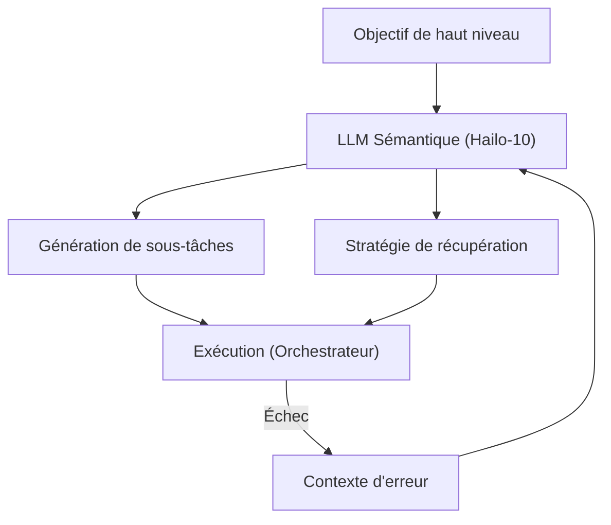

<p align="center">
  
</p>

# 🧩 HYDRA-UMC-SEMANTIC-PLANNER

<p align="center"><a href="README.md">🇺🇸 English</a> | <a href="README_spa.md">🇪🇸 Español</a> | 🇫🇷 <b>Français</b> | <a href="README_ita.md">🇮🇹 Italiano</a> | <a href="README_deu.md">🇩🇪 Deutsch</a> | <a href="README_zho.md">🇨🇳 简体中文</a> | <a href="README_jpn.md">🇯🇵 日本語</a></p>

### 🧠 Planificateur de mission basé sur LLM et système de récupération logique

<p align="left">
  
  
  
</p>

---

## 1. 🛠️ APERÇU TECHNIQUE

**HYDRA-UMC-SEMANTIC-PLANNER** est l'« orchestrateur logique » du nœud Cognitive AI. Il utilise des LLM locaux (Large Language Models) pour décomposer des objectifs complexes en primitives robotiques exploitables.

Il gère l'ambiguïté de haut niveau et permet la récupération d'erreurs sémantiques : si une tâche échoue (ex : « la pince à vide a perdu son étanchéité »), le planificateur raisonne sur la cause et décide d'augmenter la pression, de réessayer ou de changer pour un outil mécanique.

### Caractéristiques principales :
* 🧩 **Décomposition des tâches (v0) :** Décomposition réelle à base de règles d'un petit vocabulaire d'objectifs connus (ex : « assembler un circuit imprimé ») en commandes robotiques séquentielles. *(implémenté comme de vraies règles de modèle - pas encore un LLM ; voir BUILD ET EXÉCUTION ci-dessous)*
* 🛡️ **Récupération sémantique (v0) :** Recherche réelle à base de règles depuis des codes d'erreur MCU structurés vers une action de récupération. *(implémenté comme une véritable table explicite sur un vocabulaire de codes connu ; les codes inconnus escaladent toujours vers un humain)*
* 🤖 **Flux de travail agentique :** Fonctionne comme un agent local capable d'interroger l'état du système et les outils. *(prévu)*
* ⚡ **Optimisé pour Hailo-10 :** Exploite 40 TOPS pour un raisonnement rapide en plusieurs étapes. *(prévu - nécessite le vrai LLM local)*
* 👨‍👩‍👧 **Enfant du Cognitive AI Node :** Fonctionne comme l'un des
  quatre services frères sous [HYDRA-UMC-COGNITIVE-NODE](https://github.com/JuanenRac/HYDRA-UMC-COGNITIVE-NODE)
  (aux côtés de VLA-Engine, Voice-UI et Docs-QA), partageant l'image
  HydraOS et les poids de modèles de son parent au lieu de conserver ses
  propres copies.
* 📦 **Versionnage compteur kilométrique :** Chaque build réel incrémente
  automatiquement la version de `pyproject.toml` (`bump_version.py`) - pas
  de modification manuelle de version.

---

## 2. 🔄 CYCLE DE PLANIFICATION



---

## 3. 🧱 ARCHITECTURE & DÉCISIONS DE CONCEPTION

Ce dépôt est un **enfant** de la famille Cognitive AI Node - son parent,
[HYDRA-UMC-COGNITIVE-NODE](https://github.com/JuanenRac/HYDRA-UMC-COGNITIVE-NODE),
détient l'image HydraOS partagée et les poids de modèles quantifiés, et
relie ce service dans son `docker-compose.yml` aux côtés de ses trois
frères (VLA-Engine, Voice-UI, Docs-QA) :

* **Pourquoi cet enfant n'a pas de matériel/firmware/`os/`/`models/`
  propres.** Il fonctionne entièrement sur le module CM5 + Hailo-10 M.2
  déjà détenu par le parent - centraliser les poids de modèles et
  l'image HydraOS à un seul endroit évite quatre copies divergentes de
  plusieurs gigaoctets au sein de la famille.
* **Pourquoi une structure `src/`.** Sépare le paquet installable
  (`hydra_umc_semantic_planner`) de l'outillage à la racine du dépôt
  (`bump_version.py`), conformément au reste des projets Python de
  l'écosystème.
* **Pourquoi le point d'entrée se contente d'afficher
  identité/version/rôle aujourd'hui.** C'est l'étape d'échafaudage :
  prouver que le paquet s'installe, se compile et s'importe correctement
  - sur la version Python cible réelle - est un prérequis avant d'ajouter
  une vraie logique de planification/récupération basée sur LLM, et
  isole ce travail ultérieur des préoccupations d'empaquetage.
* **Comment cela s'intègre dans le reste de l'écosystème.** Ce
  planificateur est le cœur décisionnel du Cognitive AI Node : il
  consomme l'intention de son frère HYDRA-UMC-VOICE-UI et les jetons
  d'action de son frère HYDRA-UMC-VLA-ENGINE, et envoie les décisions de
  mission résultantes en aval vers HYDRA-UMC-ORCHESTRATOR pour
  exécution physique.
* **Pourquoi `decompose.py` est de vraies règles regex, pas un LLM
  local.** Un petit vocabulaire réel d'objectifs (assembler/pick-and-
  place/inspecter) est entièrement et honnêtement couvert par des règles
  aujourd'hui - le même raisonnement que le vrai index TF-IDF du frère
  HYDRA-UMC-DOCS-QA plutôt qu'un modèle d'embeddings : un noyau réel et
  testable maintenant, qu'un futur planificateur basé sur LLM pourra
  remplacer derrière le même contrat `decompose_goal()`.
* **Pourquoi les codes d'erreur de `recovery.py` correspondent au
  vocabulaire de l'adaptateur MCU documenté dans le manuel
  d'architecture BIBLIA.** `INVALID_STATE`/`OUT_OF_RANGE`/
  `ESTOP_ACTIVE`/`TOOL_INCOMPATIBLE`/`TIMEOUT`/`UNSUPPORTED` sont les
  vraies erreurs structurées que cet adaptateur est conçu pour renvoyer
  - une logique de récupération construite dès aujourd'hui contre ce
  vrai vocabulaire reste valide une fois l'adaptateur lui-même en place,
  au lieu d'inventer une taxonomie d'erreurs parallèle qu'il faudrait
  réconcilier plus tard.
* **Pourquoi `ESTOP_ACTIVE`/`UNSUPPORTED`/les codes inconnus escaladent
  toujours vers un humain.** Conforme à la règle de sécurité de tout
  l'écosystème selon laquelle les couches IA, UI et cloud ne remplacent
  jamais une condition de sécurité physique - ce planificateur propose
  une action de récupération, il ne lève jamais un E-STOP ni ne devine
  face à une erreur qu'il ne reconnaît pas.

---

## 📂 STRUCTURE DES RÉPERTOIRES

```text
HYDRA-UMC-SEMANTIC-PLANNER/
├── src/hydra_umc_semantic_planner/
│   ├── primitives.py                  # Vrai vocabulaire fermé de primitives de commande robot
│   ├── decompose.py                    # Décomposition réelle de tâches à base de règles
│   ├── recovery.py                      # Récupération sémantique réelle d'erreurs à base de règles
│   └── main.py                            # Point d'entrée + sous-commandes réelles `decompose`/`recover`
├── tests/                            # Tests réels : décomposition, récupération, CLI de bout en bout
├── docs/                             # Documentation et base de connaissances
├── images/                           # Médias et diagrammes
├── scripts/                          # Scripts utilitaires
├── build/                            # Sortie de build locale (ignorée par git)
├── pyproject.toml                    # Métadonnées du paquet (version 0.0.4, incrément type compteur kilométrique)
├── bump_version.py                   # Incrément de version type compteur kilométrique (utilisé par build.sh/.bat)
├── build.sh / build.bat              # Crée le venv, installe (avec extras dev), exécute les tests, vérifie l'import
└── run.sh / run.bat                  # Exécute le point d'entrée (transmet les arguments, ex. `decompose`)
```

> **Remarque :** `hardware/` et `firmware/` ont été supprimés - ce nœud
> fonctionne sur un module CM5 + Hailo-10 M.2 déjà existant, sans
> conception matérielle/firmware propre. `os/` et `models/` ont également
> été supprimés - l'image HydraOS et les poids de modèles Hailo-10
> partagés se trouvent dans le projet parent
> `HYDRA-UMC-COGNITIVE-NODE`, auquel ce projet se rattache en tant que
> service (voir son `docker-compose.yml`).

---

## ⚙️ BUILD ET EXÉCUTION

Nécessite Python >= 3.10.

```bash
# Linux / macOS / Git Bash
./build.sh   # crée .venv, installe le paquet (éditable), vérifie l'import
./run.sh     # exécute le point d'entrée

# Windows (cmd)
build.bat
run.bat
```

`build.sh`/`build.bat` incrémentent la version (type compteur
kilométrique, voir `bump_version.py`) avant chaque build réel, et
exécutent la vraie suite de tests (`pytest tests/`). Sortie attendue
d'un `run.sh` sans argument :

```text
HYDRA-UMC-SEMANTIC-PLANNER v0.0.4
Semantic Planner (Hailo-10) - decomposes high-level goals into robotic primitives and recovers from execution failures.
```

Les vraies sous-commandes décomposent un objectif ou proposent une
récupération :

```bash
./run.sh decompose "assembler la pcb"
./run.sh recover --component gripper --error-code GRIP_LOST_SEAL --detail "vacuum gripper lost seal"

# Windows
run.bat decompose "assembler la pcb"
run.bat recover --component gripper --error-code GRIP_LOST_SEAL --detail "vacuum gripper lost seal"
```

### 🩺 Dépannage

* **`python : commande introuvable` / le build échoue à l'étape 1.**
  Nécessite Python >= 3.10 dans le `PATH`. Sous Windows, installez-le
  depuis [python.org](https://python.org) et cochez "Add to PATH" lors de
  l'installation ; sous Linux/macOS, c'est généralement `python3`.
* **`build.sh` n'arrive pas à activer le venv.** `python3 -m venv .venv`
  place le script d'activation à un emplacement différent selon la
  plateforme : `.venv/bin/activate` sous Linux/macOS,
  `.venv/Scripts/activate` sous Windows (également pour un venv Python
  Windows utilisé depuis Git Bash). `build.sh` vérifie déjà les deux
  chemins - si cela échoue toujours, supprimez `.venv/` et relancez
  `./build.sh` pour le reconstruire entièrement.
* **`pip install -e .` échoue.** Généralement dû à un `.venv/` obsolète.
  Supprimez le dossier `.venv/` et relancez `./build.sh`/`build.bat` pour
  le recréer.
* **`import OK` ne s'affiche jamais.** Signifie que `python -c "import
  hydra_umc_semantic_planner"` a lui-même échoué - relancez avec le venv
  actif pour voir la vraie trace d'erreur.

---

## 🚀 ROADMAP
* **Phase 1 :** Déploiement du moteur VLA et traitement des entrées multimodales sur Hailo-10.
* **Phase 2 :** Intégration du planificateur sémantique avec des modèles de comportement en essaim et une mémoire à long terme.
* **Phase 3 :** Exécution locale à faible latence de l'interface vocale et suppression du bruit industriel.
* **Phase 4 :** Coordination multi-agents pour la décomposition d'objectifs partagés et optimisation de la récupération sémantique.

---

## 🔗 PROJETS LIÉS

Ce projet fait partie d'un écosystème robotique plus large du même auteur (JuanenRac / Electro Hobby 3D), couvrant firmware, logiciel de contrôle, nœuds IA et outillage de flotte.

### Directement liés à ce planificateur

- **[HYDRA-UMC-ORCHESTRATOR](https://github.com/JuanenRac/HYDRA-UMC-ORCHESTRATOR)** — reçoit les décisions de mission de ce planificateur.

### Reste de l'écosystème

**Plateforme HYDRA-UMC** — la micro-usine multi-robots
- **[HYDRA-UMC](https://github.com/JuanenRac/HYDRA-UMC)** — la carte mère elle-même : hôte Raspberry Pi CM5 + coprocesseur temps réel STM32H745 double cœur, orchestrant jusqu'à 8 bras robotiques distribués via CAN-OTA/SPI-OTA.
- **[HYDRA-UMC SERVER](https://github.com/JuanenRac/HYDRA-UMC-SERVER)** — backend Express/WebSocket headless détenant l'état des robots.
- **[HYDRA-UMC STUDIO](https://github.com/JuanenRac/HYDRA-UMC-STUDIO)** — tableau de bord de contrôle web.
- **[HYDRA-UMC-ANDROID-CONTROL](https://github.com/JuanenRac/HYDRA-UMC-ANDROID-CONTROL)** — application Android de contrôle pour HYDRA-UMC.
- **[HYDRA-UMC-IOS-CONTROL](https://github.com/JuanenRac/HYDRA-UMC-IOS-CONTROL)** — application iOS/iPadOS de contrôle pour HYDRA-UMC.
- **[HYDRA-UMC-SUITE](https://github.com/JuanenRac/HYDRA-UMC-SUITE)** — centre de commande de bureau pour l'essaim.
- **[HYDRA-UMC-EDITOR-URDF](https://github.com/JuanenRac/HYDRA-UMC-EDITOR-URDF)** — créateur/éditeur graphique de bureau pour modèles URDF.
- **[HYDRA-UMC-DSI](https://github.com/JuanenRac/HYDRA-UMC-DSI)** — interface tactile native pour HYDRA-UMC.

**Plateforme URTC** — le contrôleur de tête d'outil que porte chaque bras HYDRA-UMC
- **[URTC](https://github.com/JuanenRac/URTC)** — Universal Robot Tool Controller, firmware.
- **[URTC Flasher](https://github.com/JuanenRac/URTC-FLASHER)** — outil de bureau de flashage CAN-OTA + SWD/JTAG.
- **[URTC Tester](https://github.com/JuanenRac/URTC-TESTER)** — outil de bureau de diagnostic CAN en direct.
- **[URTC Web Studio](https://github.com/JuanenRac/URTC-WEB-STUDIO)** — alternative navigateur aux 2 outils de bureau ci-dessus.

**👁️ Vision AI Node (Hailo-8)**
- [HYDRA-UMC-VISION-NODE](https://github.com/JuanenRac/HYDRA-UMC-VISION-NODE)
- [HYDRA-UMC-VISION-STREAMER](https://github.com/JuanenRac/HYDRA-UMC-VISION-STREAMER)
- [HYDRA-UMC-DETECTION-HEF](https://github.com/JuanenRac/HYDRA-UMC-DETECTION-HEF)
- [HYDRA-UMC-SAFETY-ZONES](https://github.com/JuanenRac/HYDRA-UMC-SAFETY-ZONES)
- [HYDRA-UMC-VISUAL-SERVOING-API](https://github.com/JuanenRac/HYDRA-UMC-VISUAL-SERVOING-API)

**🐝 Orchestration & Swarm**
- [HYDRA-UMC-SWARM-SYNC](https://github.com/JuanenRac/HYDRA-UMC-SWARM-SYNC)
- [HYDRA-UMC-PATH-PLANNER-3D](https://github.com/JuanenRac/HYDRA-UMC-PATH-PLANNER-3D)
- [HYDRA-UMC-JOB-DISPATCHER](https://github.com/JuanenRac/HYDRA-UMC-JOB-DISPATCHER)
- [HYDRA-UMC-NODE-HEALING](https://github.com/JuanenRac/HYDRA-UMC-NODE-HEALING)

**🎮 Digital Twin & Simulation**
- [HYDRA-UMC-TWIN](https://github.com/JuanenRac/HYDRA-UMC-TWIN)
- [HYDRA-UMC-PHYSICS-REPLICA](https://github.com/JuanenRac/HYDRA-UMC-PHYSICS-REPLICA)
- [HYDRA-UMC-HIL-BRIDGE](https://github.com/JuanenRac/HYDRA-UMC-HIL-BRIDGE)
- [HYDRA-UMC-SYNTHETIC-DATA-GEN](https://github.com/JuanenRac/HYDRA-UMC-SYNTHETIC-DATA-GEN)

**📊 Data & Analytics**
- [HYDRA-UMC-DATALAKE](https://github.com/JuanenRac/HYDRA-UMC-DATALAKE)
- [HYDRA-UMC-TELEMETRY-COLLECTOR](https://github.com/JuanenRac/HYDRA-UMC-TELEMETRY-COLLECTOR)
- [HYDRA-UMC-ANOMALY-DETECTOR](https://github.com/JuanenRac/HYDRA-UMC-ANOMALY-DETECTOR)
- [HYDRA-UMC-PRODUCTION-REPORTS](https://github.com/JuanenRac/HYDRA-UMC-PRODUCTION-REPORTS)

**🏭 Industrial Gateway**
- [HYDRA-UMC-GATEWAY-INDUSTRIAL](https://github.com/JuanenRac/HYDRA-UMC-GATEWAY-INDUSTRIAL)
- [HYDRA-UMC-OPCUA-SERVER](https://github.com/JuanenRac/HYDRA-UMC-OPCUA-SERVER)
- [HYDRA-UMC-MQTT-BROKER](https://github.com/JuanenRac/HYDRA-UMC-MQTT-BROKER)
- [HYDRA-UMC-MTCONNECT-ADAPTER](https://github.com/JuanenRac/HYDRA-UMC-MTCONNECT-ADAPTER)

**🛠️ Complementary Tools**
- [URTC-SMART-RACK](https://github.com/JuanenRac/URTC-SMART-RACK)
- [URTC-VISION-TOOL](https://github.com/JuanenRac/URTC-VISION-TOOL)
- [HYDRA-UMC-WATCH](https://github.com/JuanenRac/HYDRA-UMC-WATCH)
- [HYDRA-UMC-TOOL-CLI](https://github.com/JuanenRac/HYDRA-UMC-TOOL-CLI)
- [HYDRA-UMC-DASHBOARD-AI](https://github.com/JuanenRac/HYDRA-UMC-DASHBOARD-AI)

---

## 👤 AUTEUR
**JuanenRac** (Electro Hobby 3D)
📧 electrohobby3d@gmail.com

## 📜 LICENCE
GPL-3.0 - Voir le fichier LICENSE pour plus de détails.
