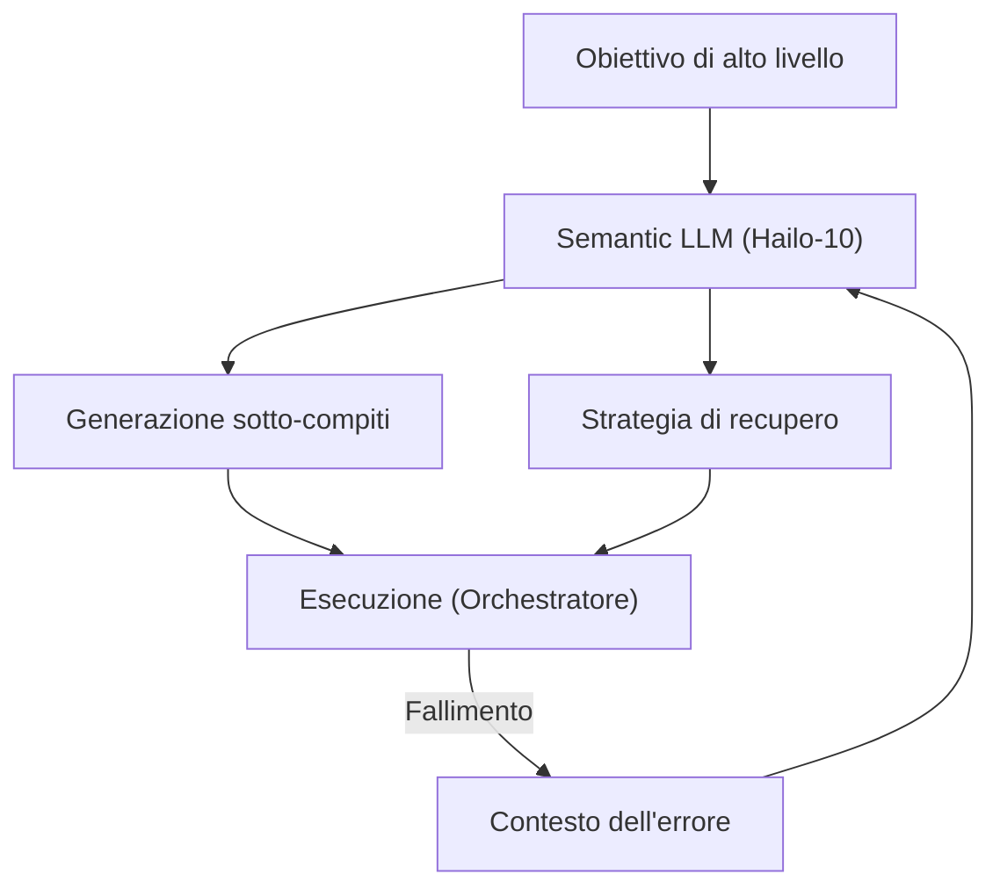

<p align="center">
  
</p>

# 🧩 HYDRA-UMC-SEMANTIC-PLANNER

<p align="center"><a href="README.md">🇺🇸 English</a> | <a href="README_spa.md">🇪🇸 Español</a> | <a href="README_fra.md">🇫🇷 Français</a> | 🇮🇹 <b>Italiano</b> | <a href="README_deu.md">🇩🇪 Deutsch</a> | <a href="README_zho.md">🇨🇳 简体中文</a> | <a href="README_jpn.md">🇯🇵 日本語</a></p>

### 🧠 Pianificatore di missioni basato su LLM e sistema di recupero logico

<p align="left">
  
  
  
</p>

---

## 1. 🛠️ PANORAMICA TECNICA

**HYDRA-UMC-SEMANTIC-PLANNER** è l'«orchestratore logico» del Cognitive AI Node. Utilizza LLM (Large Language Models) locali per decomporre obiettivi complessi in primitive robotiche azionabili.

Gestisce l'ambiguità di alto livello e fornisce il recupero semantico degli errori: se un compito fallisce (ad esempio, «la pinza a vuoto ha perso la tenuta»), il pianificatore ragiona sulla causa e decide se aumentare la pressione, riprovare o passare a uno strumento meccanico.

### Caratteristiche principali:
* 🧩 **Decomposizione dei compiti (v0):** Scomposizione reale basata su regole di un piccolo vocabolario di obiettivi noti (es. «assemblare PCB») in comandi robotici sequenziali. *(implementato come vere regole a modello - non ancora un LLM; vedi BUILD ED ESECUZIONE sotto)*
* 🛡️ **Recupero semantico (v0):** Ricerca reale basata su regole da codici di errore MCU strutturati a un'azione di recupero. *(implementato come una vera tabella esplicita su un vocabolario di codici noto; i codici sconosciuti passano sempre a un umano)*
* ✅ **Validazione delle precondizioni:** Ogni piano decomposto viene verificato rispetto a ciò di cui ogni primitiva reale ha realmente bisogno prima di essere consegnato - un piano che fallisce viene rifiutato, mai passato silenziosamente come pronto per l'esecuzione. *(implementato)*
* 🎲 **Deterministico e testato per proprietà:** `decompose_goal()` è dimostrato deterministico (stesso obiettivo, stesso piano, sempre) ed è testato tramite fuzzing su centinaia di obiettivi casuali/non validi - non va mai in crash, non restituisce mai un piano malformato. *(implementato)*
* 🤖 **Workflow agenziale:** Opera come un agente locale in grado di interrogare lo stato del sistema e gli strumenti. *(pianificato)*
* ⚡ **Ottimizzato per Hailo-10:** Sfrutta 40 TOPS per un ragionamento rapido in più passaggi. *(pianificato - richiede il vero LLM locale)*
* 👨‍👩‍👧 **Figlio del Cognitive AI Node:** Gira come uno dei quattro
  servizi fratelli sotto [HYDRA-UMC-COGNITIVE-NODE](https://github.com/JuanenRac/HYDRA-UMC-COGNITIVE-NODE)
  (insieme a VLA-Engine, Voice-UI e Docs-QA), condividendo l'immagine
  HydraOS e i pesi dei modelli del padre invece di mantenere copie
  proprie.
* 📦 **Versionamento Contachilometri:** Ogni build reale incrementa
  automaticamente la versione di `pyproject.toml` (`bump_version.py`) -
  nessuna modifica manuale della versione.

---

## 2. 🔄 CICLO DI PIANIFICAZIONE



---

## 3. 🧱 ARCHITETTURA E DECISIONI DI PROGETTAZIONE

Questo repository è un **figlio** della famiglia Cognitive AI Node - il
suo padre, [HYDRA-UMC-COGNITIVE-NODE](https://github.com/JuanenRac/HYDRA-UMC-COGNITIVE-NODE),
possiede l'immagine HydraOS condivisa e i pesi dei modelli quantizzati, e
collega questo servizio nel suo `docker-compose.yml` insieme ai suoi tre
fratelli (VLA-Engine, Voice-UI, Docs-QA):

* **Perché questo figlio non ha hardware/firmware/`os/`/`models/`
  propri.** Gira interamente sul modulo CM5 + Hailo-10 M.2 già posseduto
  dal padre - centralizzare i pesi dei modelli e l'immagine HydraOS in un
  unico posto evita quattro copie divergenti di più gigabyte all'interno
  della famiglia.
* **Perché una struttura `src/`.** Mantiene il pacchetto installabile
  (`hydra_umc_semantic_planner`) separato dal tooling nella radice del
  repo (`bump_version.py`), coerentemente con il resto dei progetti
  Python dell'ecosistema.
* **Perché il punto di ingresso oggi si limita a stampare
  identità/versione/ruolo.** Questa è la fase di andamiaje
  (impalcatura): dimostrare che il pacchetto si installa, compila e
  importa correttamente - sulla versione Python reale di destinazione -
  è un prerequisito prima di aggiungere la vera logica di
  pianificazione/recupero basata su LLM, e mantiene quel lavoro
  successivo isolato dalle questioni di packaging.
* **Come si inserisce nel resto dell'ecosistema.** Questo pianificatore
  è il nucleo decisionale del Cognitive AI Node: consuma l'intento dal
  suo fratello HYDRA-UMC-VOICE-UI e i token di azione dal suo fratello
  HYDRA-UMC-VLA-ENGINE, e invia le decisioni di missione risultanti a
  valle verso HYDRA-UMC-ORCHESTRATOR per l'esecuzione fisica.
* **Perché `decompose.py` sono vere regole regex, non un LLM locale.**
  Un piccolo vocabolario reale di obiettivi (assemblare/pick-and-place/
  ispezionare) è coperto interamente e onestamente da regole oggi - lo
  stesso ragionamento del vero indice TF-IDF del fratello
  HYDRA-UMC-DOCS-QA invece di un modello di embedding: un nucleo reale e
  testabile ora, che un futuro pianificatore basato su LLM potrà
  sostituire dietro lo stesso contratto `decompose_goal()`.
* **Perché i codici di errore di `recovery.py` corrispondono al contratto
  pubblico di recupero.** `INVALID_STATE`/`OUT_OF_RANGE`/`ESTOP_ACTIVE`/
  `TOOL_INCOMPATIBLE`/`TIMEOUT`/`UNSUPPORTED` sono i veri errori
  strutturati che quell'adattatore è progettato per restituire - una
  logica di recupero costruita oggi contro questo vero vocabolario resta
  valida quando l'adattatore stesso esisterà, invece di inventare una
  tassonomia di errori parallela da riconciliare in seguito.
* **Perché `ESTOP_ACTIVE`/`UNSUPPORTED`/i codici sconosciuti passano
  sempre a un umano.** Coerente con la regola di sicurezza di tutto
  l'ecosistema secondo cui i livelli IA, UI e cloud non annullano mai
  una condizione di sicurezza fisica - questo pianificatore propone
  un'azione di recupero, non annulla mai un E-STOP né indovina di
  fronte a un errore che non riconosce.
* **Perché `validation.py` esiste anche se i veri modelli di
  `decompose.py` non producono mai realmente un piano non valido.**
  Un modello fisso può garantire parametri ben formati per
  costruzione - un futuro pianificatore basato su LLM non può farlo.
  `validate_plan()` è il contratto reale ed esplicito che quel
  pianificatore dovrebbe soddisfare, verificato qui e ora contro
  l'unico pianificatore che esiste oggi, così che il contratto stesso
  sia dimostrato corretto prima che qualcosa di più difficile debba
  soddisfarlo.
* **Perché `decompose_goal()` viene testato tramite fuzzing con un
  seed casuale fisso invece che con `hypothesis`.** Questo progetto
  (come il resto dell'ecosistema) rimane basato esclusivamente sulla
  libreria standard - un ciclo riproducibile e con seed di
  `random.Random` su centinaia di obiettivi sintetici ottiene la
  stessa proprietà reale (non va mai in crash, non restituisce mai un
  piano malformato) senza aggiungere una nuova dipendenza.

---

## 📂 STRUTTURA DELLE CARTELLE

```text
HYDRA-UMC-SEMANTIC-PLANNER/
├── src/hydra_umc_semantic_planner/
│   ├── primitives.py                  # Vero vocabolario chiuso di primitive di comando del robot
│   ├── decompose.py                    # Decomposizione reale dei compiti basata su regole
│   ├── recovery.py                      # Recupero semantico reale degli errori basato su regole
│   ├── validation.py                    # Validazione reale delle precondizioni su un Plan decomposto
│   └── main.py                            # Punto di ingresso + sottocomandi reali `decompose`/`recover`
├── tests/                            # Test reali: decomposizione, recupero, validazione, test di proprietà, CLI end-to-end
├── docs/                             # Documentazione e base di conoscenza
│   ├── CLI_REFERENCE.md               # Contratto pubblico da riga di comando
│   └── RECOVERY_CONTRACT.md           # Vocabolario pubblico di recupero
├── images/                           # Media e diagrammi
├── scripts/                          # Script di utilità
├── build/                            # Output di build locale (ignorato da git)
├── pyproject.toml                    # Metadati del pacchetto (versione 0.0.7, incremento stile contachilometri)
├── bump_version.py                   # Incremento versione stile contachilometri (usato da build.sh/.bat)
├── build.sh / build.bat              # Crea il venv, installa (con extra dev), esegue i test, verifica l'import
└── run.sh / run.bat                  # Esegue il punto di ingresso (inoltra gli argomenti, es. `decompose`)
```

> **Nota:** `hardware/` e `firmware/` sono stati potati - questo nodo
> funziona su un modulo CM5 + Hailo-10 M.2 già esistente, senza un
> progetto hardware/firmware proprio. Sono stati potati anche `os/` e
> `models/` - l'immagine HydraOS e i pesi dei modelli Hailo-10 condivisi
> risiedono nel progetto padre `HYDRA-UMC-COGNITIVE-NODE`, a cui questo
> progetto si collega come servizio (vedi il suo `docker-compose.yml`).

---

## ⚙️ BUILD ED ESECUZIONE

Richiede Python >= 3.10.

```bash
# Linux / macOS / Git Bash
./build.sh   # crea .venv, installa il pacchetto (editable), verifica l'import
./run.sh     # esegue il punto di ingresso

# Windows (cmd)
build.bat
run.bat
```

`build.sh`/`build.bat` incrementano la versione (stile contachilometri,
vedi `bump_version.py`) prima di ogni build reale, ed eseguono la vera
suite di test (`pytest tests/`). Output atteso di un `run.sh` senza
argomenti:

```text
HYDRA-UMC-SEMANTIC-PLANNER v0.0.7
Semantic Planner (Hailo-10) - decomposes high-level goals into robotic primitives and recovers from execution failures.
```

I sottocomandi reali scompongono un obiettivo o propongono un recupero:

```bash
./run.sh decompose "assembla la pcb"
./run.sh recover --component gripper --error-code GRIP_LOST_SEAL --detail "vacuum gripper lost seal"

# Windows
run.bat decompose "assembla la pcb"
run.bat recover --component gripper --error-code GRIP_LOST_SEAL --detail "vacuum gripper lost seal"
```

Ogni piano reale decomposto viene verificato rispetto alle vere
precondizioni di `validation.py` prima di essere stampato. I modelli
propri di `decompose.py` passano sempre; un piano che fallisse
verrebbe invece rifiutato:

```text
Plan for: "broken" FAILED precondition validation:
  step 1 (GRIP): missing required param 'target'
```

### 🩺 Risoluzione dei problemi

* **`python: comando non trovato` / il build fallisce al passo 1.**
  Richiede Python >= 3.10 nel `PATH`. Su Windows, installalo da
  [python.org](https://python.org) e spunta "Add to PATH" durante
  l'installazione; su Linux/macOS di solito si chiama `python3`.
* **`build.sh` non riesce ad attivare il venv.** `python3 -m venv .venv`
  posiziona lo script di attivazione in un percorso diverso a seconda
  della piattaforma: `.venv/bin/activate` su Linux/macOS,
  `.venv/Scripts/activate` su Windows (anche per un venv Python Windows
  usato da Git Bash). `build.sh` verifica già entrambi i percorsi - se
  continua a fallire, elimina `.venv/` e riesegui `./build.sh` per
  ricrearlo da zero.
* **`pip install -e .` fallisce.** Di solito per un `.venv/` obsoleto.
  Elimina la cartella `.venv/` e riesegui `./build.sh`/`build.bat` per
  ricrearla.
* **`import OK` non viene mai stampato.** Significa che `python -c
  "import hydra_umc_semantic_planner"` è fallito - riesegui con il venv
  attivo per vedere il traceback reale.

---

## 🚀 TABELLA DI MARCIA
* **Fase 1:** Distribuzione del motore VLA e elaborazione dell'input multi-modale su Hailo-10.
* **Fase 2:** Integrazione del pianificatore semantico con modelli comportamentali di sciame e memoria a lungo termine.
* **Fase 3:** Esecuzione locale a bassa latenza dell'interfaccia vocale e cancellazione del rumore industriale.
* **Fase 4:** Coordinamento multi-agente per la decomposizione di obiettivi condivisi e ottimizzazione del recupero semantico.

---

## 🔗 PROGETTI CORRELATI

Questo progetto fa parte di un ecosistema robotico più ampio dello stesso autore (JuanenRac / Electro Hobby 3D), che copre firmware, software di controllo, nodi AI e strumenti di flotta.

### Famiglia

**Genitore:** **[HYDRA-UMC-COGNITIVE-NODE](https://github.com/JuanenRac/HYDRA-UMC-COGNITIVE-NODE)** — l'Hub di Integrazione che possiede l'immagine/i pesi HydraOS condivisi di questo planner e lo collega al flusso cognitivo.

**Fratelli:**
- **[HYDRA-UMC-VOICE-UI](https://github.com/JuanenRac/HYDRA-UMC-VOICE-UI)** — gateway STT/TTS; fornisce a questo planner il proprio input vocale/testuale.
- **[HYDRA-UMC-VLA-ENGINE](https://github.com/JuanenRac/HYDRA-UMC-VLA-ENGINE)** — trasforma i dati di visione in token di azione che questo planner consuma.
- **[HYDRA-UMC-DOCS-QA](https://github.com/JuanenRac/HYDRA-UMC-DOCS-QA)** — assistente RAG che fonda le decisioni di questo planner su manuali tecnici.

### Direttamente correlati a questo pianificatore

- **[HYDRA-UMC-ORCHESTRATOR](https://github.com/JuanenRac/HYDRA-UMC-ORCHESTRATOR)** — riceve le decisioni di missione di questo pianificatore.

### Resto dell'ecosistema

**Piattaforma HYDRA-UMC** — la micro-fabbrica multi-robot
- **[HYDRA-UMC](https://github.com/JuanenRac/HYDRA-UMC)** — la scheda madre stessa: host Raspberry Pi CM5 + coprocessore real-time STM32H745 dual-core, che orchestra fino a 8 bracci robotici distribuiti via CAN-OTA/SPI-OTA.
- **[HYDRA-UMC SERVER](https://github.com/JuanenRac/HYDRA-UMC-SERVER)** — backend Express/WebSocket headless che possiede lo stato dei robot.
- **[HYDRA-UMC STUDIO](https://github.com/JuanenRac/HYDRA-UMC-STUDIO)** — dashboard di controllo web.
- **[HYDRA-UMC-ANDROID-CONTROL](https://github.com/JuanenRac/HYDRA-UMC-ANDROID-CONTROL)** — app Android di controllo per HYDRA-UMC.
- **[HYDRA-UMC-IOS-CONTROL](https://github.com/JuanenRac/HYDRA-UMC-IOS-CONTROL)** — app iOS/iPadOS di controllo per HYDRA-UMC.
- **[HYDRA-UMC-SUITE](https://github.com/JuanenRac/HYDRA-UMC-SUITE)** — centro di comando desktop per lo sciame.
- **[HYDRA-UMC-EDITOR-URDF](https://github.com/JuanenRac/HYDRA-UMC-EDITOR-URDF)** — creatore/editor grafico desktop per modelli URDF.
- **[HYDRA-UMC-DSI](https://github.com/JuanenRac/HYDRA-UMC-DSI)** — UI touch nativa per HYDRA-UMC.

**Piattaforma URTC** — il controller della testa utensile che ogni braccio HYDRA-UMC porta
- **[URTC](https://github.com/JuanenRac/URTC)** — Universal Robot Tool Controller, firmware.
- **[URTC Flasher](https://github.com/JuanenRac/URTC-FLASHER)** — strumento desktop di flashing CAN-OTA + SWD/JTAG.
- **[URTC Tester](https://github.com/JuanenRac/URTC-TESTER)** — strumento desktop di diagnostica CAN live.
- **[URTC Web Studio](https://github.com/JuanenRac/URTC-WEB-STUDIO)** — alternativa basata su browser ai 2 strumenti desktop sopra.

**👁️ Nodo di Visione IA (Hailo-8)**
- [HYDRA-UMC-VISION-NODE](https://github.com/JuanenRac/HYDRA-UMC-VISION-NODE)
- [HYDRA-UMC-VISION-STREAMER](https://github.com/JuanenRac/HYDRA-UMC-VISION-STREAMER)
- [HYDRA-UMC-DETECTION-HEF](https://github.com/JuanenRac/HYDRA-UMC-DETECTION-HEF)
- [HYDRA-UMC-SAFETY-ZONES](https://github.com/JuanenRac/HYDRA-UMC-SAFETY-ZONES)
- [HYDRA-UMC-VISUAL-SERVOING-API](https://github.com/JuanenRac/HYDRA-UMC-VISUAL-SERVOING-API)

**🐝 Orchestrazione e Sciame**
- [HYDRA-UMC-SWARM-SYNC](https://github.com/JuanenRac/HYDRA-UMC-SWARM-SYNC)
- [HYDRA-UMC-PATH-PLANNER-3D](https://github.com/JuanenRac/HYDRA-UMC-PATH-PLANNER-3D)
- [HYDRA-UMC-JOB-DISPATCHER](https://github.com/JuanenRac/HYDRA-UMC-JOB-DISPATCHER)
- [HYDRA-UMC-NODE-HEALING](https://github.com/JuanenRac/HYDRA-UMC-NODE-HEALING)

**🎮 Gemello Digitale e Simulazione**
- [HYDRA-UMC-TWIN](https://github.com/JuanenRac/HYDRA-UMC-TWIN)
- [HYDRA-UMC-PHYSICS-REPLICA](https://github.com/JuanenRac/HYDRA-UMC-PHYSICS-REPLICA)
- [HYDRA-UMC-HIL-BRIDGE](https://github.com/JuanenRac/HYDRA-UMC-HIL-BRIDGE)
- [HYDRA-UMC-SYNTHETIC-DATA-GEN](https://github.com/JuanenRac/HYDRA-UMC-SYNTHETIC-DATA-GEN)

**📊 Dati e Analisi**
- [HYDRA-UMC-DATALAKE](https://github.com/JuanenRac/HYDRA-UMC-DATALAKE)
- [HYDRA-UMC-TELEMETRY-COLLECTOR](https://github.com/JuanenRac/HYDRA-UMC-TELEMETRY-COLLECTOR)
- [HYDRA-UMC-ANOMALY-DETECTOR](https://github.com/JuanenRac/HYDRA-UMC-ANOMALY-DETECTOR)
- [HYDRA-UMC-PRODUCTION-REPORTS](https://github.com/JuanenRac/HYDRA-UMC-PRODUCTION-REPORTS)

**🏭 Gateway Industriale**
- [HYDRA-UMC-GATEWAY-INDUSTRIAL](https://github.com/JuanenRac/HYDRA-UMC-GATEWAY-INDUSTRIAL)
- [HYDRA-UMC-OPCUA-SERVER](https://github.com/JuanenRac/HYDRA-UMC-OPCUA-SERVER)
- [HYDRA-UMC-MQTT-BROKER](https://github.com/JuanenRac/HYDRA-UMC-MQTT-BROKER)
- [HYDRA-UMC-MTCONNECT-ADAPTER](https://github.com/JuanenRac/HYDRA-UMC-MTCONNECT-ADAPTER)

**🛠️ Strumenti Complementari**
- [URTC-SMART-RACK](https://github.com/JuanenRac/URTC-SMART-RACK)
- [URTC-VISION-TOOL](https://github.com/JuanenRac/URTC-VISION-TOOL)
- [HYDRA-UMC-WATCH](https://github.com/JuanenRac/HYDRA-UMC-WATCH)
- [HYDRA-UMC-TOOL-CLI](https://github.com/JuanenRac/HYDRA-UMC-TOOL-CLI)
- [HYDRA-UMC-DASHBOARD-AI](https://github.com/JuanenRac/HYDRA-UMC-DASHBOARD-AI)

---

## 👤 AUTORE
**JuanenRac** (Electro Hobby 3D)
📧 electrohobby3d@gmail.com
📺 [youtube.com/@electrohobby3d](https://youtube.com/@electrohobby3d)

## 📜 LICENZA
GPL-3.0 - Vedere LICENSE per i dettagli.
