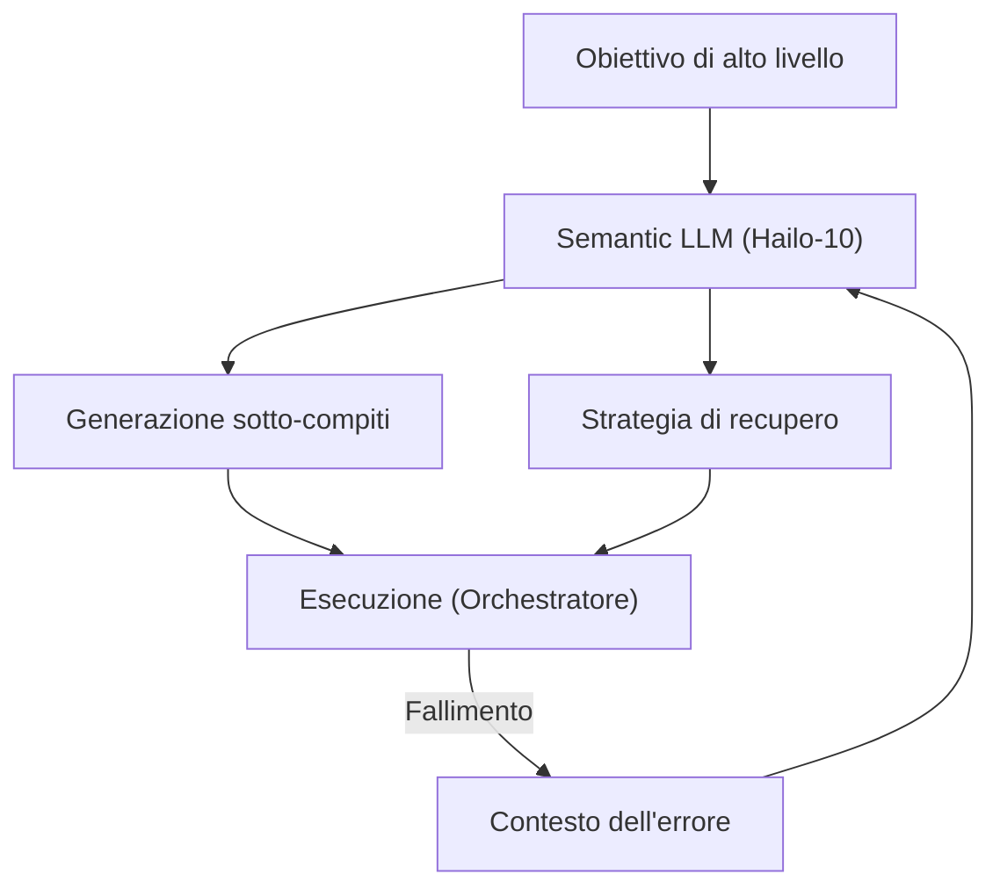

<p align="center">
  
</p>

# 🧩 HYDRA-UMC-SEMANTIC-PLANNER

<p align="center"><a href="README.md">🇺🇸 English</a> | <a href="README_spa.md">🇪🇸 Español</a> | <a href="README_fra.md">🇫🇷 Français</a> | 🇮🇹 <b>Italiano</b> | <a href="README_deu.md">🇩🇪 Deutsch</a> | <a href="README_zho.md">🇨🇳 简体中文</a> | <a href="README_jpn.md">🇯🇵 日本語</a></p>

### 🧠 Pianificatore di missioni basato su LLM e sistema di recupero logico

<p align="left">
  
  
  
</p>

---

## 1. 🛠️ PANORAMICA TECNICA

**HYDRA-UMC-SEMANTIC-PLANNER** è l'«orchestratore logico» del Cognitive AI Node. Utilizza LLM (Large Language Models) locali per decomporre obiettivi complessi in primitive robotiche azionabili.

Gestisce l'ambiguità di alto livello e fornisce il recupero semantico degli errori: se un compito fallisce (ad esempio, «la pinza a vuoto ha perso la tenuta»), il pianificatore ragiona sulla causa e decide se aumentare la pressione, riprovare o passare a uno strumento meccanico.

### Caratteristiche principali:
* 🧩 **Decomposizione dei compiti (v0):** Scomposizione reale basata su regole di un piccolo vocabolario di obiettivi noti (es. «assemblare PCB») in comandi robotici sequenziali. *(implementato come vere regole a modello - non ancora un LLM; vedi BUILD ED ESECUZIONE sotto)*
* 🛡️ **Recupero semantico (v0):** Ricerca reale basata su regole da codici di errore MCU strutturati a un'azione di recupero. *(implementato come una vera tabella esplicita su un vocabolario di codici noto; i codici sconosciuti passano sempre a un umano)*
* ✅ **Validazione delle precondizioni:** Ogni piano decomposto viene verificato rispetto a ciò di cui ogni primitiva reale ha realmente bisogno prima di essere consegnato - un piano che fallisce viene rifiutato, mai passato silenziosamente come pronto per l'esecuzione. *(implementato)*
* 🌐 **API JSON/HTTP (v0.0.7):** il sottocomando `serve` espone la stessa identica logica di `decompose`/`recover` su un `http.server` della stdlib (`POST /decompose`, `POST /recover`, `GET /stats`) per chi non usa la CLI - solo loopback di default, come l'unità `systemd/hydra-umc-semantic-planner.service`. Vedi [`docs/CLI_REFERENCE.md`](docs/CLI_REFERENCE.md) per ogni comando, flag e codice di uscita reale, e [`docs/RECOVERY_CONTRACT.md`](docs/RECOVERY_CONTRACT.md) per il vocabolario pubblico completo dei codici di errore.
* 🎲 **Deterministico e testato per proprietà:** `decompose_goal()` è dimostrato deterministico (stesso obiettivo, stesso piano, sempre) ed è testato tramite fuzzing su centinaia di obiettivi casuali/non validi - non va mai in crash, non restituisce mai un piano malformato. *(implementato)*
* 🤖 **Workflow agenziale:** Opera come un agente locale in grado di interrogare lo stato del sistema e gli strumenti. *(pianificato)*
* ⚡ **Ottimizzato per Hailo-10:** Sfrutta 40 TOPS per un ragionamento rapido in più passaggi. *(pianificato - richiede il vero LLM locale)*
* 👨‍👩‍👧 **Figlio del Cognitive AI Node:** Gira come uno dei quattro
  servizi fratelli sotto [HYDRA-UMC-COGNITIVE-NODE](https://github.com/JuanenRac/HYDRA-UMC-COGNITIVE-NODE)
  (insieme a VLA-Engine, Voice-UI e Docs-QA), condividendo l'immagine
  HydraOS e i pesi dei modelli del padre invece di mantenere copie
  proprie.
* 📦 **Versionamento Contachilometri:** Ogni build reale incrementa
  automaticamente la versione di `pyproject.toml` (`bump_version.py`) -
  nessuna modifica manuale della versione.

---

## 2. 🔄 CICLO DI PIANIFICAZIONE



---

## 3. 🧱 ARCHITETTURA E DECISIONI DI PROGETTAZIONE

Questo repository è un **figlio** della famiglia Cognitive AI Node - il
suo padre, [HYDRA-UMC-COGNITIVE-NODE](https://github.com/JuanenRac/HYDRA-UMC-COGNITIVE-NODE),
possiede l'immagine HydraOS condivisa e i pesi dei modelli quantizzati, e
collega questo servizio nel suo `docker-compose.yml` insieme ai suoi tre
fratelli (VLA-Engine, Voice-UI, Docs-QA):

* **Perché questo figlio non ha hardware/firmware/`os/`/`models/`
  propri.** Gira interamente sul modulo CM5 + Hailo-10 M.2 già posseduto
  dal padre - centralizzare i pesi dei modelli e l'immagine HydraOS in un
  unico posto evita quattro copie divergenti di più gigabyte all'interno
  della famiglia.
* **Perché una struttura `src/`.** Mantiene il pacchetto installabile
  (`hydra_umc_semantic_planner`) separato dal tooling nella radice del
  repo (`bump_version.py`), coerentemente con il resto dei progetti
  Python dell'ecosistema.
* **Perché il punto di ingresso oggi si limita a stampare
  identità/versione/ruolo.** Questa è la fase di andamiaje
  (impalcatura): dimostrare che il pacchetto si installa, compila e
  importa correttamente - sulla versione Python reale di destinazione -
  è un prerequisito prima di aggiungere la vera logica di
  pianificazione/recupero basata su LLM, e mantiene quel lavoro
  successivo isolato dalle questioni di packaging.
* **Come si inserisce nel resto dell'ecosistema.** Questo pianificatore
  è il nucleo decisionale del Cognitive AI Node: consuma l'intento dal
  suo fratello HYDRA-UMC-VOICE-UI e i token di azione dal suo fratello
  HYDRA-UMC-VLA-ENGINE, e invia le decisioni di missione risultanti a
  valle verso HYDRA-UMC-ORCHESTRATOR per l'esecuzione fisica.
* **Perché `decompose.py` sono vere regole regex, non un LLM locale.**
  Un piccolo vocabolario reale di obiettivi (assemblare/pick-and-place/
  ispezionare) è coperto interamente e onestamente da regole oggi - lo
  stesso ragionamento del vero indice TF-IDF del fratello
  HYDRA-UMC-DOCS-QA invece di un modello di embedding: un nucleo reale e
  testabile ora, che un futuro pianificatore basato su LLM potrà
  sostituire dietro lo stesso contratto `decompose_goal()`.
* **Perché i codici di errore di `recovery.py` corrispondono al contratto
  pubblico di recupero.** `INVALID_STATE`/`OUT_OF_RANGE`/`ESTOP_ACTIVE`/
  `TOOL_INCOMPATIBLE`/`TIMEOUT`/`UNSUPPORTED` sono i veri errori
  strutturati che quell'adattatore è progettato per restituire - una
  logica di recupero costruita oggi contro questo vero vocabolario resta
  valida quando l'adattatore stesso esisterà, invece di inventare una
  tassonomia di errori parallela da riconciliare in seguito.
* **Perché `ESTOP_ACTIVE`/`UNSUPPORTED`/i codici sconosciuti passano
  sempre a un umano.** Coerente con la regola di sicurezza di tutto
  l'ecosistema secondo cui i livelli IA, UI e cloud non annullano mai
  una condizione di sicurezza fisica - questo pianificatore propone
  un'azione di recupero, non annulla mai un E-STOP né indovina di
  fronte a un errore che non riconosce.
* **Perché `validation.py` esiste anche se i veri modelli di
  `decompose.py` non producono mai realmente un piano non valido.**
  Un modello fisso può garantire parametri ben formati per
  costruzione - un futuro pianificatore basato su LLM non può farlo.
  `validate_plan()` è il contratto reale ed esplicito che quel
  pianificatore dovrebbe soddisfare, verificato qui e ora contro
  l'unico pianificatore che esiste oggi, così che il contratto stesso
  sia dimostrato corretto prima che qualcosa di più difficile debba
  soddisfarlo.
* **Perché `decompose_goal()` viene testato tramite fuzzing con un
  seed casuale fisso invece che con `hypothesis`.** Questo progetto
  (come il resto dell'ecosistema) rimane basato esclusivamente sulla
  libreria standard - un ciclo riproducibile e con seed di
  `random.Random` su centinaia di obiettivi sintetici ottiene la
  stessa proprietà reale (non va mai in crash, non restituisce mai un
  piano malformato) senza aggiungere una nuova dipendenza.

---

## 📂 STRUTTURA DELLE CARTELLE

```text
HYDRA-UMC-SEMANTIC-PLANNER/
├── src/hydra_umc_semantic_planner/
│   ├── primitives.py                  # Vero vocabolario chiuso di primitive di comando del robot
│   ├── decompose.py                    # Decomposizione reale dei compiti basata su regole
│   ├── recovery.py                      # Recupero semantico reale degli errori basato su regole
│   ├── validation.py                    # Validazione reale delle precondizioni su un Plan decomposto
│   ├── api.py                             # Superficie JSON/HTTP semplice (http.server di stdlib) su decompose/recover
│   └── main.py                            # Punto di ingresso + sottocomandi reali `decompose`/`recover`
├── tests/                            # Test reali: decomposizione, recupero, validazione, api, test di proprietà, CLI end-to-end
├── docs/                             # Documentazione e base di conoscenza
│   ├── CLI_REFERENCE.md               # Contratto pubblico da riga di comando
│   └── RECOVERY_CONTRACT.md           # Vocabolario pubblico di recupero
├── images/                           # Media e diagrammi
├── systemd/
│   └── hydra-umc-semantic-planner.service # Unità systemd della API locale decompose/recover sulla CM5
├── tools/
│   ├── build_test.py                 # Controllo build senza versionamento
│   └── ci_validate.py                # Validazione manifest/CHANGELOG/docs usata dalla CI
├── build/                            # Output di build locale (ignorato da git)
├── pyproject.toml                    # Metadati del pacchetto (versione a incremento contachilometri)
├── bump_manifest_version.py          # Sincronizza la versione di hydra-umc.project.json con quella nativa (--sync)
├── bump_version.py                   # Incremento versione stile contachilometri (usato da build.sh/.bat)
├── build.sh / build.bat              # Crea il venv, installa (con extra dev), esegue i test, verifica l'import
└── run.sh / run.bat                  # Esegue il punto di ingresso (inoltra gli argomenti, es. `decompose`)
```

> **Nota:** `hardware/` e `firmware/` sono stati potati - questo nodo
> funziona su un modulo CM5 + Hailo-10 M.2 già esistente, senza un
> progetto hardware/firmware proprio. Sono stati potati anche `os/` e
> `models/` - l'immagine HydraOS e i pesi dei modelli Hailo-10 condivisi
> risiedono nel progetto padre `HYDRA-UMC-COGNITIVE-NODE`, a cui questo
> progetto si collega come servizio (vedi il suo `docker-compose.yml`).

---

## ⚙️ BUILD ED ESECUZIONE

Richiede Python >= 3.10.

```bash
# Linux / macOS / Git Bash
./build.sh   # crea .venv, installa il pacchetto (editable), verifica l'import
./run.sh     # esegue il punto di ingresso

# Windows (cmd)
build.bat
run.bat
```

`build.sh`/`build.bat` incrementano la versione (stile contachilometri,
vedi `bump_version.py`) prima di ogni build reale, ed eseguono la vera
suite di test (`pytest tests/`). Output atteso di un `run.sh` senza
argomenti:

```text
HYDRA-UMC-SEMANTIC-PLANNER v0.0.7
Semantic Planner (Hailo-10) - decomposes high-level goals into robotic primitives and recovers from execution failures.
```

I sottocomandi reali scompongono un obiettivo o propongono un recupero:

```bash
./run.sh decompose "assembla la pcb"
./run.sh recover --component gripper --error-code GRIP_LOST_SEAL --detail "vacuum gripper lost seal"

# Windows
run.bat decompose "assembla la pcb"
run.bat recover --component gripper --error-code GRIP_LOST_SEAL --detail "vacuum gripper lost seal"
```

Ogni piano reale decomposto viene verificato rispetto alle vere
precondizioni di `validation.py` prima di essere stampato. I modelli
propri di `decompose.py` passano sempre; un piano che fallisse
verrebbe invece rifiutato:

```text
Plan for: "broken" FAILED precondition validation:
  step 1 (GRIP): missing required param 'target'
```

La stessa logica di `decompose`/`recover` è raggiungibile anche via HTTP, per chi non usa la CLI:

```bash
./run.sh serve --addr 127.0.0.1 --port 8109
# in un altro terminale:
curl -s -X POST http://127.0.0.1:8109/decompose -d '{"goal": "assemble the pcb"}'
```

Vedi [`docs/CLI_REFERENCE.md`](docs/CLI_REFERENCE.md) per il riferimento completo di comandi, flag e codici di uscita, e [`docs/RECOVERY_CONTRACT.md`](docs/RECOVERY_CONTRACT.md) per il vocabolario pubblico dei codici di errore di recupero.

### 🩺 Risoluzione dei problemi

* **`python: comando non trovato` / il build fallisce al passo 1.**
  Richiede Python >= 3.10 nel `PATH`. Su Windows, installalo da
  [python.org](https://python.org) e spunta "Add to PATH" durante
  l'installazione; su Linux/macOS di solito si chiama `python3`.
* **`build.sh` non riesce ad attivare il venv.** `python3 -m venv .venv`
  posiziona lo script di attivazione in un percorso diverso a seconda
  della piattaforma: `.venv/bin/activate` su Linux/macOS,
  `.venv/Scripts/activate` su Windows (anche per un venv Python Windows
  usato da Git Bash). `build.sh` verifica già entrambi i percorsi - se
  continua a fallire, elimina `.venv/` e riesegui `./build.sh` per
  ricrearlo da zero.
* **`pip install -e .` fallisce.** Di solito per un `.venv/` obsoleto.
  Elimina la cartella `.venv/` e riesegui `./build.sh`/`build.bat` per
  ricrearla.
* **`import OK` non viene mai stampato.** Significa che `python -c
  "import hydra_umc_semantic_planner"` è fallito - riesegui con il venv
  attivo per vedere il traceback reale.

---

## 🚀 TABELLA DI MARCIA
* **Fase 1:** Distribuzione del motore VLA e elaborazione dell'input multi-modale su Hailo-10.
* **Fase 2:** Integrazione del pianificatore semantico con modelli comportamentali di sciame e memoria a lungo termine.
* **Fase 3:** Esecuzione locale a bassa latenza dell'interfaccia vocale e cancellazione del rumore industriale.
* **Fase 4:** Coordinamento multi-agente per la decomposizione di obiettivi condivisi e ottimizzazione del recupero semantico.

---

## 🔗 Progetti Correlati

Questo progetto fa parte dell'ecosistema robotico HYDRA-UMC dello stesso autore (JuanenRac / Electro Hobby 3D). Vale la pena conoscerlo, poiché una richiesta potrebbe in realtà riguardare uno di questi invece di questo repository.

**Progetto Padre**
- **[HYDRA-UMC-COGNITIVE-NODE](https://github.com/JuanenRac/HYDRA-UMC-COGNITIVE-NODE)** — hub di integrazione per la pipeline cognitiva Hailo-10 (orchestrazione LLM/VLA/voce); il genitore di cui questo repository è una fase o un consumatore specifico, all'interno della propria pipeline cognitiva.

**Progetti Fratelli** — le altre fasi/consumatori della pipeline cognitiva Hailo-10 propria di HYDRA-UMC-COGNITIVE-NODE
- **[HYDRA-UMC-VOICE-UI](https://github.com/JuanenRac/HYDRA-UMC-VOICE-UI)** — vero front-end vocale (VAD + parser di intenti) con un relay verso Watch limitato e soggetto a conferma.
- **[HYDRA-UMC-VLA-ENGINE](https://github.com/JuanenRac/HYDRA-UMC-VLA-ENGINE)** — vera codifica/decodifica di token d'azione e generazione di traiettoria per un modello Vision-Language-Action.
- **[HYDRA-UMC-DOCS-QA](https://github.com/JuanenRac/HYDRA-UMC-DOCS-QA)** — vera ricerca documentale TF-IDF (solo libreria standard) sui documenti Markdown di questo ecosistema.

**Direttamente Correlati**
- **[HYDRA-UMC-ORCHESTRATOR](https://github.com/JuanenRac/HYDRA-UMC-ORCHESTRATOR)** — hub di integrazione con un vero contratto di health-report gRPC/Protobuf e una macchina a stati di missione; riceve le proprie decisioni di missione di questo pianificatore.

**Fa Anche Parte dell'Ecosistema**

*Hardware e Piattaforma di Base*
- **[HYDRA-UMC](https://github.com/JuanenRac/HYDRA-UMC)** — la scheda madre fisica del braccio robotico: host CM5 + coprocessore STM32H745 dual-core, che coordina fino a 8 bracci utensile via CAN-OTA/SPI-OTA.
- **[HYDRA-UMC-OS](https://github.com/JuanenRac/HYDRA-UMC-OS)** — livello prodotto riproducibile su Raspberry Pi OS per il CM5: agente in sola lettura, config/profili validati, provisioning WiFi al primo contatto.
- **[HYDRA-UMC-SDK](https://github.com/JuanenRac/HYDRA-UMC-SDK)** — il contratto JSON-Schema condiviso e la barriera di sicurezza contro cui ogni bridge valida i propri comandi.

*Backend Centrale e Client*
- **[HYDRA-UMC-SERVER](https://github.com/JuanenRac/HYDRA-UMC-SERVER)** — il vero backend headless (REST/WebSocket) con cui parla davvero ogni client di controllo.
- **[HYDRA-UMC-STUDIO](https://github.com/JuanenRac/HYDRA-UMC-STUDIO)** — dashboard di controllo web con visualizzazione 3D multi-robot in tempo reale.
- **[HYDRA-UMC-SUITE](https://github.com/JuanenRac/HYDRA-UMC-SUITE)** — centro di comando sciame desktop (PySide6) per più server contemporaneamente, pacchettizzato come eseguibile standalone.
- **[HYDRA-UMC-ANDROID-CONTROL](https://github.com/JuanenRac/HYDRA-UMC-ANDROID-CONTROL)** — app di controllo nativa per Android con login biometrico e un companion Wear OS abbinato.
- **[HYDRA-UMC-IOS-CONTROL](https://github.com/JuanenRac/HYDRA-UMC-IOS-CONTROL)** — app di controllo per iOS/iPadOS (Flutter) con sincronizzazione WebSocket in tempo reale.
- **[HYDRA-UMC-DSI](https://github.com/JuanenRac/HYDRA-UMC-DSI)** — interfaccia touch nativa per il touchscreen DSI da 7" a bordo, incorporata direttamente nel CM5.
- **[HYDRA-UMC-EDITOR-URDF](https://github.com/JuanenRac/HYDRA-UMC-EDITOR-URDF)** — creatore/editor grafico desktop di URDF che invia i modelli finiti al catalogo di STUDIO.
- **[HYDRA-UMC-BRIDGE-AMR](https://github.com/JuanenRac/HYDRA-UMC-BRIDGE-AMR)** — barriera di coordinamento per flotte AGV/AMR tramite un publisher MQTT VDA 5050 reale.
- **[HYDRA-UMC-BRIDGE-CNC](https://github.com/JuanenRac/HYDRA-UMC-BRIDGE-CNC)** — coordinatore ad alto livello per celle CNC con accesso reale a stato/byte di controllo GRBL.
- **[HYDRA-UMC-BRIDGE-DROIDS](https://github.com/JuanenRac/HYDRA-UMC-BRIDGE-DROIDS)** — barriera di coordinamento per droidi con zampe/umanoidi, con un vero mittente di comandi per Boston Dynamics Spot.
- **[HYDRA-UMC-BRIDGE-LASER](https://github.com/JuanenRac/HYDRA-UMC-BRIDGE-LASER)** — coordinatore di sicurezza per celle laser che legge 3 salvaguardie GPIO reali di chiave/involucro/interblocco.
- **[HYDRA-UMC-BRIDGE-OPENPNP](https://github.com/JuanenRac/HYDRA-UMC-BRIDGE-OPENPNP)** — coordinatore ad alto livello sicuro per il flusso schede del pick-and-place OpenPnP.
- **[HYDRA-UMC-BRIDGE-PRINTER3D](https://github.com/JuanenRac/HYDRA-UMC-BRIDGE-PRINTER3D)** — barriera di coordinamento sicura per stampanti 3D Moonraker/Klipper, con comandi di lavoro reali e controllati.
- **[HYDRA-UMC-BRIDGE-ROS2](https://github.com/JuanenRac/HYDRA-UMC-BRIDGE-ROS2)** — coordinatore di sicurezza con un vero trasporto ROS 2 rclpy, importato in modo lazy.
- **[HYDRA-UMC-BRIDGE-UAV](https://github.com/JuanenRac/HYDRA-UMC-BRIDGE-UAV)** — barriera di coordinamento per UAV dotati di fotocamera, con un vero mittente di comandi MAVLink.

*Piattaforma Strumenti URTC*
- **[URTC](https://github.com/JuanenRac/URTC)** — firmware per la scheda fisica dell'Universal Robot Tool Controller, oltre 25 profili utensile su bus CAN.
- **[URTC-FLASHER](https://github.com/JuanenRac/URTC-FLASHER)** — strumento desktop con GUI per il flashing delle schede URTC, CAN-OTA più SWD/JTAG a chip intero.
- **[URTC-TESTER](https://github.com/JuanenRac/URTC-TESTER)** — strumento desktop di diagnostica CAN-bus dal vivo per schede URTC, un pannello per profilo utensile.
- **[URTC-WEB-STUDIO](https://github.com/JuanenRac/URTC-WEB-STUDIO)** — alternativa basata su browser a URTC-TESTER tramite la Web Serial API, senza installazione locale.

*Nodo IA Visione (Hailo-8)*
- **[HYDRA-UMC-VISION-NODE](https://github.com/JuanenRac/HYDRA-UMC-VISION-NODE)** — hub di integrazione per la pipeline di visione Hailo-8, con un vero controllo di prontezza hardware per fase.
- **[HYDRA-UMC-DETECTION-HEF](https://github.com/JuanenRac/HYDRA-UMC-DETECTION-HEF)** — registro reale di modelli compilati con verifica di caricamento sicuro per architettura Hailo/checksum.
- **[HYDRA-UMC-VISION-STREAMER](https://github.com/JuanenRac/HYDRA-UMC-VISION-STREAMER)** — generatore reale di pipeline GStreamer + config MediaMTX, con una vera barriera di integrazione HailoRT.
- **[HYDRA-UMC-VISUAL-SERVOING-API](https://github.com/JuanenRac/HYDRA-UMC-VISUAL-SERVOING-API)** — vera legge di correzione Position-Based Visual Servoing, con cancello di sicurezza sullo stato di zona a monte.
- **[HYDRA-UMC-SAFETY-ZONES](https://github.com/JuanenRac/HYDRA-UMC-SAFETY-ZONES)** — vero controllo di violazione zona e richiesta E-STOP, con imposizione della freschezza di calibrazione.

*Orchestrazione e Sciame*
- **[HYDRA-UMC-JOB-DISPATCHER](https://github.com/JuanenRac/HYDRA-UMC-JOB-DISPATCHER)** — vera coda di lavori basata su priorità con deduplicazione, su una vera API HTTP.
- **[HYDRA-UMC-NODE-HEALING](https://github.com/JuanenRac/HYDRA-UMC-NODE-HEALING)** — vero watchdog di salute della flotta basato su gRPC, con retry/backoff e rilevamento di discrepanza d'identità.
- **[HYDRA-UMC-PATH-PLANNER-3D](https://github.com/JuanenRac/HYDRA-UMC-PATH-PLANNER-3D)** — vero pianificatore di percorsi 3D basato su RRT, con vera validazione delle collisioni ostacolo/spazio di lavoro.
- **[HYDRA-UMC-SWARM-SYNC](https://github.com/JuanenRac/HYDRA-UMC-SWARM-SYNC)** — vera sincronizzazione di stato CRDT LWW-Element-Map, con property test per la convergenza multi-cella.

*Gemello Digitale e Simulazione*
- **[HYDRA-UMC-TWIN](https://github.com/JuanenRac/HYDRA-UMC-TWIN)** — hub di integrazione per il motore di gemello digitale, con un vero contratto di sincronizzazione per compatibilità di versione.
- **[HYDRA-UMC-HIL-BRIDGE](https://github.com/JuanenRac/HYDRA-UMC-HIL-BRIDGE)** — vero interblocco di sicurezza hardware-in-the-loop che instrada i comandi tra simulazione e hardware reale.
- **[HYDRA-UMC-PHYSICS-REPLICA](https://github.com/JuanenRac/HYDRA-UMC-PHYSICS-REPLICA)** — vera cinematica diretta e validazione dei limiti articolari su un vero sottoinsieme URDF.
- **[HYDRA-UMC-SYNTHETIC-DATA-GEN](https://github.com/JuanenRac/HYDRA-UMC-SYNTHETIC-DATA-GEN)** — vero generatore procedurale di scene 2D con esportazione di annotazioni YOLO/COCO.

*Dati e Analisi*
- **[HYDRA-UMC-DATALAKE](https://github.com/JuanenRac/HYDRA-UMC-DATALAKE)** — vero archivio di serie temporali basato su sqlite3, con una vera API HTTP di ingestione/query.
- **[HYDRA-UMC-ANOMALY-DETECTOR](https://github.com/JuanenRac/HYDRA-UMC-ANOMALY-DETECTOR)** — vero rilevatore di anomalie FFT + baseline statistica, con monitoraggio della deriva.
- **[HYDRA-UMC-PRODUCTION-REPORTS](https://github.com/JuanenRac/HYDRA-UMC-PRODUCTION-REPORTS)** — vero calcolo OEE/disponibilità sullo storico di DATALAKE, con esportazione CSV riproducibile.
- **[HYDRA-UMC-TELEMETRY-COLLECTOR](https://github.com/JuanenRac/HYDRA-UMC-TELEMETRY-COLLECTOR)** — vera pipeline di ingestione CAN/WebSocket verso DATALAKE, con deduplicazione per sequenza.

*Gateway Industriale*
- **[HYDRA-UMC-GATEWAY-INDUSTRIAL](https://github.com/JuanenRac/HYDRA-UMC-GATEWAY-INDUSTRIAL)** — hub di integrazione che inoltra ai protocolli industriali, con un vero livello di allowlist dei comandi/backpressure.
- **[HYDRA-UMC-OPCUA-SERVER](https://github.com/JuanenRac/HYDRA-UMC-OPCUA-SERVER)** — vero spazio di indirizzi OPC-UA, verificato con una vera sessione client del protocollo binario.
- **[HYDRA-UMC-MQTT-BROKER](https://github.com/JuanenRac/HYDRA-UMC-MQTT-BROKER)** — vero broker MQTT con autenticazione opzionale per client e ACL sui topic.
- **[HYDRA-UMC-MTCONNECT-ADAPTER](https://github.com/JuanenRac/HYDRA-UMC-MTCONNECT-ADAPTER)** — veri endpoint XML `/probe` e `/current` di MTConnect, con output in modalità degradata.

*Strumenti Complementari e Operazioni dell'Ecosistema*
- **[HYDRA-UMC-DASHBOARD-AI](https://github.com/JuanenRac/HYDRA-UMC-DASHBOARD-AI)** — pannelli Smart Summaries e Anomaly Highlighting su DATALAKE/ANOMALY-DETECTOR, con un fallback statistico onesto.
- **[HYDRA-UMC-TOOL-CLI](https://github.com/JuanenRac/HYDRA-UMC-TOOL-CLI)** — CLI di flotta con un vero e stabile contratto di exit-code, un client live reale della stessa API di HYDRA-UMC-SERVER.
- **[HYDRA-UMC-WATCH](https://github.com/JuanenRac/HYDRA-UMC-WATCH)** — app companion WearOS con avvisi aptici reali e un relay vocale verso il telefono abbinato.
- **[URTC-SMART-RACK](https://github.com/JuanenRac/URTC-SMART-RACK)** — firmware per un rack di montaggio schede con decodifica reale dell'ID utensile e logica di preriscaldamento Smart Idle.
- **[URTC-VISION-TOOL](https://github.com/JuanenRac/URTC-VISION-TOOL)** — firmware più un vero companion di visione Python per una testa utensile di ispezione termica/RGB.
- **[HYDRA-UMC-UPDATER](https://github.com/JuanenRac/HYDRA-UMC-UPDATER)** — strumento amministrativo desktop che scopre, clona e aggiorna ogni repository di questo ecosistema.

---

## 📚 Documentazione e Comunità

- **[CONTRIBUTING.md](CONTRIBUTING.md)** — stack tecnologico e linee guida di codifica per una pull request.
- **[CODE_OF_CONDUCT.md](CODE_OF_CONDUCT.md)** — gli standard di comportamento attesi in questa comunità.
- **[SECURITY.md](SECURITY.md)** — come segnalare una vulnerabilità, e le reali aree di attenzione sulla sicurezza di questo progetto.
- **[SUPPORT.md](SUPPORT.md)** — dove porre domande e segnalare bug.
- **[LICENSE.md](LICENSE.md)** — la licenza propria di questo progetto.

## 👤 AUTORE
**JuanenRac** (Electro Hobby 3D)
📧 electrohobby3d@gmail.com
📺 [youtube.com/@electrohobby3d](https://youtube.com/@electrohobby3d)

## 📜 LICENZA
GPL-3.0 - Vedere LICENSE per i dettagli.
