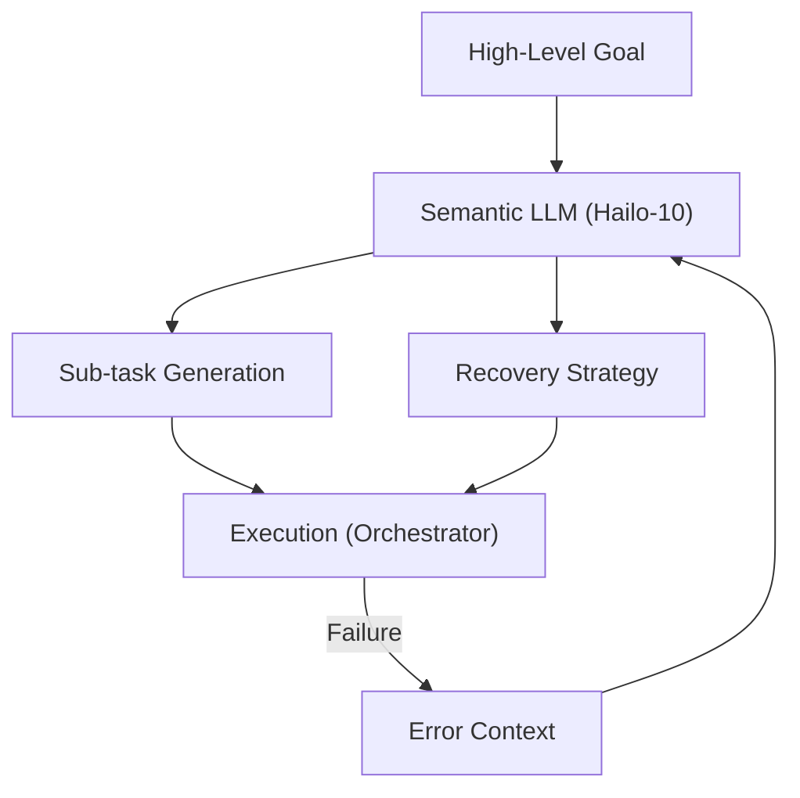

<p align="center">
  
</p>

# 🧩 HYDRA-UMC-SEMANTIC-PLANNER

<p align="center"><a href="README.md">🇺🇸 English</a> | <a href="README_spa.md">🇪🇸 Español</a> | <a href="README_fra.md">🇫🇷 Français</a> | <a href="README_ita.md">🇮🇹 Italiano</a> | <a href="README_deu.md">🇩🇪 Deutsch</a> | <a href="README_zho.md">🇨🇳 简体中文</a> | 🇯🇵 <b>日本語</b></p>

### 🧠 LLM ベースのミッションプランナー & ロジック復旧システム

<p align="left">
  
  
  
</p>

---

## 1. 🛠️ 技術概要

**HYDRA-UMC-SEMANTIC-PLANNER** は、Cognitive AI Node の「ロジック
オーケストレーター」です。ローカル LLM（大規模言語モデル）を使用して、
複雑な目標を実行可能なロボットプリミティブへと分解します。

高レベルの曖昧さを処理し、意味的なエラー復旧を提供します：あるタスクが
失敗した場合（例：「バキュームグリッパーの密封が失われた」）、プランナー
はその原因を推論し、圧力を上げるか、再試行するか、機械式ツールに切り
替えるかを判断します。

### 主な機能：
* 🧩 **タスク分解（v0）：** 既知の小さな目標語彙に対する実際のルールベース分解（例：「PCB を組み立てる」）により、順序立ったロボットコマンドを生成します。*（実際のテンプレートルールとして実装済み——まだ LLM ではありません。下記の「ビルドと実行」を参照）*
* 🛡️ **意味的復旧（v0）：** 構造化された MCU エラーコードから復旧アクションへの、実際のルールベースの参照。*（既知のコード語彙に対する実際の明示的なテーブルとして実装済み。未知のコードは常に人間にエスカレーションされます）*
* ✅ **前提条件の検証：** 分解された各プランは、渡される前に、各実際のプリミティブが本当に必要とするものに照らしてチェックされます —— 失敗したプランは拒否され、実行可能として黙って次に渡されることはありません。*（実装済み）*
* 🎲 **決定論的でプロパティテスト済み：** `decompose_goal()` は決定論的であること（同じ目標には常に同じプラン）が証明されており、数百のランダム/無効な目標に対してファジングテストされています —— クラッシュすることはなく、形式不正なプランを返すこともありません。*（実装済み）*
* 🤖 **エージェント型ワークフロー：** システム状態やツールを照会できるローカルエージェントとして動作します。*（計画中）*
* ⚡ **Hailo-10 最適化：** 40 TOPS を活用した高速な多段階推論。*（計画中——実際のローカル LLM が必要です）*
* 👨‍👩‍👧 **認知 AI ノードの子プロジェクト：**
  [HYDRA-UMC-COGNITIVE-NODE](https://github.com/JuanenRac/HYDRA-UMC-COGNITIVE-NODE) の下で 4 つの兄弟サービスの 1 つとして動作します（VLA-Engine、Voice-UI、Docs-QA と並んで）。独自のコピーを保持するのではなく、親プロジェクトの HydraOS イメージとモデルの重みを共有します。
* 📦 **オドメーター式バージョン管理：** 実際のビルドのたびに
  `pyproject.toml` 自身のバージョンが自動的に増加します
  （`bump_version.py`）——手動でのバージョン編集は不要です。

---

## 2. 🔄 プランニングサイクル



---

## 3. 🧱 アーキテクチャと設計上の決定

本リポジトリは Cognitive AI Node ファミリーの**子プロジェクト**です——
親プロジェクトである [HYDRA-UMC-COGNITIVE-NODE](https://github.com/JuanenRac/HYDRA-UMC-COGNITIVE-NODE) が共有の HydraOS イメージと量子化モデルの重みを保持し、本サービスを他の 3 つの兄弟プロジェクト（VLA-Engine、Voice-UI、Docs-QA）とともに `docker-compose.yml` に接続します：

* **本子プロジェクトに独自のハードウェア/ファームウェア/`os/`/`models/` がない理由。** 親プロジェクトが既に保有する CM5 + Hailo-10 M.2 モジュール上で完全に動作します——モデルの重みと HydraOS イメージを 1 か所に集約することで、ファミリー全体で数 GB にも及ぶモデルの重みが 4 つの食い違ったコピーとして存在することを避けられます。
* **`src/` レイアウトを採用した理由。** インストール可能なパッケージ（`hydra_umc_semantic_planner`）をリポジトリルートのツール（`bump_version.py`）から分離し、エコシステム内の他のすべての Python プロジェクトで使用されているレイアウトと一致させるためです。
* **エントリポイントが今日は身元/バージョン/役割のみを表示する理由。** これは足場（スキャフォールディング）段階です：実際のターゲット Python バージョン上で、本パッケージが正しくインストール・コンパイルされ、問題なくインポートできることを証明することが、後で実際の LLM ベースのプランニング/復旧ロジックを追加するための前提条件であり、その後の作業をパッケージングの懸念から切り離しておきます。
* **エコシステムの他の部分との関係。** 本プランナーは、Cognitive AI Node の意思決定の中核です：兄弟プロジェクトである HYDRA-UMC-VOICE-UI から意図を消費し、兄弟プロジェクトである HYDRA-UMC-VLA-ENGINE から動作トークンを消費し、その結果生じたミッションの決定を、物理的な実行のために下流の HYDRA-UMC-ORCHESTRATOR へ送信します。
* **`decompose.py` が実際の正規表現ルールであり、ローカル LLM ではない理由。** 小さな実際の目標語彙（組み立て/ピックアンドプレース/検査）は、今日すでにルールによって完全かつ正直にカバーされています——これは兄弟プロジェクトである HYDRA-UMC-DOCS-QA が埋め込みモデルではなく実際の TF-IDF インデックスを使う理由と同じです：将来 LLM ベースのプランナーが同じ `decompose_goal()` 契約の背後で置き換えられる、実際に機能するテスト可能なカーネルを今持っているということです。
* **`recovery.py` のエラーコードが公開リカバリー契約と一致する理由。** `INVALID_STATE`/`OUT_OF_RANGE`/`ESTOP_ACTIVE`/`TOOL_INCOMPATIBLE`/`TIMEOUT`/`UNSUPPORTED` は、そのアダプターが返すよう設計されている実際の構造化エラーです——今日この実際の語彙に対して構築された復旧ロジックは、アダプター自体が実際に存在するようになった後もそのまま有効であり、後で調整が必要になる並行したエラー分類体系を発明せずに済みます。
* **`ESTOP_ACTIVE`/`UNSUPPORTED`/未知のコードが常に人間にエスカレーションされる理由。** IA、UI、クラウド層が物理的な安全条件を決して上書きしないという、エコシステム全体の安全規則に一致しています——本プランナーは復旧アクションを提案するだけであり、E-STOP を自ら解除することも、認識できないエラーに対して推測することも決してありません。
* **`decompose.py` の実際のテンプレートが実際には無効なプランを一度も生成しないにもかかわらず、`validation.py` が存在する理由。** 固定のテンプレートは、その構造自体によって整形されたパラメータを保証できますが —— 将来の LLM ベースのプランナーはそうはいきません。`validate_plan()` は、そのプランナーが満たす必要のある実際の、明示的な契約であり、今存在する唯一のプランナーに対して今ここで検証することで、より難しいものがそれを満たす必要ができる前に、契約そのものが正しいことを証明します。
* **`decompose_goal()` が `hypothesis` ではなく、固定のランダムシードでファジングテストされている理由。** 本プロジェクトは（エコシステムの他の部分と同様に）標準ライブラリのみに依存しています —— 新たな依存関係を追加せずに、数百の合成目標に対する再現可能でシード付きの `random.Random` ループが、同じ実際の特性（クラッシュしない、形式不正なプランを返さない）を得られます。

---

## 📂 リポジトリ構成

```text
HYDRA-UMC-SEMANTIC-PLANNER/
├── src/hydra_umc_semantic_planner/
│   ├── primitives.py                  # 実際の、閉じたロボットコマンドプリミティブの語彙
│   ├── decompose.py                    # 実際の、ルールベースのタスク分解
│   ├── recovery.py                      # 実際の、ルールベースの意味的エラー復旧
│   ├── validation.py                    # 分解された Plan に対する実際の前提条件検証
│   └── main.py                            # エントリポイント + 実際の `decompose`/`recover` サブコマンド
├── tests/                            # 実際のテスト：分解、復旧、検証、プロパティテスト、エンドツーエンド CLI
├── docs/                             # ドキュメントとナレッジベース
│   ├── CLI_REFERENCE.md               # 公開コマンドライン契約
│   └── RECOVERY_CONTRACT.md           # 公開エラー/復旧語彙
├── images/                           # メディアと図表
├── scripts/                          # ユーティリティスクリプト
├── build/                            # ローカルビルド出力（git 管理外）
├── pyproject.toml                    # パッケージメタデータ（バージョン 0.0.4、オドメーター式増加）
├── bump_version.py                   # オドメーター式バージョンインクリメント（build.sh/.bat が使用）
├── build.sh / build.bat              # venv 作成、インストール（dev エクストラ付き）、テスト実行、インポート検証
└── run.sh / run.bat                  # エントリポイントを実行（引数を転送、例：`decompose`）
```

> **注：** `hardware/` と `firmware/` は省略されています——本ノードは
> 既存の CM5 + Hailo-10 M.2 モジュール上で動作し、独自のハードウェア/
> ファームウェア設計を持ちません。`os/` と `models/` も省略されています
> ——HydraOS イメージと共有される Hailo-10 モデルの重みは、親プロジェクト
> `HYDRA-UMC-COGNITIVE-NODE` に存在し、本プロジェクトはサービスとして
> それに接続します（その `docker-compose.yml` を参照）。

---

## ⚙️ ビルドと実行

Python >= 3.10 が必要です。

```bash
# Linux / macOS / Git Bash
./build.sh   # .venv を作成し、パッケージを（editable モードで）インストールし、インポートを検証します
./run.sh     # エントリポイントを実行します

# Windows (cmd)
build.bat
run.bat
```

`build.sh`/`build.bat` は、実際の各ビルドの前にバージョンを増加させ
（オドメーター方式、`bump_version.py` を参照）、実際のテストスイートを
実行します（`pytest tests/`）。引数なしの `run.sh` の予期される出力：

```text
HYDRA-UMC-SEMANTIC-PLANNER v0.0.4
Semantic Planner (Hailo-10) - decomposes high-level goals into robotic primitives and recovers from execution failures.
```

実際のサブコマンドは、目標を分解するか、復旧策を提案します：

```bash
./run.sh decompose "pcb を組み立てる"
./run.sh recover --component gripper --error-code GRIP_LOST_SEAL --detail "vacuum gripper lost seal"

# Windows
run.bat decompose "pcb を組み立てる"
run.bat recover --component gripper --error-code GRIP_LOST_SEAL --detail "vacuum gripper lost seal"
```

実際の分解された各プランは、表示される前に `validation.py` の実際の前提条件に照らしてチェックされます。`decompose.py` 自身のテンプレートは常に合格しますが、失敗したプランは代わりに拒否されます：

```text
Plan for: "broken" FAILED precondition validation:
  step 1 (GRIP): missing required param 'target'
```

### 🩺 トラブルシューティング

* **`python: command not found` / ビルドがステップ 1 で失敗する。** `PATH` 上に Python >= 3.10 が必要です。Windows では [python.org](https://python.org) からインストールし、セットアップ中に「Add to PATH」がチェックされていることを確認してください。Linux/macOS では通常 `python3` という名前が使われます。
* **`build.sh` が venv をアクティブ化できない。** `python3 -m venv .venv` は、プラットフォームごとに異なる場所にアクティベートスクリプトを配置します：Linux/macOS では `.venv/bin/activate`、Windows（Git Bash から使用される Windows Python venv でも同様）では `.venv/Scripts/activate`。`build.sh` は既に両方のパスをチェックしています——それでも失敗する場合は、`.venv/` を削除して `./build.sh` を再実行し、ゼロから再構築してください。
* **`pip install -e .` が失敗する。** 通常は `.venv/` が古くなっていることが原因です。`.venv/` フォルダを削除して `./build.sh`/`build.bat` を再実行し、再作成してください。
* **`import OK` が一度も表示されない。** `python -c "import hydra_umc_semantic_planner"` 自体が失敗したことを意味します——venv がアクティブな状態で再実行し、実際のトレースバックを確認してください。

---

## 🚀 ロードマップ
* **フェーズ 1：** Hailo-10 上での VLA エンジンのデプロイとマルチモーダル入力処理。
* **フェーズ 2：** 意味プランナーと群行動モデルおよび長期記憶の統合。
* **フェーズ 3：** 音声 UI の低遅延ローカル実行と産業用ノイズキャンセリング。
* **フェーズ 4：** 共有目標分解のためのマルチエージェント協調と意味的復旧の最適化。

---

## 🔗 関連プロジェクト

本プロジェクトは、同一著者（JuanenRac / Electro Hobby 3D）による、
ファームウェア、制御ソフトウェア、AI ノード、フリート管理ツールにまたがる、
より大きなロボティクスエコシステムの一部です。

### 本プランナーに直接関連

- **[HYDRA-UMC-ORCHESTRATOR](https://github.com/JuanenRac/HYDRA-UMC-ORCHESTRATOR)** —— 本プランナーのミッション決定を受け取ります。

### エコシステムのその他のプロジェクト

**HYDRA-UMC プラットフォーム** — マルチロボット・マイクロファクトリーセル
- **[HYDRA-UMC](https://github.com/JuanenRac/HYDRA-UMC)** — マザーボード本体：Raspberry Pi CM5 ホスト + デュアルコア STM32H745 リアルタイムコプロセッサ、CAN-OTA/SPI-OTA 経由で最大 8 台の分散ロボットアームを統括。
- **[HYDRA-UMC SERVER](https://github.com/JuanenRac/HYDRA-UMC-SERVER)** — ロボットの状態を保持するヘッドレス Express/WebSocket バックエンド。
- **[HYDRA-UMC STUDIO](https://github.com/JuanenRac/HYDRA-UMC-STUDIO)** — Web ベースの制御ダッシュボード。
- **[HYDRA-UMC-ANDROID-CONTROL](https://github.com/JuanenRac/HYDRA-UMC-ANDROID-CONTROL)** — HYDRA-UMC 向け Android 制御アプリ。
- **[HYDRA-UMC-IOS-CONTROL](https://github.com/JuanenRac/HYDRA-UMC-IOS-CONTROL)** — HYDRA-UMC 向け iOS/iPadOS 制御アプリ。
- **[HYDRA-UMC-SUITE](https://github.com/JuanenRac/HYDRA-UMC-SUITE)** — デスクトップ版群制御コマンドセンター。
- **[HYDRA-UMC-EDITOR-URDF](https://github.com/JuanenRac/HYDRA-UMC-EDITOR-URDF)** — デスクトップ版グラフィカル URDF 作成/編集ツール。
- **[HYDRA-UMC-DSI](https://github.com/JuanenRac/HYDRA-UMC-DSI)** — HYDRA-UMC のネイティブタッチスクリーン UI。

**URTC プラットフォーム** — すべての HYDRA-UMC ロボットアームが搭載するツールヘッドコントローラー
- **[URTC](https://github.com/JuanenRac/URTC)** — Universal Robot Tool Controller、ファームウェア。
- **[URTC Flasher](https://github.com/JuanenRac/URTC-FLASHER)** — デスクトップ版 CAN-OTA + SWD/JTAG フラッシュツール。
- **[URTC Tester](https://github.com/JuanenRac/URTC-TESTER)** — デスクトップ版ライブ CAN バス診断ツール。
- **[URTC Web Studio](https://github.com/JuanenRac/URTC-WEB-STUDIO)** — 上記 2 つのデスクトップツールのブラウザベースの代替版。

**👁️ ビジョン AI ノード（Hailo-8）**
- [HYDRA-UMC-VISION-NODE](https://github.com/JuanenRac/HYDRA-UMC-VISION-NODE)
- [HYDRA-UMC-VISION-STREAMER](https://github.com/JuanenRac/HYDRA-UMC-VISION-STREAMER)
- [HYDRA-UMC-DETECTION-HEF](https://github.com/JuanenRac/HYDRA-UMC-DETECTION-HEF)
- [HYDRA-UMC-SAFETY-ZONES](https://github.com/JuanenRac/HYDRA-UMC-SAFETY-ZONES)
- [HYDRA-UMC-VISUAL-SERVOING-API](https://github.com/JuanenRac/HYDRA-UMC-VISUAL-SERVOING-API)

**🐝 オーケストレーションと群制御**
- [HYDRA-UMC-SWARM-SYNC](https://github.com/JuanenRac/HYDRA-UMC-SWARM-SYNC)
- [HYDRA-UMC-PATH-PLANNER-3D](https://github.com/JuanenRac/HYDRA-UMC-PATH-PLANNER-3D)
- [HYDRA-UMC-JOB-DISPATCHER](https://github.com/JuanenRac/HYDRA-UMC-JOB-DISPATCHER)
- [HYDRA-UMC-NODE-HEALING](https://github.com/JuanenRac/HYDRA-UMC-NODE-HEALING)

**🎮 デジタルツインとシミュレーション**
- [HYDRA-UMC-TWIN](https://github.com/JuanenRac/HYDRA-UMC-TWIN)
- [HYDRA-UMC-PHYSICS-REPLICA](https://github.com/JuanenRac/HYDRA-UMC-PHYSICS-REPLICA)
- [HYDRA-UMC-HIL-BRIDGE](https://github.com/JuanenRac/HYDRA-UMC-HIL-BRIDGE)
- [HYDRA-UMC-SYNTHETIC-DATA-GEN](https://github.com/JuanenRac/HYDRA-UMC-SYNTHETIC-DATA-GEN)

**📊 データと分析**
- [HYDRA-UMC-DATALAKE](https://github.com/JuanenRac/HYDRA-UMC-DATALAKE)
- [HYDRA-UMC-TELEMETRY-COLLECTOR](https://github.com/JuanenRac/HYDRA-UMC-TELEMETRY-COLLECTOR)
- [HYDRA-UMC-ANOMALY-DETECTOR](https://github.com/JuanenRac/HYDRA-UMC-ANOMALY-DETECTOR)
- [HYDRA-UMC-PRODUCTION-REPORTS](https://github.com/JuanenRac/HYDRA-UMC-PRODUCTION-REPORTS)

**🏭 産業用ゲートウェイ**
- [HYDRA-UMC-GATEWAY-INDUSTRIAL](https://github.com/JuanenRac/HYDRA-UMC-GATEWAY-INDUSTRIAL)
- [HYDRA-UMC-OPCUA-SERVER](https://github.com/JuanenRac/HYDRA-UMC-OPCUA-SERVER)
- [HYDRA-UMC-MQTT-BROKER](https://github.com/JuanenRac/HYDRA-UMC-MQTT-BROKER)
- [HYDRA-UMC-MTCONNECT-ADAPTER](https://github.com/JuanenRac/HYDRA-UMC-MTCONNECT-ADAPTER)

**🛠️ 補完ツール**
- [URTC-SMART-RACK](https://github.com/JuanenRac/URTC-SMART-RACK)
- [URTC-VISION-TOOL](https://github.com/JuanenRac/URTC-VISION-TOOL)
- [HYDRA-UMC-WATCH](https://github.com/JuanenRac/HYDRA-UMC-WATCH)
- [HYDRA-UMC-TOOL-CLI](https://github.com/JuanenRac/HYDRA-UMC-TOOL-CLI)
- [HYDRA-UMC-DASHBOARD-AI](https://github.com/JuanenRac/HYDRA-UMC-DASHBOARD-AI)

---

## 👤 作者
**JuanenRac**（Electro Hobby 3D）
📧 electrohobby3d@gmail.com

## 📜 ライセンス
GPL-3.0 —— 詳細は LICENSE を参照してください。

## 🛠️ BUILD & RUN

リリースビルドの前に、バージョンを変更しないビルドチェックを使用してください。

| 操作 | Windows | Linux / macOS |
|---|---|---|
| ビルドチェック（バージョンと CHANGELOG を変更しない） | `build-test.bat` | `./build-test.sh` |
| 実行 / 開発（提供されている場合） | `run*.bat` または `dev*.bat` | `./run*.sh` または `./dev*.sh` |

`build-test.bat` と `build-test.sh` は、`hydra-umc.project.json` をインクリメントせず、`CHANGELOG.md` も変更せずにプロジェクトのスタックをコンパイルまたは検証します。通常のコンパイラ出力だけが作成される場合があります。既存の `build*.bat`、`build*.sh`、`run*`、`dev*` は、各プロジェクト固有のバージョン化または実行時の動作を維持します。その動作が必要な場合はそれらを使用してください。
