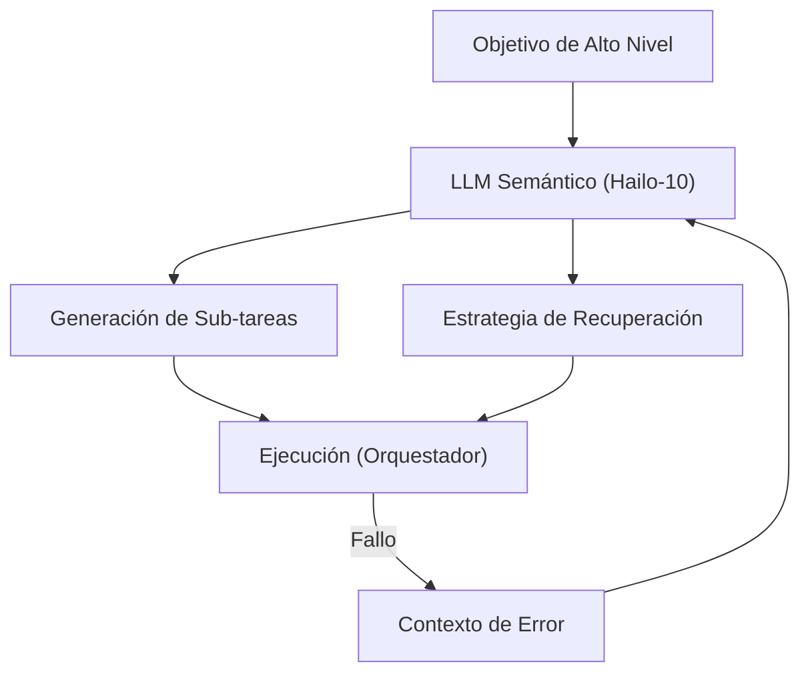

<p align="center">
  
</p>

# 🧩 HYDRA-UMC-SEMANTIC-PLANNER

<p align="center"><a href="README.md">🇺🇸 English</a> | 🇪🇸 <b>Español</b> | <a href="README_fra.md">🇫🇷 Français</a> | <a href="README_ita.md">🇮🇹 Italiano</a> | <a href="README_deu.md">🇩🇪 Deutsch</a> | <a href="README_zho.md">🇨🇳 简体中文</a> | <a href="README_jpn.md">🇯🇵 日本語</a></p>

### 🧠 Planificador de Misiones Basado en LLM y Sistema de Recuperación Lógica

<p align="left">
  
  
  
</p>

---

## 1. 🛠️ VISIÓN GENERAL TÉCNICA

**HYDRA-UMC-SEMANTIC-PLANNER** es el "Orquestador de Lógica" del Nodo Cognitive AI. Utiliza LLMs locales (Large Language Models) para descomponer objetivos complejos en primitivas robóticas accionables.

Maneja la ambigüedad de alto nivel y proporciona recuperación semántica de errores: si una tarea falla (ej. "el gripper de vacío perdió el sello"), el planificador razona sobre la causa y decide si aumentar la presión, intentarlo de nuevo o cambiar a una herramienta mecánica.

### Características Clave:
* 🧩 **Descomposición de Tareas (v0):** División real basada en reglas de un pequeño vocabulario de objetivos conocidos (ej. "ensamblar PCB") en comandos secuenciales de robot. *(implementado como reglas de plantilla reales, todavía no un LLM - ver BUILD Y EJECUCIÓN abajo)*
* 🛡️ **Recuperación Semántica (v0):** Búsqueda real basada en reglas desde códigos de error estructurados del MCU a una acción de recuperación. *(implementado como una tabla explícita real sobre un vocabulario de códigos conocido; los códigos desconocidos siempre escalan a un humano)*
* ✅ **Validación de Precondiciones:** Cada plan descompuesto se valida contra lo que cada primitiva real realmente necesita antes de entregarlo - un plan que falla es rechazado, nunca se pasa silenciosamente como listo para ejecutar. *(implementado)*
* 🎲 **Determinista y Testeado por Propiedades:** `decompose_goal()` está probado como determinista (mismo objetivo, mismo plan, siempre) y testeado mediante fuzzing contra cientos de objetivos aleatorios/inválidos - nunca falla, nunca devuelve un plan mal formado. *(implementado)*
* 🤖 **Flujo Agéntico:** Funciona como un agente local capaz de consultar el estado del sistema y herramientas. *(planeado)*
* ⚡ **Optimizado para Hailo-10:** Aprovecha 40 TOPS para un razonamiento multi-paso rápido. *(planeado - necesita el LLM local real)*
* 👨‍👩‍👧 **Hijo del Cognitive AI Node:** Corre como uno de los cuatro
  servicios hermanos bajo [HYDRA-UMC-COGNITIVE-NODE](https://github.com/JuanenRac/HYDRA-UMC-COGNITIVE-NODE)
  (junto a VLA-Engine, Voice-UI y Docs-QA), compartiendo la imagen
  HydraOS y los pesos de modelos de su padre en vez de mantener copias
  propias.
* 📦 **Versionado Cuentakilómetros:** Cada build real incrementa
  automáticamente la versión de `pyproject.toml` (`bump_version.py`) - sin
  ediciones manuales de versión.

---

## 2. 🔄 CICLO DE PLANIFICACIÓN



---

## 3. 🧱 ARQUITECTURA Y DECISIONES DE DISEÑO

Este repositorio es un **hijo** de la familia Cognitive AI Node - su
padre, [HYDRA-UMC-COGNITIVE-NODE](https://github.com/JuanenRac/HYDRA-UMC-COGNITIVE-NODE),
posee la imagen HydraOS compartida y los pesos de modelos cuantizados, y
conecta este servicio en su `docker-compose.yml` junto a sus tres
hermanos (VLA-Engine, Voice-UI, Docs-QA):

* **Por qué este hijo no tiene hardware/firmware/`os/`/`models/`
  propios.** Corre por completo sobre el módulo CM5 + Hailo-10 M.2 que ya
  posee el padre - centralizar los pesos de modelos y la imagen HydraOS
  en un solo lugar evita cuatro copias divergentes de varios gigabytes
  dentro de la familia.
* **Por qué una estructura `src/`.** Mantiene el paquete instalable
  (`hydra_umc_semantic_planner`) separado del tooling en la raíz del
  repo (`bump_version.py`), igual que el resto de proyectos Python del
  ecosistema.
* **Por qué el punto de entrada solo imprime identidad/versión/rol hoy.**
  Esta es la etapa de andamiaje: demostrar que el paquete se instala,
  compila e importa correctamente - en la versión real de Python objetivo
  - es un requisito previo antes de añadir lógica real de planificación y
  recuperación basada en LLM, y mantiene ese trabajo posterior aislado de
  los problemas de empaquetado.
* **Cómo encaja en el resto del ecosistema.** Este planificador es el
  núcleo de decisión del Cognitive AI Node: consume la intención de su
  hermano HYDRA-UMC-VOICE-UI y los tokens de acción de su hermano
  HYDRA-UMC-VLA-ENGINE, y envía las decisiones de misión resultantes
  aguas abajo a HYDRA-UMC-ORCHESTRATOR para su ejecución física.
* **Por qué `decompose.py` son reglas regex reales, no un LLM local.**
  Un vocabulario de objetivos pequeño y real (ensamblar/pick-and-place/
  inspeccionar) queda cubierto por completo y de forma honesta con
  reglas hoy - el mismo razonamiento que el índice TF-IDF real del
  hermano HYDRA-UMC-DOCS-QA en vez de un modelo de embeddings: un núcleo
  real y testeable ahora que un futuro planificador basado en LLM puede
  sustituir detrás del mismo contrato `decompose_goal()`.
* **Por qué los códigos de error de `recovery.py` coinciden con el contrato
  público de recuperación.** `INVALID_STATE`/`OUT_OF_RANGE`/`ESTOP_ACTIVE`/
  `TOOL_INCOMPATIBLE`/`TIMEOUT`/`UNSUPPORTED` son los errores
  estructurados reales que ese adaptador está diseñado para devolver -
  una lógica de recuperación construida hoy contra ese vocabulario real
  sigue siendo válida cuando el propio adaptador exista, en vez de
  inventar una taxonomía de errores paralela que habría que reconciliar
  después.
* **Por qué `ESTOP_ACTIVE`/`UNSUPPORTED`/códigos desconocidos siempre
  escalan a un humano.** Coincide con la regla de seguridad de todo el
  ecosistema de que las capas de IA, UI y nube nunca anulan una
  condición de seguridad física - este planificador propone una acción
  de recuperación, nunca despeja un E-STOP ni adivina ante un error que
  no reconoce.
* **Por qué existe `validation.py` aunque las plantillas reales de
  `decompose.py` nunca produzcan realmente un plan inválido.** Una
  plantilla fija puede garantizar parámetros bien formados por
  construcción - un futuro planificador basado en LLM no puede.
  `validate_plan()` es el contrato real y explícito que ese
  planificador tendría que cumplir, comprobado aquí y ahora contra el
  único planificador que existe hoy, de modo que el propio contrato
  quede probado como correcto antes de que algo más difícil tenga que
  cumplirlo.
* **Por qué `decompose_goal()` se testea mediante fuzzing con una
  semilla aleatoria fija en lugar de `hypothesis`.** Este proyecto
  (como el resto del ecosistema) se mantiene solo con la librería
  estándar - un bucle reproducible y con semilla de `random.Random`
  sobre cientos de objetivos sintéticos obtiene la misma propiedad
  real (nunca falla, nunca devuelve un plan mal formado) sin añadir
  una nueva dependencia.

---

## 📂 ESTRUCTURA DE DIRECTORIOS

```text
HYDRA-UMC-SEMANTIC-PLANNER/
├── src/hydra_umc_semantic_planner/
│   ├── primitives.py                  # Vocabulario cerrado real de primitivas de comando del robot
│   ├── decompose.py                    # Descomposición real de tareas basada en reglas
│   ├── recovery.py                      # Recuperación semántica real de errores basada en reglas
│   ├── validation.py                    # Validación real de precondiciones sobre un Plan descompuesto
│   └── main.py                            # Punto de entrada + subcomandos reales `decompose`/`recover`
├── tests/                            # Tests reales: descomposición, recuperación, validación, tests de propiedades, CLI end-to-end
├── docs/                             # Documentación y base de conocimientos
│   ├── CLI_REFERENCE.md               # Contrato público de línea de comandos
│   └── RECOVERY_CONTRACT.md           # Vocabulario público de recuperación
├── images/                           # Medios y diagramas
├── scripts/                          # Scripts de utilidad
├── build/                            # Salida de build local (ignorada por git)
├── pyproject.toml                    # Metadatos del paquete (versión 0.0.4, incremento cuentakilómetros)
├── bump_version.py                   # Incremento de versión estilo cuentakilómetros (usado por build.sh/.bat)
├── build.sh / build.bat              # Crea el venv, instala (con extras de dev), corre tests, verifica la importación
└── run.sh / run.bat                  # Ejecuta el punto de entrada (reenvia argumentos, ej. `decompose`)
```

> **Nota:** se podaron `hardware/` y `firmware/` - este nodo corre sobre un
> módulo CM5 + Hailo-10 M.2 ya existente, sin diseño de hardware/firmware
> propio. También se podaron `os/` y `models/` - la imagen HydraOS y los
> pesos de modelos Hailo-10 compartidos viven en el proyecto padre
> `HYDRA-UMC-COGNITIVE-NODE`, al que este proyecto se conecta como
> servicio (ver su `docker-compose.yml`).

---

## ⚙️ BUILD Y EJECUCIÓN

Requiere Python >= 3.10.

```bash
# Linux / macOS / Git Bash
./build.sh   # crea .venv, instala el paquete (editable), verifica la importación
./run.sh     # ejecuta el punto de entrada

# Windows (cmd)
build.bat
run.bat
```

`build.sh`/`build.bat` incrementan la versión (estilo cuentakilómetros, ver
`bump_version.py`) antes de cada build real, y corren la suite de tests
real (`pytest tests/`). Salida esperada de un `run.sh` sin argumentos:

```text
HYDRA-UMC-SEMANTIC-PLANNER v0.0.4
Semantic Planner (Hailo-10) - decomposes high-level goals into robotic primitives and recovers from execution failures.
```

Los subcomandos reales descomponen un objetivo o proponen una recuperación:

```bash
./run.sh decompose "ensamblar la pcb"
./run.sh recover --component gripper --error-code GRIP_LOST_SEAL --detail "vacuum gripper lost seal"

# Windows
run.bat decompose "ensamblar la pcb"
run.bat recover --component gripper --error-code GRIP_LOST_SEAL --detail "vacuum gripper lost seal"
```

Cada plan real descompuesto se valida contra las precondiciones reales
de `validation.py` antes de imprimirse. Las propias plantillas de
`decompose.py` siempre pasan; un plan que fallara sería rechazado en
su lugar:

```text
Plan for: "broken" FAILED precondition validation:
  step 1 (GRIP): missing required param 'target'
```

### 🩺 Solución de problemas

* **`python: comando no encontrado` / el build falla en el paso 1.**
  Requiere Python >= 3.10 en el `PATH`. En Windows, instálalo desde
  [python.org](https://python.org) y marca "Add to PATH" durante la
  instalación; en Linux/macOS suele llamarse `python3`.
* **`build.sh` no consigue activar el venv.** `python3 -m venv .venv`
  coloca el script de activación en una ruta distinta según la
  plataforma: `.venv/bin/activate` en Linux/macOS, `.venv/Scripts/activate`
  en Windows (también con un venv de Python de Windows usado desde Git
  Bash). `build.sh` ya comprueba ambas rutas - si sigue fallando, borra
  `.venv/` y vuelve a ejecutar `./build.sh` para reconstruirlo desde cero.
* **`pip install -e .` falla.** Normalmente por un `.venv/` obsoleto.
  Borra la carpeta `.venv/` y vuelve a ejecutar `./build.sh`/`build.bat`
  para recrearla.
* **`import OK` nunca se imprime.** Significa que `python -c "import
  hydra_umc_semantic_planner"` falló - vuelve a ejecutarlo con el venv
  activo para ver el traceback real.

---

## 🚀 HOJA DE RUTA
* **Fase 1:** Despliegue del motor VLA y procesamiento de entrada multi-modal en Hailo-10.
* **Fase 2:** Integración del planificador semántico con modelos de comportamiento de enjambre y memoria a largo plazo.
* **Fase 3:** Ejecución local de baja latencia de Voice UI y cancelación de ruido industrial.
* **Fase 4:** Coordinación multi-agente para descomposición de objetivos compartidos y optimización de recuperación semántica.

---

## 🔗 PROYECTOS RELACIONADOS

Este proyecto forma parte de un ecosistema de robótica más amplio del mismo autor (JuanenRac / Electro Hobby 3D), que abarca firmware, software de control, nodos de IA y herramientas de flota.

### Directamente relacionados con este planificador

- **[HYDRA-UMC-ORCHESTRATOR](https://github.com/JuanenRac/HYDRA-UMC-ORCHESTRATOR)** — recibe las decisiones de misión de este planificador.

### Resto del ecosistema

**Plataforma HYDRA-UMC** — la micro-fábrica multi-robot
- **[HYDRA-UMC](https://github.com/JuanenRac/HYDRA-UMC)** — la placa base: host Raspberry Pi CM5 + coprocesador de tiempo real STM32H745 de doble núcleo, orquestando hasta 8 brazos robóticos distribuidos vía CAN-OTA/SPI-OTA.
- **[HYDRA-UMC SERVER](https://github.com/JuanenRac/HYDRA-UMC-SERVER)** — backend Express/WebSocket headless que posee el estado de los robots.
- **[HYDRA-UMC STUDIO](https://github.com/JuanenRac/HYDRA-UMC-STUDIO)** — dashboard de control web.
- **[HYDRA-UMC-ANDROID-CONTROL](https://github.com/JuanenRac/HYDRA-UMC-ANDROID-CONTROL)** — app Android de control para HYDRA-UMC.
- **[HYDRA-UMC-IOS-CONTROL](https://github.com/JuanenRac/HYDRA-UMC-IOS-CONTROL)** — app iOS/iPadOS de control para HYDRA-UMC.
- **[HYDRA-UMC-SUITE](https://github.com/JuanenRac/HYDRA-UMC-SUITE)** — centro de mando de escritorio para el enjambre.
- **[HYDRA-UMC-EDITOR-URDF](https://github.com/JuanenRac/HYDRA-UMC-EDITOR-URDF)** — creador/editor gráfico de escritorio para modelos URDF.
- **[HYDRA-UMC-DSI](https://github.com/JuanenRac/HYDRA-UMC-DSI)** — UI táctil nativa para HYDRA-UMC.

**Plataforma URTC** — el controlador de cabezal de herramienta que lleva cada brazo HYDRA-UMC
- **[URTC](https://github.com/JuanenRac/URTC)** — Universal Robot Tool Controller, firmware.
- **[URTC Flasher](https://github.com/JuanenRac/URTC-FLASHER)** — herramienta de escritorio de flasheo CAN-OTA + SWD/JTAG.
- **[URTC Tester](https://github.com/JuanenRac/URTC-TESTER)** — herramienta de escritorio de diagnóstico CAN en vivo.
- **[URTC Web Studio](https://github.com/JuanenRac/URTC-WEB-STUDIO)** — alternativa basada en navegador a las 2 herramientas de escritorio anteriores.

**👁️ Nodo de IA de Visión (Hailo-8)**
- [HYDRA-UMC-VISION-NODE](https://github.com/JuanenRac/HYDRA-UMC-VISION-NODE)
- [HYDRA-UMC-VISION-STREAMER](https://github.com/JuanenRac/HYDRA-UMC-VISION-STREAMER)
- [HYDRA-UMC-DETECTION-HEF](https://github.com/JuanenRac/HYDRA-UMC-DETECTION-HEF)
- [HYDRA-UMC-SAFETY-ZONES](https://github.com/JuanenRac/HYDRA-UMC-SAFETY-ZONES)
- [HYDRA-UMC-VISUAL-SERVOING-API](https://github.com/JuanenRac/HYDRA-UMC-VISUAL-SERVOING-API)

**🐝 Orquestación y Enjambre**
- [HYDRA-UMC-SWARM-SYNC](https://github.com/JuanenRac/HYDRA-UMC-SWARM-SYNC)
- [HYDRA-UMC-PATH-PLANNER-3D](https://github.com/JuanenRac/HYDRA-UMC-PATH-PLANNER-3D)
- [HYDRA-UMC-JOB-DISPATCHER](https://github.com/JuanenRac/HYDRA-UMC-JOB-DISPATCHER)
- [HYDRA-UMC-NODE-HEALING](https://github.com/JuanenRac/HYDRA-UMC-NODE-HEALING)

**🎮 Gemelo Digital y Simulación**
- [HYDRA-UMC-TWIN](https://github.com/JuanenRac/HYDRA-UMC-TWIN)
- [HYDRA-UMC-PHYSICS-REPLICA](https://github.com/JuanenRac/HYDRA-UMC-PHYSICS-REPLICA)
- [HYDRA-UMC-HIL-BRIDGE](https://github.com/JuanenRac/HYDRA-UMC-HIL-BRIDGE)
- [HYDRA-UMC-SYNTHETIC-DATA-GEN](https://github.com/JuanenRac/HYDRA-UMC-SYNTHETIC-DATA-GEN)

**📊 Datos y Analítica**
- [HYDRA-UMC-DATALAKE](https://github.com/JuanenRac/HYDRA-UMC-DATALAKE)
- [HYDRA-UMC-TELEMETRY-COLLECTOR](https://github.com/JuanenRac/HYDRA-UMC-TELEMETRY-COLLECTOR)
- [HYDRA-UMC-ANOMALY-DETECTOR](https://github.com/JuanenRac/HYDRA-UMC-ANOMALY-DETECTOR)
- [HYDRA-UMC-PRODUCTION-REPORTS](https://github.com/JuanenRac/HYDRA-UMC-PRODUCTION-REPORTS)

**🏭 Pasarela Industrial**
- [HYDRA-UMC-GATEWAY-INDUSTRIAL](https://github.com/JuanenRac/HYDRA-UMC-GATEWAY-INDUSTRIAL)
- [HYDRA-UMC-OPCUA-SERVER](https://github.com/JuanenRac/HYDRA-UMC-OPCUA-SERVER)
- [HYDRA-UMC-MQTT-BROKER](https://github.com/JuanenRac/HYDRA-UMC-MQTT-BROKER)
- [HYDRA-UMC-MTCONNECT-ADAPTER](https://github.com/JuanenRac/HYDRA-UMC-MTCONNECT-ADAPTER)

**🛠️ Herramientas Complementarias**
- [URTC-SMART-RACK](https://github.com/JuanenRac/URTC-SMART-RACK)
- [URTC-VISION-TOOL](https://github.com/JuanenRac/URTC-VISION-TOOL)
- [HYDRA-UMC-WATCH](https://github.com/JuanenRac/HYDRA-UMC-WATCH)
- [HYDRA-UMC-TOOL-CLI](https://github.com/JuanenRac/HYDRA-UMC-TOOL-CLI)
- [HYDRA-UMC-DASHBOARD-AI](https://github.com/JuanenRac/HYDRA-UMC-DASHBOARD-AI)

---

## 👤 AUTOR
**JuanenRac** (Electro Hobby 3D)
📧 electrohobby3d@gmail.com

## 📜 LICENCIA
GPL-3.0 - Ver archivo LICENSE para más detalles.
