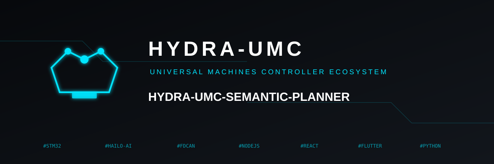
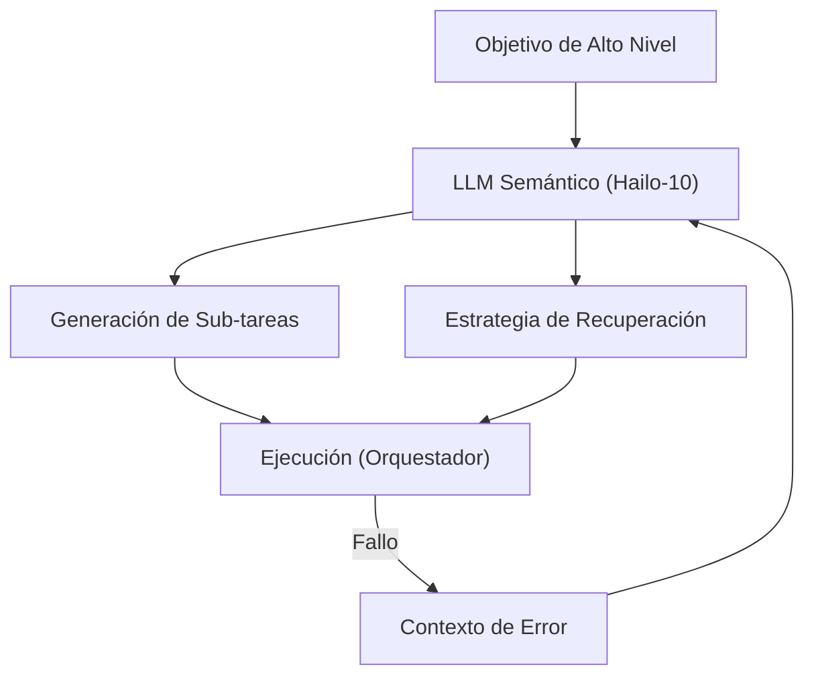

<p align="center">
  
</p>

# 🧩 HYDRA-UMC-SEMANTIC-PLANNER

<p align="center"><a href="README.md">🇺🇸 English</a> | 🇪🇸 <b>Español</b> | <a href="README_fra.md">🇫🇷 Français</a> | <a href="README_ita.md">🇮🇹 Italiano</a> | <a href="README_deu.md">🇩🇪 Deutsch</a> | <a href="README_zho.md">🇨🇳 简体中文</a> | <a href="README_jpn.md">🇯🇵 日本語</a></p>

### 🧠 Planificador de Misiones Basado en LLM y Sistema de Recuperación Lógica

<p align="left">
  
  
  
</p>

---

## 1. 🛠️ VISIÓN GENERAL TÉCNICA

**HYDRA-UMC-SEMANTIC-PLANNER** es el "Orquestador de Lógica" del Nodo Cognitive AI. Utiliza LLMs locales (Large Language Models) para descomponer objetivos complejos en primitivas robóticas accionables.

Maneja la ambigüedad de alto nivel y proporciona recuperación semántica de errores: si una tarea falla (ej. "el gripper de vacío perdió el sello"), el planificador razona sobre la causa y decide si aumentar la presión, intentarlo de nuevo o cambiar a una herramienta mecánica.

### Características Clave:
* 🧩 **Descomposición de Tareas (v0):** División real basada en reglas de un pequeño vocabulario de objetivos conocidos (ej. "ensamblar PCB") en comandos secuenciales de robot. *(implementado como reglas de plantilla reales, todavía no un LLM - ver BUILD Y EJECUCIÓN abajo)*
* 🛡️ **Recuperación Semántica (v0):** Búsqueda real basada en reglas desde códigos de error estructurados del MCU a una acción de recuperación. *(implementado como una tabla explícita real sobre un vocabulario de códigos conocido; los códigos desconocidos siempre escalan a un humano)*
* ✅ **Validación de Precondiciones:** Cada plan descompuesto se valida contra lo que cada primitiva real realmente necesita antes de entregarlo - un plan que falla es rechazado, nunca se pasa silenciosamente como listo para ejecutar. *(implementado)*
* 🌐 **API JSON/HTTP (v0.0.7):** el subcomando `serve` expone la misma lógica exacta de `decompose`/`recover` sobre un `http.server` de la stdlib (`POST /decompose`, `POST /recover`, `GET /stats`) para clientes que no son la CLI - solo loopback por defecto, igual que la unidad `systemd/hydra-umc-semantic-planner.service`. Ver [`docs/CLI_REFERENCE.md`](docs/CLI_REFERENCE.md) para cada comando, flag y código de salida real, y [`docs/RECOVERY_CONTRACT.md`](docs/RECOVERY_CONTRACT.md) para el vocabulario público completo de códigos de error.
* 🎲 **Determinista y Testeado por Propiedades:** `decompose_goal()` está probado como determinista (mismo objetivo, mismo plan, siempre) y testeado mediante fuzzing contra cientos de objetivos aleatorios/inválidos - nunca falla, nunca devuelve un plan mal formado. *(implementado)*
* 🤖 **Flujo Agéntico:** Funciona como un agente local capaz de consultar el estado del sistema y herramientas. *(planeado)*
* ⚡ **Optimizado para Hailo-10:** Aprovecha 40 TOPS para un razonamiento multi-paso rápido. *(planeado - necesita el LLM local real)*
* 👨‍👩‍👧 **Hijo del Cognitive AI Node:** Corre como uno de los cuatro
  servicios hermanos bajo [HYDRA-UMC-COGNITIVE-NODE](https://github.com/JuanenRac/HYDRA-UMC-COGNITIVE-NODE)
  (junto a VLA-Engine, Voice-UI y Docs-QA), compartiendo la imagen
  HydraOS y los pesos de modelos de su padre en vez de mantener copias
  propias.
* 📦 **Versionado Cuentakilómetros:** Cada build real incrementa
  automáticamente la versión de `pyproject.toml` (`bump_version.py`) - sin
  ediciones manuales de versión.

---

## 2. 🔄 CICLO DE PLANIFICACIÓN



---

## 3. 🧱 ARQUITECTURA Y DECISIONES DE DISEÑO

Este repositorio es un **hijo** de la familia Cognitive AI Node - su
padre, [HYDRA-UMC-COGNITIVE-NODE](https://github.com/JuanenRac/HYDRA-UMC-COGNITIVE-NODE),
posee la imagen HydraOS compartida y los pesos de modelos cuantizados, y
conecta este servicio en su `docker-compose.yml` junto a sus tres
hermanos (VLA-Engine, Voice-UI, Docs-QA):

* **Por qué este hijo no tiene hardware/firmware/`os/`/`models/`
  propios.** Corre por completo sobre el módulo CM5 + Hailo-10 M.2 que ya
  posee el padre - centralizar los pesos de modelos y la imagen HydraOS
  en un solo lugar evita cuatro copias divergentes de varios gigabytes
  dentro de la familia.
* **Por qué una estructura `src/`.** Mantiene el paquete instalable
  (`hydra_umc_semantic_planner`) separado del tooling en la raíz del
  repo (`bump_version.py`), igual que el resto de proyectos Python del
  ecosistema.
* **Por qué el punto de entrada solo imprime identidad/versión/rol hoy.**
  Esta es la etapa de andamiaje: demostrar que el paquete se instala,
  compila e importa correctamente - en la versión real de Python objetivo
  - es un requisito previo antes de añadir lógica real de planificación y
  recuperación basada en LLM, y mantiene ese trabajo posterior aislado de
  los problemas de empaquetado.
* **Cómo encaja en el resto del ecosistema.** Este planificador es el
  núcleo de decisión del Cognitive AI Node: consume la intención de su
  hermano HYDRA-UMC-VOICE-UI y los tokens de acción de su hermano
  HYDRA-UMC-VLA-ENGINE, y envía las decisiones de misión resultantes
  aguas abajo a HYDRA-UMC-ORCHESTRATOR para su ejecución física.
* **Por qué `decompose.py` son reglas regex reales, no un LLM local.**
  Un vocabulario de objetivos pequeño y real (ensamblar/pick-and-place/
  inspeccionar) queda cubierto por completo y de forma honesta con
  reglas hoy - el mismo razonamiento que el índice TF-IDF real del
  hermano HYDRA-UMC-DOCS-QA en vez de un modelo de embeddings: un núcleo
  real y testeable ahora que un futuro planificador basado en LLM puede
  sustituir detrás del mismo contrato `decompose_goal()`.
* **Por qué los códigos de error de `recovery.py` coinciden con el contrato
  público de recuperación.** `INVALID_STATE`/`OUT_OF_RANGE`/`ESTOP_ACTIVE`/
  `TOOL_INCOMPATIBLE`/`TIMEOUT`/`UNSUPPORTED` son los errores
  estructurados reales que ese adaptador está diseñado para devolver -
  una lógica de recuperación construida hoy contra ese vocabulario real
  sigue siendo válida cuando el propio adaptador exista, en vez de
  inventar una taxonomía de errores paralela que habría que reconciliar
  después.
* **Por qué `ESTOP_ACTIVE`/`UNSUPPORTED`/códigos desconocidos siempre
  escalan a un humano.** Coincide con la regla de seguridad de todo el
  ecosistema de que las capas de IA, UI y nube nunca anulan una
  condición de seguridad física - este planificador propone una acción
  de recuperación, nunca despeja un E-STOP ni adivina ante un error que
  no reconoce.
* **Por qué existe `validation.py` aunque las plantillas reales de
  `decompose.py` nunca produzcan realmente un plan inválido.** Una
  plantilla fija puede garantizar parámetros bien formados por
  construcción - un futuro planificador basado en LLM no puede.
  `validate_plan()` es el contrato real y explícito que ese
  planificador tendría que cumplir, comprobado aquí y ahora contra el
  único planificador que existe hoy, de modo que el propio contrato
  quede probado como correcto antes de que algo más difícil tenga que
  cumplirlo.
* **Por qué `decompose_goal()` se testea mediante fuzzing con una
  semilla aleatoria fija en lugar de `hypothesis`.** Este proyecto
  (como el resto del ecosistema) se mantiene solo con la librería
  estándar - un bucle reproducible y con semilla de `random.Random`
  sobre cientos de objetivos sintéticos obtiene la misma propiedad
  real (nunca falla, nunca devuelve un plan mal formado) sin añadir
  una nueva dependencia.

---

## 📂 ESTRUCTURA DE DIRECTORIOS

```text
HYDRA-UMC-SEMANTIC-PLANNER/
├── src/hydra_umc_semantic_planner/
│   ├── primitives.py                  # Vocabulario cerrado real de primitivas de comando del robot
│   ├── decompose.py                    # Descomposición real de tareas basada en reglas
│   ├── recovery.py                      # Recuperación semántica real de errores basada en reglas
│   ├── validation.py                    # Validación real de precondiciones sobre un Plan descompuesto
│   ├── api.py                             # Superficie JSON/HTTP plana (http.server de stdlib) sobre decompose/recover
│   └── main.py                            # Punto de entrada + subcomandos reales `decompose`/`recover`
├── tests/                            # Tests reales: descomposición, recuperación, validación, api, tests de propiedades, CLI end-to-end
├── docs/                             # Documentación y base de conocimientos
│   ├── CLI_REFERENCE.md               # Contrato público de línea de comandos
│   └── RECOVERY_CONTRACT.md           # Vocabulario público de recuperación
├── images/                           # Medios y diagramas
├── systemd/
│   └── hydra-umc-semantic-planner.service # Unidad systemd de la API local de decompose/recover en la CM5
├── tools/
│   ├── build_test.py                 # Comprobación de compilación sin versionado
│   └── ci_validate.py                # Validación de manifiesto/CHANGELOG/docs usada por CI
├── build/                            # Salida de build local (ignorada por git)
├── pyproject.toml                    # Metadatos del paquete (versión con incremento cuentakilómetros)
├── bump_manifest_version.py          # Sincroniza la versión de hydra-umc.project.json con la nativa (--sync)
├── bump_version.py                   # Incremento de versión estilo cuentakilómetros (usado por build.sh/.bat)
├── build.sh / build.bat              # Crea el venv, instala (con extras de dev), corre tests, verifica la importación
└── run.sh / run.bat                  # Ejecuta el punto de entrada (reenvia argumentos, ej. `decompose`)
```

> **Nota:** se podaron `hardware/` y `firmware/` - este nodo corre sobre un
> módulo CM5 + Hailo-10 M.2 ya existente, sin diseño de hardware/firmware
> propio. También se podaron `os/` y `models/` - la imagen HydraOS y los
> pesos de modelos Hailo-10 compartidos viven en el proyecto padre
> `HYDRA-UMC-COGNITIVE-NODE`, al que este proyecto se conecta como
> servicio (ver su `docker-compose.yml`).

---

## ⚙️ BUILD Y EJECUCIÓN

Requiere Python >= 3.10.

```bash
# Linux / macOS / Git Bash
./build.sh   # crea .venv, instala el paquete (editable), verifica la importación
./run.sh     # ejecuta el punto de entrada

# Windows (cmd)
build.bat
run.bat
```

`build.sh`/`build.bat` incrementan la versión (estilo cuentakilómetros, ver
`bump_version.py`) antes de cada build real, y corren la suite de tests
real (`pytest tests/`). Salida esperada de un `run.sh` sin argumentos:

```text
HYDRA-UMC-SEMANTIC-PLANNER v0.0.7
Semantic Planner (Hailo-10) - decomposes high-level goals into robotic primitives and recovers from execution failures.
```

Los subcomandos reales descomponen un objetivo o proponen una recuperación:

```bash
./run.sh decompose "ensamblar la pcb"
./run.sh recover --component gripper --error-code GRIP_LOST_SEAL --detail "vacuum gripper lost seal"

# Windows
run.bat decompose "ensamblar la pcb"
run.bat recover --component gripper --error-code GRIP_LOST_SEAL --detail "vacuum gripper lost seal"
```

Cada plan real descompuesto se valida contra las precondiciones reales
de `validation.py` antes de imprimirse. Las propias plantillas de
`decompose.py` siempre pasan; un plan que fallara sería rechazado en
su lugar:

```text
Plan for: "broken" FAILED precondition validation:
  step 1 (GRIP): missing required param 'target'
```

La misma lógica de `decompose`/`recover` también es accesible por HTTP, para clientes que no son la CLI:

```bash
./run.sh serve --addr 127.0.0.1 --port 8109
# en otra terminal:
curl -s -X POST http://127.0.0.1:8109/decompose -d '{"goal": "assemble the pcb"}'
```

Ver [`docs/CLI_REFERENCE.md`](docs/CLI_REFERENCE.md) para la referencia completa de comandos, flags y códigos de salida, y [`docs/RECOVERY_CONTRACT.md`](docs/RECOVERY_CONTRACT.md) para el vocabulario público de códigos de error de recuperación.

### 🩺 Solución de problemas

* **`python: comando no encontrado` / el build falla en el paso 1.**
  Requiere Python >= 3.10 en el `PATH`. En Windows, instálalo desde
  [python.org](https://python.org) y marca "Add to PATH" durante la
  instalación; en Linux/macOS suele llamarse `python3`.
* **`build.sh` no consigue activar el venv.** `python3 -m venv .venv`
  coloca el script de activación en una ruta distinta según la
  plataforma: `.venv/bin/activate` en Linux/macOS, `.venv/Scripts/activate`
  en Windows (también con un venv de Python de Windows usado desde Git
  Bash). `build.sh` ya comprueba ambas rutas - si sigue fallando, borra
  `.venv/` y vuelve a ejecutar `./build.sh` para reconstruirlo desde cero.
* **`pip install -e .` falla.** Normalmente por un `.venv/` obsoleto.
  Borra la carpeta `.venv/` y vuelve a ejecutar `./build.sh`/`build.bat`
  para recrearla.
* **`import OK` nunca se imprime.** Significa que `python -c "import
  hydra_umc_semantic_planner"` falló - vuelve a ejecutarlo con el venv
  activo para ver el traceback real.

---

## 🚀 HOJA DE RUTA
* **Fase 1:** Despliegue del motor VLA y procesamiento de entrada multi-modal en Hailo-10.
* **Fase 2:** Integración del planificador semántico con modelos de comportamiento de enjambre y memoria a largo plazo.
* **Fase 3:** Ejecución local de baja latencia de Voice UI y cancelación de ruido industrial.
* **Fase 4:** Coordinación multi-agente para descomposición de objetivos compartidos y optimización de recuperación semántica.

---

## 🔗 Proyectos Relacionados

Este proyecto es parte del ecosistema de robótica HYDRA-UMC del mismo autor (JuanenRac / Electro Hobby 3D). Vale la pena conocerlo, ya que una petición podría en realidad ser sobre alguno de estos en vez de sobre este repositorio.

**Proyecto Padre**
- **[HYDRA-UMC-COGNITIVE-NODE](https://github.com/JuanenRac/HYDRA-UMC-COGNITIVE-NODE)** — nodo de integración para el pipeline cognitivo Hailo-10 (orquestación de LLM/VLA/voz); el padre del que este repositorio es una etapa o consumidor específico, dentro de su propio pipeline cognitivo.

**Proyectos Hermanos** — las demás etapas/consumidores del propio pipeline cognitivo Hailo-10 de HYDRA-UMC-COGNITIVE-NODE
- **[HYDRA-UMC-VOICE-UI](https://github.com/JuanenRac/HYDRA-UMC-VOICE-UI)** — front-end de voz real (VAD + analizador de intención) con un relé a Watch acotado y con confirmación.
- **[HYDRA-UMC-VLA-ENGINE](https://github.com/JuanenRac/HYDRA-UMC-VLA-ENGINE)** — codificación/decodificación real de tokens de acción y generación de trayectoria para un modelo Vision-Language-Action.
- **[HYDRA-UMC-DOCS-QA](https://github.com/JuanenRac/HYDRA-UMC-DOCS-QA)** — búsqueda real de documentos TF-IDF (solo librería estándar) sobre los propios documentos Markdown de este ecosistema.

**Directamente Relacionados**
- **[HYDRA-UMC-ORCHESTRATOR](https://github.com/JuanenRac/HYDRA-UMC-ORCHESTRATOR)** — nodo de integración con un contrato real de informe de salud gRPC/Protobuf y una máquina de estados de misión; recibe las propias decisiones de misión de este planificador.

**También Forma Parte del Ecosistema**

*Hardware y Plataforma Base*
- **[HYDRA-UMC](https://github.com/JuanenRac/HYDRA-UMC)** — la placa madre física del brazo robótico: host CM5 + coprocesador STM32H745 de doble núcleo, coordinando hasta 8 brazos herramienta por CAN-OTA/SPI-OTA.
- **[HYDRA-UMC-OS](https://github.com/JuanenRac/HYDRA-UMC-OS)** — capa de producto reproducible sobre Raspberry Pi OS para el CM5: agente de solo lectura, config/perfiles validados, aprovisionamiento WiFi de primer contacto.
- **[HYDRA-UMC-SDK](https://github.com/JuanenRac/HYDRA-UMC-SDK)** — el contrato JSON-Schema compartido y la barrera de seguridad contra la que cada bridge valida sus comandos.

*Backend Central y Clientes*
- **[HYDRA-UMC-SERVER](https://github.com/JuanenRac/HYDRA-UMC-SERVER)** — el backend headless real (REST/WebSocket) con el que habla de verdad cada cliente de control.
- **[HYDRA-UMC-STUDIO](https://github.com/JuanenRac/HYDRA-UMC-STUDIO)** — panel de control web con visualización 3D multi-robot en tiempo real.
- **[HYDRA-UMC-SUITE](https://github.com/JuanenRac/HYDRA-UMC-SUITE)** — centro de mando de enjambre de escritorio (PySide6) para varios servidores a la vez, empaquetado como ejecutable independiente.
- **[HYDRA-UMC-ANDROID-CONTROL](https://github.com/JuanenRac/HYDRA-UMC-ANDROID-CONTROL)** — app nativa de control para Android con inicio de sesión biométrico y un compañero Wear OS emparejado.
- **[HYDRA-UMC-IOS-CONTROL](https://github.com/JuanenRac/HYDRA-UMC-IOS-CONTROL)** — app de control para iOS/iPadOS (Flutter) con sincronización en tiempo real por WebSocket.
- **[HYDRA-UMC-DSI](https://github.com/JuanenRac/HYDRA-UMC-DSI)** — interfaz táctil nativa para la pantalla táctil DSI de 7" a bordo, embebida en el propio CM5.
- **[HYDRA-UMC-EDITOR-URDF](https://github.com/JuanenRac/HYDRA-UMC-EDITOR-URDF)** — creador/editor gráfico de URDF de escritorio que envía los modelos terminados al propio catálogo de STUDIO.
- **[HYDRA-UMC-BRIDGE-AMR](https://github.com/JuanenRac/HYDRA-UMC-BRIDGE-AMR)** — barrera de coordinación para flotas AGV/AMR mediante un publicador MQTT VDA 5050 real.
- **[HYDRA-UMC-BRIDGE-CNC](https://github.com/JuanenRac/HYDRA-UMC-BRIDGE-CNC)** — coordinador de alto nivel para celdas CNC con acceso real a estado/bytes de control GRBL.
- **[HYDRA-UMC-BRIDGE-DROIDS](https://github.com/JuanenRac/HYDRA-UMC-BRIDGE-DROIDS)** — barrera de coordinación para droides con patas/humanoides, con un emisor de comandos real para Boston Dynamics Spot.
- **[HYDRA-UMC-BRIDGE-LASER](https://github.com/JuanenRac/HYDRA-UMC-BRIDGE-LASER)** — coordinador de seguridad para celdas láser que lee 3 salvaguardas GPIO reales de llave/carcasa/enclavamiento.
- **[HYDRA-UMC-BRIDGE-OPENPNP](https://github.com/JuanenRac/HYDRA-UMC-BRIDGE-OPENPNP)** — coordinador de alto nivel seguro para el flujo de placas de pick-and-place OpenPnP.
- **[HYDRA-UMC-BRIDGE-PRINTER3D](https://github.com/JuanenRac/HYDRA-UMC-BRIDGE-PRINTER3D)** — barrera de coordinación segura para impresoras 3D Moonraker/Klipper, con comandos de trabajo reales y controlados.
- **[HYDRA-UMC-BRIDGE-ROS2](https://github.com/JuanenRac/HYDRA-UMC-BRIDGE-ROS2)** — coordinador de seguridad con un transporte ROS 2 rclpy real, importado de forma perezosa.
- **[HYDRA-UMC-BRIDGE-UAV](https://github.com/JuanenRac/HYDRA-UMC-BRIDGE-UAV)** — barrera de coordinación para UAV equipados con cámara, con un emisor de comandos MAVLink real.

*Plataforma de Herramientas URTC*
- **[URTC](https://github.com/JuanenRac/URTC)** — firmware para la placa física del Universal Robot Tool Controller, más de 25 perfiles de herramienta por bus CAN.
- **[URTC-FLASHER](https://github.com/JuanenRac/URTC-FLASHER)** — herramienta de escritorio con GUI para flashear placas URTC, CAN-OTA más SWD/JTAG de chip completo.
- **[URTC-TESTER](https://github.com/JuanenRac/URTC-TESTER)** — herramienta de escritorio de diagnóstico CAN-bus en vivo para placas URTC, un panel por perfil de herramienta.
- **[URTC-WEB-STUDIO](https://github.com/JuanenRac/URTC-WEB-STUDIO)** — alternativa basada en navegador a URTC-TESTER mediante la Web Serial API, sin instalación local.

*Nodo IA de Visión (Hailo-8)*
- **[HYDRA-UMC-VISION-NODE](https://github.com/JuanenRac/HYDRA-UMC-VISION-NODE)** — nodo de integración para el pipeline de visión Hailo-8, con una comprobación real de disponibilidad de hardware por etapa.
- **[HYDRA-UMC-DETECTION-HEF](https://github.com/JuanenRac/HYDRA-UMC-DETECTION-HEF)** — registro real de modelos compilados con verificación de carga segura por arquitectura Hailo/checksum.
- **[HYDRA-UMC-VISION-STREAMER](https://github.com/JuanenRac/HYDRA-UMC-VISION-STREAMER)** — generador real de pipeline GStreamer + config MediaMTX, con una frontera de integración HailoRT real.
- **[HYDRA-UMC-VISUAL-SERVOING-API](https://github.com/JuanenRac/HYDRA-UMC-VISUAL-SERVOING-API)** — ley de corrección real de Position-Based Visual Servoing, con puerta de seguridad según el estado de zona previo.
- **[HYDRA-UMC-SAFETY-ZONES](https://github.com/JuanenRac/HYDRA-UMC-SAFETY-ZONES)** — comprobación real de invasión de zona y solicitud de E-STOP, con exigencia de vigencia de calibración.

*Orquestación y Enjambre*
- **[HYDRA-UMC-JOB-DISPATCHER](https://github.com/JuanenRac/HYDRA-UMC-JOB-DISPATCHER)** — cola de trabajos real basada en prioridad con deduplicación, sobre una API HTTP real.
- **[HYDRA-UMC-NODE-HEALING](https://github.com/JuanenRac/HYDRA-UMC-NODE-HEALING)** — watchdog de salud de flota real basado en gRPC, con reintento/backoff y detección de discrepancia de identidad.
- **[HYDRA-UMC-PATH-PLANNER-3D](https://github.com/JuanenRac/HYDRA-UMC-PATH-PLANNER-3D)** — planificador de rutas 3D real basado en RRT, con validación real de colisión de obstáculos/espacio de trabajo.
- **[HYDRA-UMC-SWARM-SYNC](https://github.com/JuanenRac/HYDRA-UMC-SWARM-SYNC)** — sincronización de estado real mediante CRDT LWW-Element-Map, con pruebas de propiedades para convergencia multi-celda.

*Gemelo Digital y Simulación*
- **[HYDRA-UMC-TWIN](https://github.com/JuanenRac/HYDRA-UMC-TWIN)** — nodo de integración para el motor de gemelo digital, con un contrato real de sincronización por compatibilidad de versión.
- **[HYDRA-UMC-HIL-BRIDGE](https://github.com/JuanenRac/HYDRA-UMC-HIL-BRIDGE)** — enclavamiento de seguridad real hardware-in-the-loop que enruta comandos entre simulación y hardware real.
- **[HYDRA-UMC-PHYSICS-REPLICA](https://github.com/JuanenRac/HYDRA-UMC-PHYSICS-REPLICA)** — cinemática directa real y validación de límites articulares sobre un subconjunto real de URDF.
- **[HYDRA-UMC-SYNTHETIC-DATA-GEN](https://github.com/JuanenRac/HYDRA-UMC-SYNTHETIC-DATA-GEN)** — generador real de escenas 2D procedurales con exportación de anotaciones YOLO/COCO.

*Datos y Analítica*
- **[HYDRA-UMC-DATALAKE](https://github.com/JuanenRac/HYDRA-UMC-DATALAKE)** — almacén de series temporales real respaldado por sqlite3, con una API HTTP real de ingesta/consulta.
- **[HYDRA-UMC-ANOMALY-DETECTOR](https://github.com/JuanenRac/HYDRA-UMC-ANOMALY-DETECTOR)** — detector de anomalías real basado en FFT + línea base estadística, con monitorización de deriva.
- **[HYDRA-UMC-PRODUCTION-REPORTS](https://github.com/JuanenRac/HYDRA-UMC-PRODUCTION-REPORTS)** — cálculo real de OEE/disponibilidad sobre el histórico de DATALAKE, con exportación CSV reproducible.
- **[HYDRA-UMC-TELEMETRY-COLLECTOR](https://github.com/JuanenRac/HYDRA-UMC-TELEMETRY-COLLECTOR)** — pipeline real de ingesta CAN/WebSocket hacia DATALAKE, con deduplicación por secuencia.

*Pasarela Industrial*
- **[HYDRA-UMC-GATEWAY-INDUSTRIAL](https://github.com/JuanenRac/HYDRA-UMC-GATEWAY-INDUSTRIAL)** — nodo de integración que retransmite a protocolos industriales, con una capa real de lista blanca de comandos/contrapresión.
- **[HYDRA-UMC-OPCUA-SERVER](https://github.com/JuanenRac/HYDRA-UMC-OPCUA-SERVER)** — espacio de direcciones OPC-UA real, verificado con una sesión de cliente real del protocolo binario.
- **[HYDRA-UMC-MQTT-BROKER](https://github.com/JuanenRac/HYDRA-UMC-MQTT-BROKER)** — broker MQTT real con autenticación por cliente opcional y ACL de tópicos.
- **[HYDRA-UMC-MTCONNECT-ADAPTER](https://github.com/JuanenRac/HYDRA-UMC-MTCONNECT-ADAPTER)** — endpoints XML reales `/probe` y `/current` de MTConnect, con salida en modo degradado.

*Herramientas Complementarias y Operaciones del Ecosistema*
- **[HYDRA-UMC-DASHBOARD-AI](https://github.com/JuanenRac/HYDRA-UMC-DASHBOARD-AI)** — paneles de Resúmenes Inteligentes y Resaltado de Anomalías sobre DATALAKE/ANOMALY-DETECTOR, con un respaldo estadístico honesto.
- **[HYDRA-UMC-TOOL-CLI](https://github.com/JuanenRac/HYDRA-UMC-TOOL-CLI)** — CLI de flota con un contrato real y estable de códigos de salida, cliente real y en vivo de la propia API de HYDRA-UMC-SERVER.
- **[HYDRA-UMC-WATCH](https://github.com/JuanenRac/HYDRA-UMC-WATCH)** — app compañera de WearOS con alertas hápticas reales y un relé de voz al teléfono emparejado.
- **[URTC-SMART-RACK](https://github.com/JuanenRac/URTC-SMART-RACK)** — firmware para un rack de montaje de placas con decodificación real de ID de herramienta y lógica de precalentamiento Smart Idle.
- **[URTC-VISION-TOOL](https://github.com/JuanenRac/URTC-VISION-TOOL)** — firmware más un compañero de visión real en Python para un cabezal de inspección térmica/RGB.
- **[HYDRA-UMC-UPDATER](https://github.com/JuanenRac/HYDRA-UMC-UPDATER)** — herramienta administrativa de escritorio que descubre, clona y actualiza cada repositorio de este ecosistema.

---

## 📚 Documentación y Comunidad

- **[CONTRIBUTING.md](CONTRIBUTING.md)** — stack tecnológico y pautas de codificación para un pull request.
- **[CODE_OF_CONDUCT.md](CODE_OF_CONDUCT.md)** — los estándares de comportamiento esperados en esta comunidad.
- **[SECURITY.md](SECURITY.md)** — cómo reportar una vulnerabilidad, y las áreas reales de enfoque en seguridad de este proyecto.
- **[SUPPORT.md](SUPPORT.md)** — dónde hacer preguntas y reportar errores.
- **[LICENSE.md](LICENSE.md)** — la licencia propia de este proyecto.

## 👤 AUTOR
**JuanenRac** (Electro Hobby 3D)
📧 electrohobby3d@gmail.com
📺 [youtube.com/@electrohobby3d](https://youtube.com/@electrohobby3d)

## 📜 LICENCIA
GPL-3.0 - Ver archivo LICENSE para más detalles.
