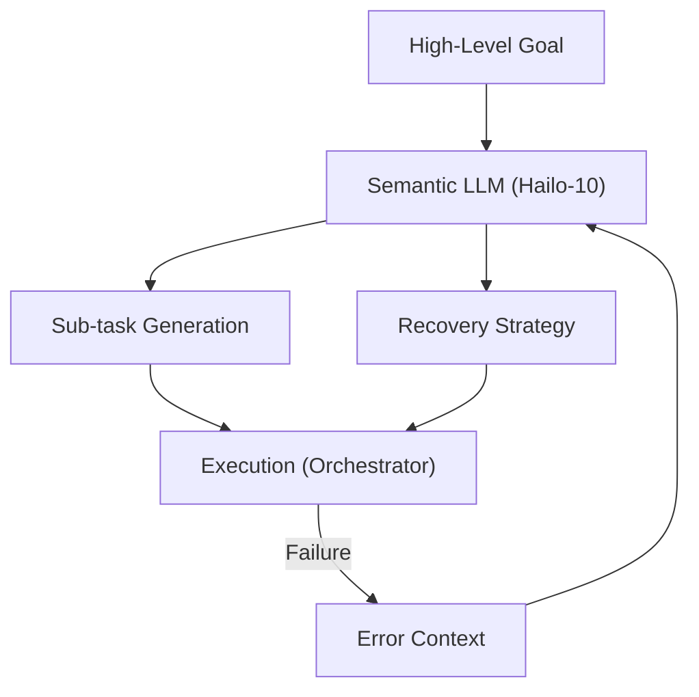

<p align="center">
  
</p>

# 🧩 HYDRA-UMC-SEMANTIC-PLANNER

<p align="center"><a href="README.md">🇺🇸 English</a> | <a href="README_spa.md">🇪🇸 Español</a> | <a href="README_fra.md">🇫🇷 Français</a> | <a href="README_ita.md">🇮🇹 Italiano</a> | <a href="README_deu.md">🇩🇪 Deutsch</a> | 🇨🇳 <b>简体中文</b> | <a href="README_jpn.md">🇯🇵 日本語</a></p>

### 🧠 基于 LLM 的任务规划与逻辑恢复系统

<p align="left">
  
  
  
</p>

---

## 1. 🛠️ 技术概述

**HYDRA-UMC-SEMANTIC-PLANNER** 是认知 AI 节点的"逻辑编排器"。它使用本地
LLM（大语言模型）将复杂目标分解为可执行的机器人操作单元。

它处理高层次的模糊性，并提供语义级错误恢复：如果一项任务失败（例如"真空
吸盘失去密封"），规划器会推理失败原因，并决定是增加压力、重试，还是更换
为机械工具。

### 关键特性：
* 🧩 **任务分解（v0）：** 对一个已知的小型目标词汇表进行真实的、基于规则的分解（例如"组装 PCB"），得到顺序的机器人指令。*（已实现为真实的模板规则——尚非 LLM；见下方"构建与运行"）*
* 🛡️ **语义恢复（v0）：** 从结构化的 MCU 错误代码到恢复动作的真实的、基于规则的查找。*（已实现为基于已知代码词汇表的真实显式表格；未知代码始终上报给人类）*
* ✅ **前置条件验证：** 每个分解后的计划在交付之前都会对照每个真实原语真正需要的内容进行检查 —— 失败的计划会被拒绝，而不会被静静地当作可执行状态放行。*（已实现）*
* 🎲 **确定性 + 属性测试：** `decompose_goal()` 已被证明具有确定性（相同目标始终得到相同计划），并针对数百个随机/无效目标进行了 fuzz 测试 —— 从不崩溃，也从不返回格式错误的计划。*（已实现）*
* 🤖 **代理式工作流：** 作为本地代理运行，能够查询系统状态和工具。*（计划中）*
* ⚡ **Hailo-10 优化：** 利用 40 TOPS 算力实现快速的多步推理。*（计划中——需要真实的本地 LLM）*
* 👨‍👩‍👧 **认知 AI 节点子项目：** 作为
  [HYDRA-UMC-COGNITIVE-NODE](https://github.com/JuanenRac/HYDRA-UMC-COGNITIVE-NODE) 下 4 个同级服务之一运行（与 VLA-Engine、Voice-UI 和 Docs-QA 并列），共享父项目的 HydraOS 镜像和模型权重，而非各自保留独立副本。
* 📦 **里程表式版本管理：** 每次真实构建都会自动递增 `pyproject.toml`
  自身的版本号（`bump_version.py`）——无需手动编辑版本号。

---

## 2. 🔄 规划周期



---

## 3. 🧱 架构与设计决策

本仓库是 Cognitive AI Node 系列的**子项目**——其父项目
[HYDRA-UMC-COGNITIVE-NODE](https://github.com/JuanenRac/HYDRA-UMC-COGNITIVE-NODE) 拥有共享的 HydraOS 镜像和量化模型权重，并将本服务与其另外 3 个同级项目（VLA-Engine、Voice-UI、Docs-QA）一同接入 `docker-compose.yml`：

* **为何本子项目没有自己的硬件/固件/`os/`/`models/`。** 它完全运行在父项目已拥有的 CM5 + Hailo-10 M.2 模块上——将模型权重和 HydraOS 镜像集中保存在一处，可避免整个项目族中出现四份互不一致的、动辄数 GB 的副本。
* **为何采用 `src/` 布局。** 使可安装的包（`hydra_umc_semantic_planner`）与仓库根目录的工具（`bump_version.py`）分离，与生态系统中其他每个 Python 项目所使用的布局保持一致。
* **为何入口点今天只打印身份/版本/角色。** 这是脚手架（scaffolding）阶段：证明该包在实际目标 Python 版本上能够正确安装、编译并被导入，是后续添加真正的基于 LLM 的规划/恢复逻辑的前提条件，并使那部分后续工作与打包相关的问题相互隔离。
* **这如何融入生态系统的其余部分。** 本规划器是认知 AI 节点的决策核心：它消费来自其同级项目 HYDRA-UMC-VOICE-UI 的意图，以及来自其同级项目 HYDRA-UMC-VLA-ENGINE 的动作令牌，并将由此产生的任务决策向下游发送给 HYDRA-UMC-ORCHESTRATOR 进行物理执行。
* **为何 `decompose.py` 是真实的正则规则，而非本地 LLM。** 一个小型真实的目标词汇表（组装/取放/检查）如今已被规则完全且诚实地覆盖——这与兄弟项目 HYDRA-UMC-DOCS-QA 使用真实 TF-IDF 索引而非嵌入模型的理由相同：一个真实的、可测试的内核，未来基于 LLM 的规划器可以在同一个 `decompose_goal()` 契约背后替换它。
* **为何 `recovery.py` 的错误代码与公开恢复契约相匹配。** `INVALID_STATE`/`OUT_OF_RANGE`/`ESTOP_ACTIVE`/`TOOL_INCOMPATIBLE`/`TIMEOUT`/`UNSUPPORTED` 是该适配器设计要返回的真实结构化错误——今天针对这个真实词汇表构建的恢复逻辑，在适配器本身存在之后依然有效，而不必事后再去调和一套并行发明的错误分类。
* **为何 `ESTOP_ACTIVE`/`UNSUPPORTED`/未知代码始终上报给人类。** 与整个生态系统的安全规则一致：IA、UI 和云层永远不能凌驾于物理安全条件之上——本规划器只提出恢复动作，绝不会自行解除 E-STOP，也不会对它无法识别的错误进行猜测。
* **为何 `validation.py` 依然存在，即使 `decompose.py` 的真实模板从未真正产生过无效计划。** 固定的模板可以在构造上保证参数格式良好 —— 未来基于 LLM 的规划器则不能。`validate_plan()` 是那个规划器将必须满足的真实、显式契约，在此处、现在就针对当前唯一存在的规划器进行了验证，以便在更难的东西需要满足它之前，契约本身就已被证明正确。
* **为何 `decompose_goal()` 使用固定的随机种子进行 fuzz 测试，而不是使用 `hypothesis`。** 本项目（与生态系统的其余部分一样）仅依赖标准库 —— 一个对数百个合成目标可重现、带种子的 `random.Random` 循环，在不引入新依赖的情况下，获得了同样的真实属性（从不崩溃，从不返回格式错误的计划）。

---

## 📂 目录结构

```text
HYDRA-UMC-SEMANTIC-PLANNER/
├── src/hydra_umc_semantic_planner/
│   ├── primitives.py                  # 真实的、封闭的机器人命令原语词汇表
│   ├── decompose.py                    # 真实的、基于规则的任务分解
│   ├── recovery.py                      # 真实的、基于规则的语义错误恢复
│   ├── validation.py                    # 对已分解 Plan 的真实前置条件验证
│   ├── api.py                             # 简洁的 JSON/HTTP 接口(基于 stdlib http.server),桥接 decompose/recover
│   └── main.py                            # 入口点 + 真实的 `decompose`/`recover` 子命令
├── tests/                            # 真实测试：分解、恢复、验证、api、属性测试、端到端 CLI
├── docs/                             # 文档与知识库
│   ├── CLI_REFERENCE.md               # 公开命令行契约
│   └── RECOVERY_CONTRACT.md           # 公开错误/恢复词汇表
├── images/                           # 媒体与图表
├── systemd/
│   └── hydra-umc-semantic-planner.service # 本地 CM5 decompose/recover API 的 systemd 单元
├── tools/
│   ├── build_test.py                 # 不递增版本号的构建检查
│   └── ci_validate.py                # CI 使用的清单/CHANGELOG/文档校验
├── build/                            # 本地构建输出（已被 git 忽略）
├── pyproject.toml                    # 包元数据（里程表式递增版本号）
├── bump_manifest_version.py          # 将 hydra-umc.project.json 的版本与原生版本同步(--sync)
├── build.sh / build.bat              # 创建 venv、安装（含 dev 附加依赖）、运行测试、验证导入
└── run.sh / run.bat                  # 运行入口点（转发参数，例如 `decompose`）
```

> **注意：** `hardware/` 和 `firmware/` 已被省略——本节点运行在现成的
> CM5 + Hailo-10 M.2 模块上，没有自己的硬件/固件设计。`os/` 和
> `models/` 也已被省略——HydraOS 镜像和共享的 Hailo-10 模型权重存放在
> 父项目 `HYDRA-UMC-COGNITIVE-NODE` 中，本项目作为一项服务接入其中
> （见其 `docker-compose.yml`）。

---

## ⚙️ 构建与运行

需要 Python >= 3.10。

```bash
# Linux / macOS / Git Bash
./build.sh   # 创建 .venv，安装该包（可编辑模式），验证导入
./run.sh     # 运行入口点

# Windows (cmd)
build.bat
run.bat
```

`build.sh`/`build.bat` 会在每次真实构建之前递增版本号（里程表式，见
`bump_version.py`），并运行真实的测试套件（`pytest tests/`）。不带参数的
`run.sh` 的预期输出：

```text
HYDRA-UMC-SEMANTIC-PLANNER v0.0.7
Semantic Planner (Hailo-10) - decomposes high-level goals into robotic primitives and recovers from execution failures.
```

真实的子命令会分解一个目标，或提出一个恢复方案：

```bash
./run.sh decompose "组装 pcb"
./run.sh recover --component gripper --error-code GRIP_LOST_SEAL --detail "vacuum gripper lost seal"

# Windows
run.bat decompose "组装 pcb"
run.bat recover --component gripper --error-code GRIP_LOST_SEAL --detail "vacuum gripper lost seal"
```

每个真实的分解后计划在打印之前都会对照 `validation.py` 的真实前置条件进行检查。`decompose.py` 自身的模板总是能通过验证；而一个失败的计划则会被拒绝：

```text
Plan for: "broken" FAILED precondition validation:
  step 1 (GRIP): missing required param 'target'
```

### 🩺 故障排查

* **`python: command not found` / 构建在第 1 步失败。** 需要 `PATH` 中存在 Python >= 3.10。在 Windows 上，从 [python.org](https://python.org) 安装，并确保安装过程中勾选了"Add to PATH"；`python3` 是 Linux/macOS 上的常见命令名。
* **`build.sh` 无法激活 venv。** `python3 -m venv .venv` 在不同平台上生成的激活脚本路径不同：Linux/macOS 上是 `.venv/bin/activate`，Windows（从 Git Bash 使用的 Windows Python venv 也是如此）上是 `.venv/Scripts/activate`。`build.sh` 已经检查了这两个路径——如果仍然失败，删除 `.venv/` 并重新运行 `./build.sh` 从头重建。
* **`pip install -e .` 失败。** 通常是 `.venv/` 已过期。删除 `.venv/` 文件夹并重新运行 `./build.sh`/`build.bat` 重新创建它。
* **`import OK` 从未打印。** 意味着 `python -c "import hydra_umc_semantic_planner"` 本身失败了——在激活 venv 的情况下重新运行以查看真实的回溯信息。

---

## 🚀 路线图
* **第一阶段：** 在 Hailo-10 上部署 VLA 引擎并进行多模态输入处理。
* **第二阶段：** 语义规划器与集群行为模型及长期记忆的集成。
* **第三阶段：** 语音 UI 的低延迟本地执行以及工业噪声消除。
* **第四阶段：** 用于共享目标分解的多智能体协调以及语义恢复优化。

---

## 🔗 相关项目

本项目是同一作者(JuanenRac / Electro Hobby 3D)打造的 HYDRA-UMC 机器人生态系统的一部分。值得了解,因为某个请求实际上可能是关于这些项目之一,而非本仓库本身。

**父项目**
- **[HYDRA-UMC-COGNITIVE-NODE](https://github.com/JuanenRac/HYDRA-UMC-COGNITIVE-NODE)** — 面向 Hailo-10 认知流水线(LLM/VLA/语音编排)的集成中枢;本仓库是其自身认知流水线中一个具体阶段或消费者所属的父项目。

**兄弟项目** —— HYDRA-UMC-COGNITIVE-NODE 自身 Hailo-10 认知流水线中的其他阶段/消费者
- **[HYDRA-UMC-VOICE-UI](https://github.com/JuanenRac/HYDRA-UMC-VOICE-UI)** — 具备受限、需确认的 Watch 中继的真实语音前端(VAD + 意图解析)。
- **[HYDRA-UMC-VLA-ENGINE](https://github.com/JuanenRac/HYDRA-UMC-VLA-ENGINE)** — 面向 Vision-Language-Action 模型的真实动作 token 编解码与轨迹生成。
- **[HYDRA-UMC-DOCS-QA](https://github.com/JuanenRac/HYDRA-UMC-DOCS-QA)** — 面向本生态系统自身 Markdown 文档的真实纯标准库 TF-IDF 文档检索。

**直接相关**
- **[HYDRA-UMC-ORCHESTRATOR](https://github.com/JuanenRac/HYDRA-UMC-ORCHESTRATOR)** — 具备真实 gRPC/Protobuf 健康报告契约与任务状态机的集成中枢;接收本规划器自身的任务决策。

**生态系统中的其他项目**

*核心硬件与平台*
- **[HYDRA-UMC](https://github.com/JuanenRac/HYDRA-UMC)** — 机器人手臂的真实主板——CM5 主机 + 双核 STM32H745，通过 CAN-OTA/SPI-OTA 协调最多 8 条工具臂。
- **[HYDRA-UMC-OS](https://github.com/JuanenRac/HYDRA-UMC-OS)** — 面向 CM5 的可复现 Raspberry Pi OS 产品层——只读代理、经过验证的配置/配置文件、WiFi 首次配网。
- **[HYDRA-UMC-SDK](https://github.com/JuanenRac/HYDRA-UMC-SDK)** — 每个桥接都据此校验自身指令的共享 JSON-Schema 契约与安全门限边界。

*核心后端与客户端*
- **[HYDRA-UMC-SERVER](https://github.com/JuanenRac/HYDRA-UMC-SERVER)** — 每个控制客户端真正通信的真实无头后端(REST/WebSocket)。
- **[HYDRA-UMC-STUDIO](https://github.com/JuanenRac/HYDRA-UMC-STUDIO)** — 具有实时多机器人 3D 可视化的网页控制面板。
- **[HYDRA-UMC-SUITE](https://github.com/JuanenRac/HYDRA-UMC-SUITE)** — 面向多台服务器的桌面(PySide6)集群指挥中心，打包为独立可执行文件。
- **[HYDRA-UMC-ANDROID-CONTROL](https://github.com/JuanenRac/HYDRA-UMC-ANDROID-CONTROL)** — 具有生物识别登录和配对 Wear OS 伴侣应用的原生 Android 控制应用。
- **[HYDRA-UMC-IOS-CONTROL](https://github.com/JuanenRac/HYDRA-UMC-IOS-CONTROL)** — 具有实时 WebSocket 同步的 iOS/iPadOS 控制应用(Flutter)。
- **[HYDRA-UMC-DSI](https://github.com/JuanenRac/HYDRA-UMC-DSI)** — 面向机载 7 英寸 DSI 触摸屏的原生触控界面，直接嵌入 CM5 本体。
- **[HYDRA-UMC-EDITOR-URDF](https://github.com/JuanenRac/HYDRA-UMC-EDITOR-URDF)** — 将完成的模型推送到 STUDIO 自身目录的桌面版图形化 URDF 创建/编辑工具。
- **[HYDRA-UMC-BRIDGE-AMR](https://github.com/JuanenRac/HYDRA-UMC-BRIDGE-AMR)** — 通过真实的 VDA 5050 MQTT 发布者为 AGV/AMR 车队提供的协调边界。
- **[HYDRA-UMC-BRIDGE-CNC](https://github.com/JuanenRac/HYDRA-UMC-BRIDGE-CNC)** — 具备真实 GRBL 状态/控制字节访问能力的高层 CNC 单元协调器。
- **[HYDRA-UMC-BRIDGE-DROIDS](https://github.com/JuanenRac/HYDRA-UMC-BRIDGE-DROIDS)** — 面向足式/人形机器人的协调边界，具备真实的 Boston Dynamics Spot 指令发送器。
- **[HYDRA-UMC-BRIDGE-LASER](https://github.com/JuanenRac/HYDRA-UMC-BRIDGE-LASER)** — 读取 3 项真实钥匙/外壳/联锁 GPIO 安全信号的激光单元安全协调器。
- **[HYDRA-UMC-BRIDGE-OPENPNP](https://github.com/JuanenRac/HYDRA-UMC-BRIDGE-OPENPNP)** — 面向 OpenPnP 贴片机板级流程的安全高层协调器。
- **[HYDRA-UMC-BRIDGE-PRINTER3D](https://github.com/JuanenRac/HYDRA-UMC-BRIDGE-PRINTER3D)** — 面向 Moonraker/Klipper 3D 打印机的安全协调边界，具备真实的受控作业指令。
- **[HYDRA-UMC-BRIDGE-ROS2](https://github.com/JuanenRac/HYDRA-UMC-BRIDGE-ROS2)** — 具备真实的惰性导入 rclpy ROS 2 传输层的安全协调器。
- **[HYDRA-UMC-BRIDGE-UAV](https://github.com/JuanenRac/HYDRA-UMC-BRIDGE-UAV)** — 面向搭载摄像头的无人机的协调边界，具备真实的 MAVLink 指令发送器。

*URTC 工具平台*
- **[URTC](https://github.com/JuanenRac/URTC)** — 面向实体 Universal Robot Tool Controller 板卡的固件，通过 CAN 总线支持 25 种以上工具配置。
- **[URTC-FLASHER](https://github.com/JuanenRac/URTC-FLASHER)** — 面向 URTC 板卡的桌面图形烧录工具，支持 CAN-OTA 以及全芯片 SWD/JTAG。
- **[URTC-TESTER](https://github.com/JuanenRac/URTC-TESTER)** — 面向 URTC 板卡的桌面实时 CAN 总线诊断工具，每种工具配置对应一个面板。
- **[URTC-WEB-STUDIO](https://github.com/JuanenRac/URTC-WEB-STUDIO)** — 通过 Web Serial API 实现的浏览器版 URTC-TESTER 替代方案，无需本地安装。

*视觉 AI 节点(Hailo-8)*
- **[HYDRA-UMC-VISION-NODE](https://github.com/JuanenRac/HYDRA-UMC-VISION-NODE)** — 面向 Hailo-8 视觉流水线的集成中枢，具备逐阶段的真实硬件就绪检测。
- **[HYDRA-UMC-DETECTION-HEF](https://github.com/JuanenRac/HYDRA-UMC-DETECTION-HEF)** — 具备 Hailo 架构/校验和安全加载验证的真实编译模型注册表。
- **[HYDRA-UMC-VISION-STREAMER](https://github.com/JuanenRac/HYDRA-UMC-VISION-STREAMER)** — 具备真实 HailoRT 集成边界的真实 GStreamer 流水线 + MediaMTX 配置生成器。
- **[HYDRA-UMC-VISUAL-SERVOING-API](https://github.com/JuanenRac/HYDRA-UMC-VISUAL-SERVOING-API)** — 具备真实 Position-Based Visual Servoing 修正律，并依据上游区域状态进行安全门控。
- **[HYDRA-UMC-SAFETY-ZONES](https://github.com/JuanenRac/HYDRA-UMC-SAFETY-ZONES)** — 具备校准新鲜度强制检查的真实区域入侵检测与 E-STOP 请求。

*编排与集群*
- **[HYDRA-UMC-JOB-DISPATCHER](https://github.com/JuanenRac/HYDRA-UMC-JOB-DISPATCHER)** — 基于真实 HTTP API 的真实优先级任务队列，支持去重。
- **[HYDRA-UMC-NODE-HEALING](https://github.com/JuanenRac/HYDRA-UMC-NODE-HEALING)** — 具备重试/退避与身份不匹配检测的真实基于 gRPC 的车队健康看门狗。
- **[HYDRA-UMC-PATH-PLANNER-3D](https://github.com/JuanenRac/HYDRA-UMC-PATH-PLANNER-3D)** — 具备真实障碍物/工作空间碰撞校验的真实基于 RRT 的三维路径规划器。
- **[HYDRA-UMC-SWARM-SYNC](https://github.com/JuanenRac/HYDRA-UMC-SWARM-SYNC)** — 经过多单元收敛属性测试的真实 CRDT LWW-Element-Map 状态同步。

*数字孪生与仿真*
- **[HYDRA-UMC-TWIN](https://github.com/JuanenRac/HYDRA-UMC-TWIN)** — 面向数字孪生引擎的集成中枢，具备真实的版本兼容性同步契约。
- **[HYDRA-UMC-HIL-BRIDGE](https://github.com/JuanenRac/HYDRA-UMC-HIL-BRIDGE)** — 在仿真与真实硬件之间路由指令的真实硬件在环安全联锁。
- **[HYDRA-UMC-PHYSICS-REPLICA](https://github.com/JuanenRac/HYDRA-UMC-PHYSICS-REPLICA)** — 面向真实 URDF 子集的真实正向运动学与关节限位校验。
- **[HYDRA-UMC-SYNTHETIC-DATA-GEN](https://github.com/JuanenRac/HYDRA-UMC-SYNTHETIC-DATA-GEN)** — 具备 YOLO/COCO 标注导出功能的真实程序化 2D 场景生成器。

*数据与分析*
- **[HYDRA-UMC-DATALAKE](https://github.com/JuanenRac/HYDRA-UMC-DATALAKE)** — 具备真实数据摄入/查询 HTTP API 的真实 sqlite3 时序数据存储。
- **[HYDRA-UMC-ANOMALY-DETECTOR](https://github.com/JuanenRac/HYDRA-UMC-ANOMALY-DETECTOR)** — 具备漂移监测能力的真实 FFT + 统计基线异常检测器。
- **[HYDRA-UMC-PRODUCTION-REPORTS](https://github.com/JuanenRac/HYDRA-UMC-PRODUCTION-REPORTS)** — 基于 DATALAKE 历史数据的真实 OEE/可用率计算，支持可复现的 CSV 导出。
- **[HYDRA-UMC-TELEMETRY-COLLECTOR](https://github.com/JuanenRac/HYDRA-UMC-TELEMETRY-COLLECTOR)** — 面向 DATALAKE 的真实 CAN/WebSocket 数据摄入管道，支持序列去重。

*工业网关*
- **[HYDRA-UMC-GATEWAY-INDUSTRIAL](https://github.com/JuanenRac/HYDRA-UMC-GATEWAY-INDUSTRIAL)** — 中继至工业协议的集成中枢，具备真实的指令白名单/背压控制层。
- **[HYDRA-UMC-OPCUA-SERVER](https://github.com/JuanenRac/HYDRA-UMC-OPCUA-SERVER)** — 经真实二进制协议客户端会话验证的真实 OPC-UA 地址空间。
- **[HYDRA-UMC-MQTT-BROKER](https://github.com/JuanenRac/HYDRA-UMC-MQTT-BROKER)** — 具备可选按客户端认证与主题 ACL 的真实 MQTT 代理。
- **[HYDRA-UMC-MTCONNECT-ADAPTER](https://github.com/JuanenRac/HYDRA-UMC-MTCONNECT-ADAPTER)** — 具备降级模式输出的真实 MTConnect `/probe` 与 `/current` XML 端点。

*辅助工具与生态系统运维*
- **[HYDRA-UMC-DASHBOARD-AI](https://github.com/JuanenRac/HYDRA-UMC-DASHBOARD-AI)** — 基于 DATALAKE/ANOMALY-DETECTOR 的智能摘要与异常高亮面板，具备诚实的统计回退机制。
- **[HYDRA-UMC-TOOL-CLI](https://github.com/JuanenRac/HYDRA-UMC-TOOL-CLI)** — 具备真实、稳定退出码契约的车队 CLI，是 HYDRA-UMC-SERVER 自身 API 的真实在线客户端。
- **[HYDRA-UMC-WATCH](https://github.com/JuanenRac/HYDRA-UMC-WATCH)** — 具备真实触觉提醒与配对手机语音中继功能的 WearOS 伴侣应用。
- **[URTC-SMART-RACK](https://github.com/JuanenRac/URTC-SMART-RACK)** — 面向板卡安装机架的固件，具备真实的工具 ID 解码与 Smart Idle 预热逻辑。
- **[URTC-VISION-TOOL](https://github.com/JuanenRac/URTC-VISION-TOOL)** — 面向热成像/RGB 检测工具头的固件及真实 Python 视觉伴侣程序。
- **[HYDRA-UMC-UPDATER](https://github.com/JuanenRac/HYDRA-UMC-UPDATER)** — 发现、克隆并更新本生态系统中每个仓库的管理类桌面工具。

---

## 📚 文档与社区

- **[CONTRIBUTING.md](CONTRIBUTING.md)** —— 提交 Pull Request 所需的技术栈和编码规范。
- **[CODE_OF_CONDUCT.md](CODE_OF_CONDUCT.md)** —— 本社区所期望的行为准则。
- **[SECURITY.md](SECURITY.md)** —— 如何报告漏洞，以及本项目真实的安全关注重点。
- **[SUPPORT.md](SUPPORT.md)** —— 在哪里提问和报告缺陷。
- **[LICENSE.md](LICENSE.md)** —— 本项目自身的许可证。

## 👤 作者
**JuanenRac** (Electro Hobby 3D)
📧 electrohobby3d@gmail.com
📺 [youtube.com/@electrohobby3d](https://youtube.com/@electrohobby3d)

## 📜 许可证
GPL-3.0 —— 详见 LICENSE。
